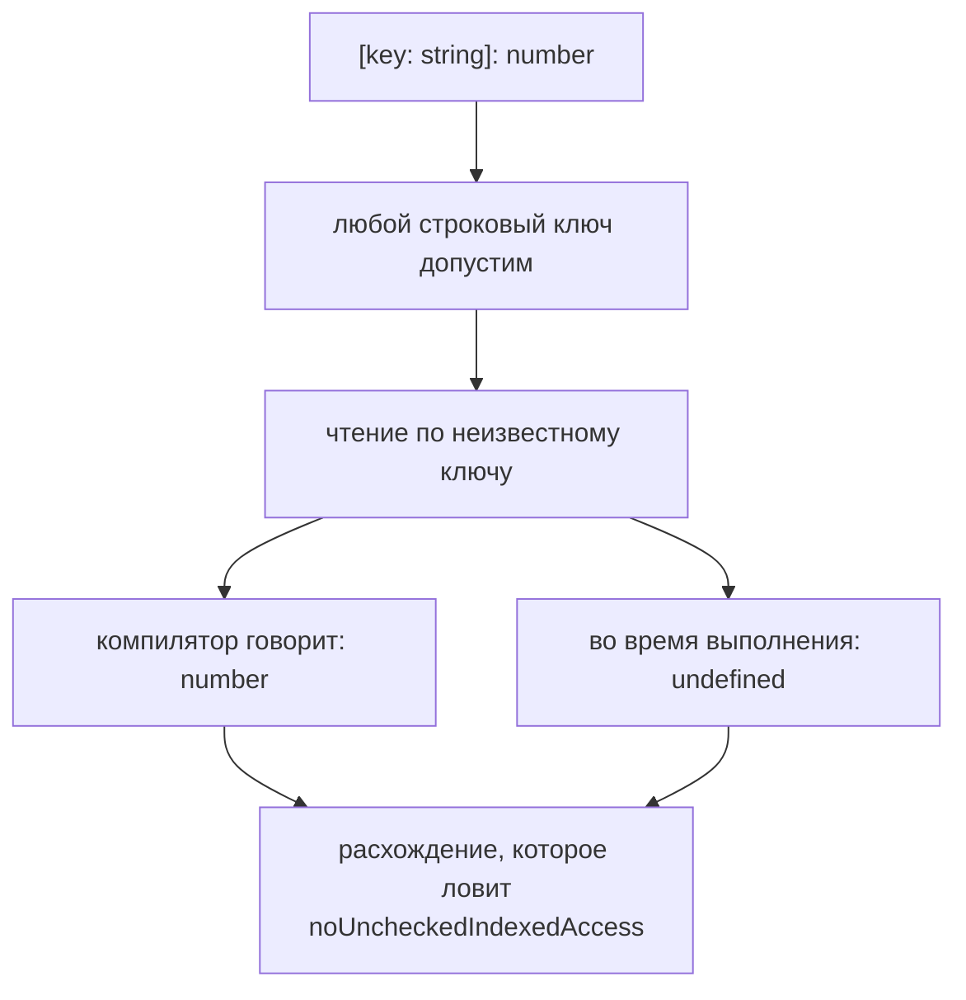

# Индексные сигнатуры

## Связь с предыдущей главой

Предыдущие главы описывали объекты с известными свойствами.

Но иногда объект работает как словарь: ключи заранее неизвестны, а тип значений должен быть одинаковым.

## Главный вопрос

> Как типизировать объект со заранее неизвестными ключами?

Короткий ответ: индексная сигнатура описывает тип ключей и тип значений для объекта-словаря.

## Мотивация

В QA-коде такие объекты встречаются в headers, metadata и наборах параметров.

Ключи могут отличаться от запроса к запросу, но значения должны оставаться предсказуемыми.

## Теория

### Правило вместо списка свойств

Индексная сигнатура описывает не конкретные свойства, а **правило для всех ключей**:

```typescript
type Headers = { [name: string]: string };
```

Читается так: любой строковый ключ имеет строковое значение. Это способ описать словарь, состав которого заранее неизвестен.

### Именованные свойства обязаны подчиняться правилу

Если у типа есть строковая индексная сигнатура, все явно названные свойства должны быть совместимы с её типом значения:

```typescript
type Bad = {
  [key: string]: string;
  count: number;      // ошибка: number не подходит под string
};
```

Логика простая: `count` тоже доступен по строковому ключу, а значит попадает под то же правило.

Если нужны разнородные значения, тип значения расширяют объединением — но тогда каждое обращение потребует сужения.

### Числовые и строковые индексы

В JavaScript ключи объекта — строки, а числовой ключ приводится к строке. Поэтому при одновременном использовании двух сигнатур тип значения числового индекса обязан подходить под строковую.

На практике числовая сигнатура нужна редко: для последовательностей лучше подходит массив.

### Обращение по неизвестному ключу обманывает

Как и в случае массивов, тип выражения оптимистичен:

```typescript
const headers: { [name: string]: string } = {};
const value = headers['accept'];   // тип: string
value.toUpperCase();               // падает во время выполнения
```

Ключа может не быть, но компилятор об этом не предупредит. Включение `noUncheckedIndexedAccess` даёт `string | undefined` и требует проверки — для кода, который работает с заголовками и параметрами, настройка окупается сразу.

### `Record` вместо рукописной сигнатуры

Ту же идею выражает встроенный тип:

```typescript
type Headers = Record<string, string>;
```

Запись короче и читается привычнее. Дополнительное преимущество — можно ограничить множество ключей:

```typescript
type Env = Record<'local' | 'staging' | 'production', string>;
```

Здесь ключи уже не произвольные: компилятор потребует все три и не пропустит четвёртый. Индексная сигнатура такого не умеет.

### Когда сигнатура не нужна

Если набор ключей известен, индексная сигнатура только ухудшает проверку: опечатка в имени свойства перестаёт быть ошибкой, потому что любой ключ допустим.

Правило: известные ключи описываются свойствами, неизвестные — сигнатурой или `Record`.

Что обещает сигнатура и что даёт время выполнения:


```mermaid
flowchart TD
    A["[key: string]: number"] --> B["любой строковый ключ допустим"]
    B --> C["чтение по неизвестному ключу"]
    C --> D["компилятор говорит: number"]
    C --> E["во время выполнения: undefined"]
    D --> F["расхождение, которое ловит<br/>noUncheckedIndexedAccess"]
    E --> F
```

## Внутренний механизм

TypeScript не знает все будущие ключи объекта.

Но он знает правило: если ключ строковый, значение должно соответствовать указанному типу.

Числовая индексная сигнатура работает похожим образом, но для числового индекса.

В JavaScript числовые ключи обычного объекта во время выполнения становятся строковыми, поэтому при совместном использовании строковой и числовой сигнатур тип значения для числового индекса должен подходить под правило строкового.

Если у типа есть строковая индексная сигнатура, явно названные свойства тоже должны иметь значения, совместимые с её типом.

В текущей конфигурации проверки обращение по неизвестному ключу имеет указанный тип значения, но отсутствующий ключ во время выполнения всё равно может вернуть `undefined`.

## Главная ментальная модель

Индексная сигнатура — это правило для словаря.

Не список конкретных свойств, а договор для всех ключей определенного вида.

## Практические примеры

Примеры находятся в:

```text
examples/02-typescript/chapter-110/
```

`01-string-index-signature.ts` показывает словарь строк.

`02-number-index-signature.ts` показывает числовой индекс.

`03-headers-metadata.ts` показывает заголовки и метаданные.

## Automation QA

Заголовки HTTP удобно описывать как словарь строк:

```typescript
const headers: { [key: string]: string } = {
  accept: 'application/json',
};
```

Так сборщик запроса не примет случайного числового значения в заголовке.

### Главная ловушка: чтение всегда «успешно»

Индексная сигнатура обещает, что **любой** ключ даёт строку. Поэтому опечатка
в имени заголовка не вызовет ошибки компиляции — она даст `undefined`,
который типизирован как `string`.

```typescript
const headers: { [key: string]: string } = { accept: 'application/json' };

const value = headers.acept;   // тип string, значение undefined
```

В тесте это выглядит как «заголовок не дошёл до сервиса», хотя проблема в
опечатке на своей стороне.

### Как поставить границу

Настройка `noUncheckedIndexedAccess` добавляет `undefined` к результату чтения
и возвращает проверку на место. Там, где набор ключей известен заранее,
индексную сигнатуру лучше заменить на `Record` по объединению литералов:

```typescript
type HeaderName = 'accept' | 'content-type' | 'authorization';

const known: Record<HeaderName, string> = {
  accept: 'application/json',
  'content-type': 'application/json',
  authorization: 'Bearer …'
};
```

Тогда опечатка становится ошибкой компиляции, а не загадкой в отчёте.

## Распространённые ошибки

### Ошибка 1. Использовать индексную сигнатуру для любого объекта

Если свойства известны заранее, тип объекта обычно яснее.

### Ошибка 2. Делать значения слишком широкими

`unknown` или `any` в словаре резко снижает полезность проверки.

### Ошибка 3. Думать, что индексная сигнатура проверяет реальные внешние данные

TypeScript проверяет код, но не проверяет объектов во время выполнения.

## Распространённые мифы

**Миф: индексная сигнатура подходит для любого объекта.**
Если ключи известны, она отключает проверку опечаток: допустим станет любой ключ.

**Миф: обращение по ключу гарантирует значение.**
По умолчанию тип оптимистичен. Честное поведение включает `noUncheckedIndexedAccess`.

**Миф: `Record<string, string>` и индексная сигнатура — разные вещи.**
Для строковых ключей это одно и то же, записанное короче.

**Миф: именованное свойство можно объявить с любым типом.**
Оно должно быть совместимо с типом значения индексной сигнатуры.

## Частые вопросы

**Когда `Record`, а когда сигнатура?**
`Record` читается лучше и умеет ограничивать множество ключей. Рукописная сигнатура нужна редко.

**Как описать объект с известными и произвольными ключами сразу?**
Тип значения сигнатуры должен покрывать все известные свойства — например, через объединение. Часто проще разделить на два типа.

**Почему `headers['accept']` не требует проверки?**
Компилятор по умолчанию считает, что ключ есть. Это упрощение ради удобства; отключается `noUncheckedIndexedAccess`.

**Подходит ли сигнатура для ответа API?**
Только если состав полей действительно произвольный. Для известной структуры нужен тип объекта и проверка на границе.

## Проверьте себя

1. Что описывает индексная сигнатура вместо списка свойств?
2. Почему `count: number` нельзя объявить рядом со строковой сигнатурой со значением `string`?
3. Какой тип имеет обращение по несуществующему ключу и что это меняет?
4. Чем `Record<'local' | 'staging', string>` лучше индексной сигнатуры?
5. Когда индексная сигнатура ухудшает проверку?

### Ответы

1. Правило для всех ключей определённого вида: какого типа ключи и какого типа значения под ними. Конкретный перечень свойств при этом не задаётся.
2. Объявленные свойства должны подходить под индексную сигнатуру: `count` тоже является строковым ключом, а его тип не `string`. Иначе правило противоречило бы само себе.
3. Тип значения из сигнатуры — то есть компилятор считает, что значение есть. На деле его может не быть; исправляет это `noUncheckedIndexedAccess`.
4. `Record` с объединением литералов задаёт точный перечень допустимых ключей. Опечатка становится ошибкой, а обращение по ключу гарантированно даёт значение.
5. Когда ключи на самом деле известны. Сигнатура разрешает любой ключ, и опечатка перестаёт быть ошибкой.

## Практика

Практика находится в:

```text
practice/02-typescript/110-index-signatures.md
```

Решения находятся в:

```text
solutions/02-typescript/110-index-signatures.md
```

## Краткие итоги

Главное:

* индексная сигнатура описывает словарь;
* ключи могут быть заранее неизвестны;
* значения должны соответствовать одному правилу;
* заголовки и метаданные часто подходят под такую модель;
* для известных свойств лучше обычный тип объекта.

## Переход

Теперь мы умеем описывать даже динамические наборы свойств.

Дальше нужно дать имя сложным типам, чтобы не повторять одну и ту же форму объекта снова и снова.
