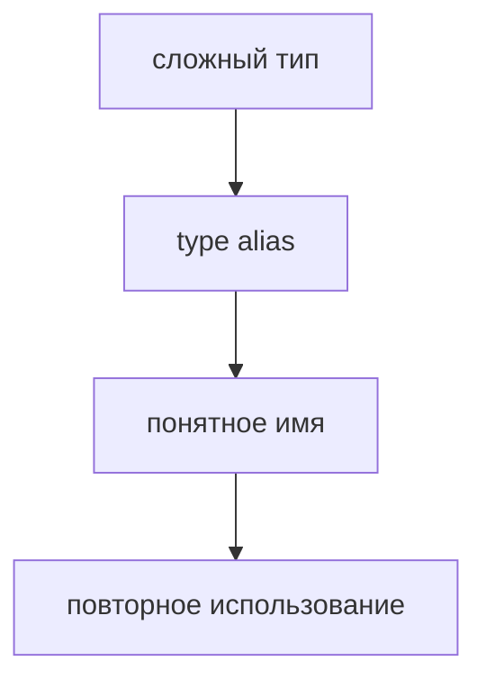

# Type Alias

## Связь с предыдущей главой

Мы уже умеем описывать объектные формы прямо на месте.

Но если одна форма повторяется в нескольких функциях, inline-запись быстро становится шумной.

## Главный вопрос

> Как дать имя сложному типу?

Короткий ответ: `type` создает alias, который дает имя типу и позволяет переиспользовать его в разных местах.

## Мотивация

В QA-проекте одна и та же форма данных API-запроса может использоваться в helpers, тестовых данных и assertions.

Если копировать тип вручную, легко получить расхождение.

Type alias помогает вынести форму в один понятный договор.

## Теория

Type alias создается с помощью `type`:

```typescript
type UserPayload = {
  id: number;
  name: string;
};

const user: UserPayload = {
  id: 1,
  name: 'Anna',
};
```



## Внутренний механизм

Type alias не создает runtime-значение.

После компиляции имя типа исчезает.

Для TypeScript это удобная метка, по которой компилятор проверяет одну и ту же форму в разных местах.

## Главная ментальная модель

Type alias — это имя для договора.

Он не меняет JavaScript, но делает TypeScript-код читаемее и устойчивее к изменениям.

## Практические примеры

Примеры находятся в:

```text
examples/02-typescript/chapter-111/
```

`01-basic-type-alias.ts` показывает именованный тип.

`02-test-data-type.ts` показывает тип для test data.

`03-api-payload.ts` показывает объект данных API-запроса.

## Automation QA

Type alias полезен для тестовых данных:

```typescript
type TestUser = {
  id: number;
  email: string;
  active: boolean;
};
```

Так все helpers используют один договор вместо копирования object type.

## Распространённые ошибки

### Ошибка 1. Думать, что type alias существует в runtime

Type alias исчезает после компиляции.

### Ошибка 2. Давать слишком общее имя

`Data` или `Info` хуже, чем `TestUser` или `ApiPayload`.

### Ошибка 3. Выносить слишком простое значение без причины

Alias нужен, когда имя действительно улучшает читаемость или уменьшает повторение.

## Практика

Практика находится в:

```text
practice/02-typescript/111-type-alias.md
```

Решения находятся в:

```text
solutions/02-typescript/111-type-alias.md
```

## Краткие итоги

Главное:

* `type` дает имя типу;
* alias не существует в runtime;
* именованный договор уменьшает дублирование;
* хорошее имя объясняет назначение типа;
* type alias полезен для тестовых данных и данных API-запроса.

## Переход

Type alias дает имя любому типу.

Следующая глава показывает другой способ описывать объектные договоры — `interface`.
