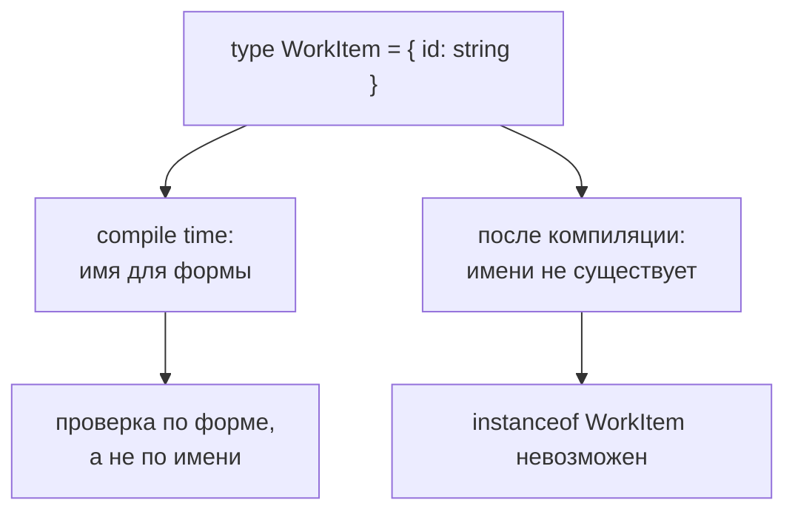

# Type Alias

## Связь с предыдущей главой

Мы уже умеем описывать объектные формы прямо на месте.

Но если одна форма повторяется в нескольких функциях, inline-запись быстро становится шумной.

## Главный вопрос

> Как дать имя сложному типу?

Короткий ответ: `type` создает alias, который дает имя типу и позволяет переиспользовать его в разных местах.

## Мотивация

В QA-проекте одна и та же форма данных API-запроса может использоваться в helpers, тестовых данных и assertions.

Если копировать тип вручную, легко получить расхождение.

Type alias помогает вынести форму в один понятный договор.

## Теория

### Имя для договора

Type alias даёт имя уже существующему типу:

```typescript
type UserPayload = {
  id: number;
  name: string;
};
```

Слово «alias» здесь точное: это **псевдоним**, а не новый тип. Компилятор подставляет описание на место имени и работает дальше с ним.

### Alias не создаёт отдельный тип

Прямое следствие: два одинаково устроенных alias взаимозаменяемы.

```typescript
type A = { id: string };
type B = { id: string };

const a: A = { id: 'x' };
const b: B = a;             // допустимо
```

Компилятор сравнивает форму, а не имя. Поэтому alias улучшает читаемость и уменьшает повторение, но **не создаёт защиты от путаницы** между разными по смыслу сущностями.

Если нужно, чтобы `UserId` и `OrderId` не смешивались, одного псевдонима мало — потребуется приём с дополнительным полем-меткой, который разбирается позже.

### Именовать можно не только объекты

Alias работает с любым типом, и это его главная сила по сравнению с описанием объектов:

```typescript
type Status = 'passed' | 'failed' | 'skipped';   // объединение
type Handler = (event: string) => void;           // функция
type ApiResult = [status: number, text: string];  // кортеж
type Id = string;                                 // примитив
```

Объединение литералов — самый частый случай в реальном коде: именно так описываются статусы, роли, окружения и методы.

### Рекурсивные типы

Alias может ссылаться на себя, и это позволяет описывать древовидные структуры:

```typescript
type JsonValue =
  | string
  | number
  | boolean
  | null
  | JsonValue[]
  | { [key: string]: JsonValue };
```

Такой тип точно описывает то, что может вернуть `JSON.parse` — в отличие от `any`, который просто отключает проверку.

### Alias исчезает после компиляции

Имя типа не существует во время выполнения: его нельзя напечатать, проверить или передать. Это тот же type erasure из главы 99.

Поэтому alias нельзя использовать как значение и нельзя спросить «соответствует ли объект этому типу» — нужна функция-страж.

### Именование

Имя — это то, ради чего всё затевалось, поэтому оно должно нести смысл.

Плохие имена: `Data`, `Info`, `Item`, `Params` — они не сообщают ничего, кроме того, что это тип.

Хорошие имена называют сущность предметной области: `TestUser`, `WorkItemPayload`, `RetryPolicy`. Хороший признак — имя понятно в сигнатуре функции без чтения самого типа.

Не стоит давать имя всему подряд: alias для `string` без дополнительного смысла добавляет уровень косвенности и ничего не объясняет.

Псевдоним живёт только до запуска:



## Внутренний механизм

Type alias не создает runtime-значение.

После компиляции имя типа исчезает.

Для TypeScript это удобная метка, по которой компилятор проверяет одну и ту же форму в разных местах.

## Главная ментальная модель

Type alias — это имя для договора.

Он не меняет JavaScript, но делает TypeScript-код читаемее и устойчивее к изменениям.

## Практические примеры

Примеры находятся в:

```text
examples/02-typescript/chapter-111/
```

`01-basic-type-alias.ts` показывает именованный тип.

`02-test-data-type.ts` показывает тип для test data.

`03-api-payload.ts` показывает объект данных API-запроса.

## Automation QA

Type alias полезен для тестовых данных:

```typescript
type TestUser = {
  id: number;
  email: string;
  active: boolean;
};
```

Так все helpers используют один договор вместо копирования object type.

## Распространённые ошибки

### Ошибка 1. Думать, что type alias существует в runtime

Type alias исчезает после компиляции.

### Ошибка 2. Давать слишком общее имя

`Data` или `Info` хуже, чем `TestUser` или `ApiPayload`.

### Ошибка 3. Выносить слишком простое значение без причины

Alias нужен, когда имя действительно улучшает читаемость или уменьшает повторение.

## Распространённые мифы

**Миф: type alias создаёт новый тип.**
Это псевдоним. Два одинаковых по форме alias взаимозаменяемы.

**Миф: alias нужен только для объектов.**
Чаще всего он используется для объединений литералов, а также для функций, кортежей и рекурсивных структур.

**Миф: `type Id = string` защитит от передачи не того идентификатора.**
Не защитит: это тот же `string`. Нужен отдельный приём с меткой.

**Миф: имя типа можно использовать во время выполнения.**
После компиляции его не существует.

## Частые вопросы

**Когда заводить alias?**
Когда форма встречается больше одного раза или когда имя объясняет смысл лучше, чем описание. Разовый inline-тип в одной сигнатуре обычно не нуждается в имени.

**Как описать результат `JSON.parse` точно?**
Рекурсивным типом вроде `JsonValue`. Он описывает всё, что бывает в JSON, не отключая проверку, как `any`.

**Чем alias отличается от interface?**
Это тема следующих глав. Коротко: alias умеет называть любой тип, interface предназначен для объектов и имеет свои особенности расширения.

**Стоит ли называть примитивы?**
Только если имя добавляет смысл и это часть более крупного замысла. Сам по себе `type Id = string` ничего не даёт.

## Проверьте себя

1. Почему type alias называют псевдонимом, а не новым типом?
2. Что произойдёт при присваивании значения типа `A` переменной типа `B`, если формы совпадают?
3. Какие типы, кроме объектов, чаще всего получают имя?
4. Зачем нужен рекурсивный тип для описания JSON?
5. По какому признаку отличают хорошее имя типа от плохого?

## Практика

Практика находится в:

```text
practice/02-typescript/111-type-alias.md
```

Решения находятся в:

```text
solutions/02-typescript/111-type-alias.md
```

## Краткие итоги

Главное:

* `type` дает имя типу;
* alias не существует в runtime;
* именованный договор уменьшает дублирование;
* хорошее имя объясняет назначение типа;
* type alias полезен для тестовых данных и данных API-запроса.

## Переход

Type alias дает имя любому типу.

Следующая глава показывает другой способ описывать объектные договоры — `interface`.
