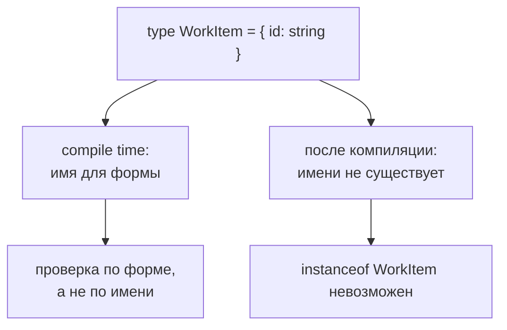

# Псевдоним типа

## Связь с предыдущей главой

Мы уже умеем описывать объектные формы прямо на месте.

Но если одна форма повторяется в нескольких функциях, inline-запись быстро становится шумной.

## Главный вопрос

> Как дать имя сложному типу?

Короткий ответ: `type` создаёт псевдоним, который даёт имя типу и позволяет переиспользовать его в разных местах.

## Мотивация

В QA-проекте одна и та же форма данных API-запроса может использоваться в helpers, тестовых данных и assertions.

Если копировать тип вручную, легко получить расхождение.

Type alias помогает вынести форму в один понятный договор.

## Теория

### Имя для договора

Псевдоним даёт имя уже существующему типу:

```typescript
type UserPayload = {
  id: number;
  name: string;
};
```

Слово «псевдоним» здесь точное: это именно второе имя, а не новый тип. Компилятор подставляет описание на место имени и работает дальше с ним.

### Псевдоним не создаёт отдельного типа

Прямое следствие: два одинаково устроенных псевдонима взаимозаменяемы.

```typescript
type A = { id: string };
type B = { id: string };

const a: A = { id: 'x' };
const b: B = a;             // допустимо
```

Компилятор сравнивает форму, а не имя. Поэтому псевдоним улучшает читаемость и уменьшает повторение, но **не создаёт защиты от путаницы** между разными по смыслу сущностями.

Если нужно, чтобы `UserId` и `OrderId` не смешивались, одного псевдонима мало — потребуется приём с дополнительным полем-меткой, который разбирается позже.

### Именовать можно не только объекты

Псевдоним работает с любым типом, и это его главная сила по сравнению с описанием объектов:

```typescript
type Status = 'passed' | 'failed' | 'skipped';   // объединение
type Handler = (event: string) => void;           // функция
type ApiResult = [status: number, text: string];  // кортеж
type Id = string;                                 // примитив
```

Объединение литералов — самый частый случай в реальном коде: именно так описываются статусы, роли, окружения и методы.

### Рекурсивные типы

Псевдоним может ссылаться на себя, и это позволяет описывать древовидные структуры:

```typescript
type JsonValue =
  | string
  | number
  | boolean
  | null
  | JsonValue[]
  | { [key: string]: JsonValue };
```

Такой тип точно описывает то, что может вернуть `JSON.parse` — в отличие от `any`, который просто отключает проверку.

### Псевдоним исчезает после компиляции

Имя типа не существует во время выполнения: его нельзя напечатать, проверить или передать. Это то же стирание типов из главы 99.

Поэтому псевдоним нельзя использовать как значение и нельзя спросить «соответствует ли объект этому типу» — нужна функция-страж.

### Именование

Имя — это то, ради чего всё затевалось, поэтому оно должно нести смысл.

Плохие имена: `Data`, `Info`, `Item`, `Params` — они не сообщают ничего, кроме того, что это тип.

Хорошие имена называют сущность предметной области: `TestUser`, `WorkItemPayload`, `RetryPolicy`. Хороший признак — имя понятно в сигнатуре функции без чтения самого типа.

Не стоит давать имя всему подряд: псевдоним для `string` без дополнительного смысла добавляет уровень косвенности и ничего не объясняет.

Псевдоним живёт только до запуска:


```mermaid
flowchart TD
    A["type WorkItem = { id: string }"] --> B["compile time:<br/>имя для формы"]
    B --> C["проверка по форме,<br/>а не по имени"]
    A --> D["после компиляции:<br/>имени не существует"]
    D --> E["instanceof WorkItem невозможен"]
```

## Внутренний механизм

Псевдоним типа не создаёт значения во время выполнения.

После компиляции имя типа исчезает.

Для TypeScript это удобная метка, по которой компилятор проверяет одну и ту же форму в разных местах.

### Псевдоним не создаёт нового типа

```ts
type TaskId = string;

function open(id: TaskId) {}

open("любая строка");   // разрешено: TaskId и string — одно и то же
```

Псевдоним даёт **имя**, а не отдельный тип. Поэтому он не защищает от
подстановки чужого значения: идентификатор задачи и идентификатор пользователя,
объявленные так, взаимозаменяемы.

Разделить их можно помеченным типом:

```ts
type TaskId = string & { readonly __brand: "TaskId" };
```

Такое значение нельзя получить случайно — только через функцию, которая его
создаёт. Во время выполнения это по-прежнему обычная строка.

### Что умеет псевдоним и чего не умеет

| Умеет | Не умеет |
| --- | --- |
| называть объединение и пересечение | повторное объявление с тем же именем |
| называть кортеж, функцию, примитив | слияние объявлений |
| принимать параметры типа | участвовать в `extends` как класс |

Правый верхний пункт отличает его от интерфейса: второе `type Config = …` в том
же файле — ошибка, а второй `interface Config` объединится с первым.

## Главная ментальная модель

Псевдоним типа — это имя для договора.

Он не меняет JavaScript, но делает TypeScript-код читаемее и устойчивее к изменениям.

## Практические примеры

Примеры находятся в:

```text
examples/02-typescript/chapter-111/
```

`01-basic-type-alias.ts` показывает именованный тип.

`02-test-data-type.ts` показывает тип для тестовых данных.

`03-api-payload.ts` показывает объект данных API-запроса.

## Automation QA

Псевдоним типа полезен для тестовых данных:

```typescript
type TestUser = {
  id: number;
  email: string;
  active: boolean;
};
```

### Псевдоним как общий словарь проекта

Тестовые данные проходят через несколько слоёв: фабрику, клиент API, проверку
и очистку. Если каждый слой описывает форму пользователя по-своему,
расхождение обнаружится только во время выполнения.

```typescript
type TestUser = { id: number; email: string; active: boolean };

function buildUser(overrides: Partial<TestUser> = {}): TestUser {
  return { id: 1, email: 'qa@example.test', active: true, ...overrides };
}

async function createUser(user: TestUser): Promise<TestUser> {
  return user;
}
```

Фабрика и клиент ссылаются на один псевдоним. Добавление поля в `TestUser`
сразу показывает все места, где его нужно заполнить, — это работа компилятора,
а не ревью.

### Чего псевдоним не делает

Псевдоним описывает форму, но не проверяет данные. Ответ стенда, пришедший из
сети, остаётся `unknown` до явной проверки: аннотация `TestUser` на нём — это
обещание, а не доказательство.

```typescript
// Опасно: компилятор поверит, стенд — нет.
const user = (await response.json()) as TestUser;
```

Граница простая: внутри проекта псевдоним гарантирует согласованность, на
границе с внешней системой нужна проверка во время выполнения.

Так все вспомогательные функции используют один договор вместо копирования типа объекта.

## Распространённые ошибки

### Ошибка 1. Думать, что псевдоним типа существует во время выполнения

Псевдоним исчезает после компиляции.

### Ошибка 2. Давать слишком общее имя

`Data` или `Info` хуже, чем `TestUser` или `ApiPayload`.

### Ошибка 3. Выносить слишком простое значение без причины

Псевдоним нужен, когда имя действительно улучшает читаемость или уменьшает повторение.

## Распространённые мифы

**Миф: псевдоним типа создаёт новый тип.**
Это второе имя. Два одинаковых по форме псевдонима взаимозаменяемы.

**Миф: псевдоним нужен только для объектов.**
Чаще всего он используется для объединений литералов, а также для функций, кортежей и рекурсивных структур.

**Миф: `type Id = string` защитит от передачи не того идентификатора.**
Не защитит: это тот же `string`. Нужен отдельный приём с меткой.

**Миф: имя типа можно использовать во время выполнения.**
После компиляции его не существует.

## Частые вопросы

**Когда заводить псевдоним?**
Когда форма встречается больше одного раза или когда имя объясняет смысл лучше, чем описание. Разовый встроенный тип в одной сигнатуре обычно не нуждается в имени.

**Как описать результат `JSON.parse` точно?**
Рекурсивным типом вроде `JsonValue`. Он описывает всё, что бывает в JSON, не отключая проверку, как `any`.

**Чем псевдоним отличается от интерфейса?**
Это тема следующих глав. Коротко: псевдоним умеет называть любой тип, интерфейс предназначен для объектов и имеет свои особенности расширения.

**Стоит ли называть примитивы?**
Только если имя добавляет смысл и это часть более крупного замысла. Сам по себе `type Id = string` ничего не даёт.

## Проверьте себя

1. Почему псевдоним типа называют вторым именем, а не новым типом?
2. Что произойдёт при присваивании значения типа `A` переменной типа `B`, если формы совпадают?
3. Какие типы, кроме объектов, чаще всего получают имя?
4. Зачем нужен рекурсивный тип для описания JSON?
5. По какому признаку отличают хорошее имя типа от плохого?

### Ответы

1. Он не создаёт нового типа, а даёт имя уже существующему. Совместимость по-прежнему определяется формой значения, а не именем.
2. Присваивание пройдёт. Разные имена не делают типы несовместимыми при совпадающей форме.
3. Объединения, кортежи, функции и вспомогательные типы, собранные из других.
4. Потому что JSON вложен сам в себя: значением может быть объект или массив таких же значений. Без рекурсии глубину пришлось бы ограничивать вручную.
5. Хорошее имя говорит о смысле данных: `WorkItemResponse`, `Environment`. Плохое повторяет форму: `StringOrNumber`, `ObjectType` — оно ничего не добавляет к тому, что и так видно.

## Практика

Практика находится в:

```text
practice/02-typescript/111-type-alias.md
```

Решения находятся в:

```text
solutions/02-typescript/111-type-alias.md
```

## Краткие итоги

Главное:

* `type` дает имя типу;
* псевдоним не существует во время выполнения;
* именованный договор уменьшает дублирование;
* хорошее имя объясняет назначение типа;
* псевдоним типа полезен для тестовых данных и данных запроса к API.

## Переход

Псевдоним типа даёт имя любому типу.

Следующая глава показывает другой способ описывать объектные договоры — `interface`.
