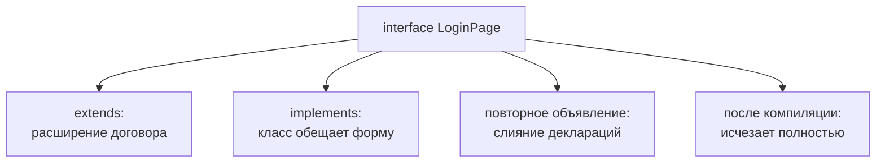

# Интерфейс

## Связь с предыдущей главой

Type alias дал имя объектной форме.

Interface решает похожую задачу, но особенно хорошо подходит для описания публичного объектного договора.

## Главный вопрос

> Как описывать объектный контракт, который будут реализовывать разные части проекта?

Короткий ответ: `interface` описывает форму объекта, которую TypeScript проверяет по свойствам и методам.

## Мотивация

В большом проекте разные части кода должны договориться о публичной форме объекта.

Например, reporter должен иметь метод записи сообщения, а helper не должен знать его внутреннюю реализацию.

Interface описывает такой внешний договор.

## Теория

### Интерфейс описывает форму объекта

```typescript
interface Reporter {
  name: string;
  write(message: string): void;
}
```

Объект подходит под интерфейс, если имеет нужную форму — независимо от того, где и как он создан:

```typescript
const consoleReporter: Reporter = {
  name: 'console',
  write(message: string): void {
    console.log(message);
  },
};
```

### Два способа записать функцию

Функцию внутри интерфейса можно объявить двумя способами, и они **проверяются по-разному**:

```typescript
interface WithMethod { handle(value: string): void }   // метод
interface WithProp   { handle: (value: string) => void }  // свойство-функция
```

Разница проявляется при подстановке функции с более узким параметром:

```typescript
const narrow = (v: 'a') => {};

const m: WithMethod = { handle: narrow };   // допустимо
const p: WithProp   = { handle: narrow };   // ошибка
```

Метод проверяется **биваринатно** — это историческое послабление, нужное для совместимости с массивами и другими встроенными типами. Свойство-функция при включённом `strictFunctionTypes` проверяется строго.

Практический вывод: если нужна строгая проверка параметров колбэка, объявляйте его свойством-функцией.

### `extends` расширяет договор

```typescript
interface Named { name: string }
interface Reporter extends Named {
  write(message: string): void;
}
```

Расширение проверяется сразу: попытка переопределить свойство несовместимым типом даёт ошибку в самом объявлении.

```typescript
interface Base { id: string }
interface Child extends Base { id: number }   // ошибка
```

Это ценное свойство: конфликт обнаруживается там, где он создан, а не там, где тип использован.

### Слияние объявлений

Уникальная способность интерфейса: одно имя можно объявить несколько раз, и объявления **сольются**.

```typescript
interface Box { a: string }
interface Box { b: number }

const box: Box = { a: 'x', b: 1 };   // нужны оба свойства
```

Псевдоним типа так не умеет: повторное объявление имени — ошибка.

Слияние редко нужно в прикладном коде, но оно незаменимо для **дополнения чужих типов**: именно так добавляют поля в типы библиотек, не меняя их исходников.

### `implements` — обещание класса

Класс может объявить, что соответствует договору:

```typescript
class FileReporter implements Reporter {
  name = 'file';
  write(message: string): void { }
}
```

`implements` только проверяет: компилятор убедится, что класс содержит нужные члены. Никакого кода эта конструкция не добавляет и типы в класс не привносит — их всё равно нужно указать.

### Интерфейс исчезает после компиляции

Как и всё в системе типов, интерфейс стирается. Он не создаёт конструктора, его нельзя проверить через `instanceof` и нельзя передать как значение.

Один договор — четыре разных применения:



## Внутренний механизм

Интерфейс существует только на этапе проверки TypeScript.

Во время выполнения остаётся обычный объект JavaScript.

TypeScript сравнивает форму объекта с описанным интерфейсом.

### Слияние объявлений

```ts
interface Config { baseUrl: string }
interface Config { timeout: number }

// дальше Config — это { baseUrl: string; timeout: number }
```

Два объявления с одним именем объединяются в одно. Псевдоним типа так не
умеет — повторное объявление даёт ошибку.

Свойство полезно ровно там, где нужно дополнить чужое описание: типы
фикстур Playwright, глобальные объекты, декларации библиотеки. И оно же опасно
в своём коде: случайное совпадение имён молча создаёт третий тип, которого никто
не писал.

### Расширение проверяется сразу

```ts
interface Base { status: string }
interface Child extends Base { status: number }   // ошибка на объявлении
```

Несовместимое переопределение свойства при наследовании интерфейса обнаруживается
немедленно. Пересечение ведёт себя иначе:

```ts
type Bad = { status: string } & { status: number };   // status: never, молча
```

Ошибки нет — тип поля становится `never`, и невозможность заполнить его
проявится позже, в месте присваивания. Это одна из причин предпочитать
`extends` там, где выражается именно наследование договора.

## Главная ментальная модель

Интерфейс — это публичный договор объекта.

Он говорит: "Мне не важно, как объект устроен внутри, но снаружи у него должны быть эти свойства и методы".

## Практические примеры

Примеры находятся в:

```text
examples/02-typescript/chapter-112/
```

`01-basic-interface.ts` показывает объектную форму.

`02-method-signature.ts` показывает метод в интерфейсе.

`03-extend-interface.ts` показывает расширение интерфейса.

## Automation QA

Интерфейс полезен для вспомогательных функций и отчётности:

```typescript
interface Logger {
  log(message: string): void;
}
```

Любой объект с методом `log` может использоваться там, где ожидается `Logger`.

### Интерфейс как точка подмены

Именно это свойство делает интерфейс удобным в тестах: вспомогательная функция
зависит от интерфейса, а не от конкретной реализации, и в тесте ей можно
передать простую заглушку.

```typescript
interface Logger {
  log(message: string): void;
}

function runStep(name: string, logger: Logger): void {
  logger.log(`шаг: ${name}`);
}

const collected: string[] = [];

runStep('вход', { log: message => collected.push(message) });
```

Заглушка не наследует ничего и не объявляет `implements` — достаточно совпадения
формы. Проверить, что шаг действительно записал сообщение, теперь можно без
настоящего журнала и без чтения файлов.

### Когда интерфейс лучше псевдонима

Для описания объекта оба варианта равноценны. Интерфейс выигрывает там, где
контракт **расширяется**: описание стороннего модуля дополняется слиянием
объявлений, а псевдоним так не умеет. В тестовом проекте это чаще всего
дополнение типов фикстур Playwright.

## Распространённые ошибки

### Ошибка 1. Думать, что интерфейс создаёт класс

Интерфейс не создаёт конструктора во время выполнения.

### Ошибка 2. Описывать детали реализации

Интерфейс должен описывать внешний договор, а не внутренние временные переменные.

### Ошибка 3. Путать описание метода и его вызов

В интерфейсе описывается форма метода, а не его выполнение.

## Распространённые мифы

**Миф: интерфейс создаёт класс или конструктор.**
Он существует только при проверке и полностью исчезает после компиляции.

**Миф: метод и свойство-функция в интерфейсе — одно и то же.**
Метод проверяется биваринатно, свойство-функция — строго. Для колбэков это влияет на найденные ошибки.

**Миф: `implements` добавляет классу типы.**
Он только проверяет соответствие. Типы членов класса нужно указывать самому.

**Миф: повторное объявление интерфейса — ошибка.**
Объявления сливаются. Именно так дополняют типы библиотек.

## Частые вопросы

**Когда объявлять функцию свойством, а не методом?**
Когда важна строгая проверка параметров — например, для обработчиков событий и колбэков.

**Зачем нужно слияние объявлений в реальном проекте?**
Чаще всего для дополнения типов сторонних библиотек: добавить поле в существующий тип, не меняя пакет.

**Можно ли расширять несколько интерфейсов сразу?**
Да, `extends A, B`. Конфликтующие свойства при этом дадут ошибку в объявлении.

**Чем интерфейс лучше объектного псевдонима типа?**
Для описания объекта они почти равнозначны. Интерфейс выигрывает в слиянии и в раннем обнаружении конфликтов при расширении.

## Проверьте себя

1. Чем различаются запись метода и свойства-функции в интерфейсе?
2. Что произойдёт при попытке переопределить свойство несовместимым типом через `extends`?
3. Что такое слияние объявлений и для чего оно нужно на практике?
4. Что именно делает `implements` и чего не делает?
5. Почему `instanceof` нельзя применить к интерфейсу?

### Ответы

1. Запись метода допускает двунаправленную проверку параметров, а свойство-функция проверяется строго. При включённом `strictFunctionTypes` свойство-функция безопаснее.
2. Будет ошибка: расширение обязано быть совместимо с базовым описанием. Сузить тип свойства можно, заменить несовместимым — нет.
3. Несколько объявлений интерфейса с одним именем объединяются в одно. На практике так дополняют типы сторонних библиотек, не меняя их исходники.
4. Проверяет, что класс соответствует описанной форме. Не добавляет классу ни свойств, ни поведения и не существует во время выполнения.
5. Интерфейс стирается при компиляции — во время выполнения его нет, и сравнивать не с чем.

## Практика

Практика находится в:

```text
practice/02-typescript/112-interface.md
```

Решения находятся в:

```text
solutions/02-typescript/112-interface.md
```

## Краткие итоги

Главное:

* интерфейс описывает объектный договор;
* интерфейс исчезает после компиляции;
* объект подходит по форме;
* описания методов задают их форму;
* интерфейс полезен для публичных договоров вспомогательных функций.

## Переход

Теперь у нас есть два инструмента: псевдоним типа и интерфейс.

Дальше нужно понять, когда выбирать один, а когда другой.
