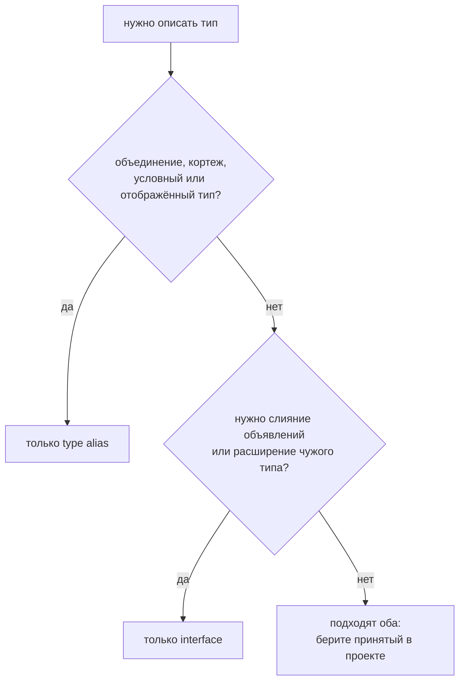

# Interface vs Type Alias

## Связь с предыдущей главой

Мы изучили `type` и `interface`.

Оба инструмента могут описывать объектную форму, поэтому возникает практический вопрос выбора.

## Главный вопрос

> Когда использовать interface, а когда type alias?

Короткий ответ: для объектных публичных договоров часто удобен interface, а для именования разных видов типов и композиций — type alias.

## Мотивация

В команде важно не спорить о стиле в каждом файле.

Нужны простые правила, которые помогают писать единообразный TypeScript.

## Теория

### Оба описывают типы, но умеют разное

Для описания объекта interface и type alias почти взаимозаменяемы. Различия начинаются за пределами этого случая.

### Что умеет только type alias

Alias может назвать **любой** тип, а не только объектную форму:

```typescript
type Status = 'passed' | 'failed';        // объединение
type Handler = (event: string) => void;   // функция
type Pair = [number, string];             // кортеж
type Id = string;                         // примитив
```

Interface так не может: он описывает форму объекта. Объединение литералов — самый частый тип в прикладном коде, и это главный аргумент в пользу alias.

Сюда же относятся вычисляемые типы — сопоставленные и условные, которые разбираются позже.

### Что умеет только interface

**Слияние объявлений.** Одно имя можно объявить несколько раз, и объявления сольются:

```typescript
interface Box { a: string }
interface Box { b: number }   // теперь у Box два свойства
```

Для alias повторное объявление — ошибка «Duplicate identifier».

Это нужно прежде всего для дополнения типов библиотек: добавить поле в чужой тип можно только слиянием.

### `extends` против пересечения при конфликте

Расширить договор можно двумя способами, и ведут они себя по-разному.

```typescript
interface Base { id: string }
interface Child extends Base { id: number }   // ошибка сразу
```

```typescript
type Conflict = { id: string } & { id: number };
// ошибки нет; тип свойства id становится never
```

Разница существенная: `extends` сообщает о конфликте **в месте объявления**, а пересечение молча создаёт тип, значение которого невозможно создать. Ошибка всплывёт позже — при попытке присвоить что-нибудь этому свойству.

Если тип задуман как расширяемый договор, `extends` безопаснее.

### Сообщения об ошибках

При несовпадении компилятор чаще показывает имя интерфейса, а пересечение разворачивает в полную структуру. На маленьких типах разница незаметна, на больших — сообщение может занять экран.

Это не правило выбора, но при прочих равных именованный interface читается в диагностике лучше.

### Практическое правило

Спор «interface или type» бессмысленен как спор о стиле. Рабочий ориентир:

| Что описываем | Чем |
| --- | --- |
| Объединение, функцию, кортеж, примитив | `type` |
| Объектный договор, который будут расширять | `interface` |
| Дополнение чужого типа | `interface` (слияние) |
| Форму данных внутри модуля | Любым — важнее единообразие |

Главное — последовательность в проекте. Смешение обоих инструментов в соседних файлах без причины вредит больше, чем неидеальный выбор.

### Оба исчезают после компиляции

Ни interface, ни alias не существуют во время выполнения. Выбор влияет на выразительность и читаемость, но не на поведение программы.

Выбор определяется задачей, а не вкусом:



## Внутренний механизм

И `interface`, и `type alias` участвуют в проверке TypeScript и исчезают после компиляции.

Разница важна в выразительности и стиле проектирования.

В этом модуле достаточно практического правила, без погружения в будущие темы композиции типов.

## Главная ментальная модель

Interface — публичный объектный договор.

Type alias — имя для типа.

Если это правило помогает читать код, оно уже полезно.

## Практические примеры

Примеры находятся в:

```text
examples/02-typescript/chapter-113/
```

`01-interface-contract.ts` показывает interface для поведения.

`02-type-alias-data.ts` показывает alias для данных.

`03-practical-choice.ts` показывает оба инструмента рядом.

## Automation QA

Для поведения reporter удобно использовать interface:

```typescript
interface Reporter {
  write(message: string): void;
}
```

Для данных login request удобно использовать type alias:

```typescript
type LoginPayload = {
  email: string;
  password: string;
};
```

## Распространённые ошибки

### Ошибка 1. Считать один инструмент всегда правильным

В реальном проекте важнее последовательность и читаемость.

### Ошибка 2. Выбирать инструмент без назначения типа

Сначала нужно понять, что описывается: поведение объекта или форма данных.

### Ошибка 3. Превращать тему в спор о стиле

Цель — поддерживаемый код, а не победа одного синтаксиса над другим.

## Распространённые мифы

**Миф: interface и type alias полностью взаимозаменяемы.**
Для объектов почти да. Alias умеет называть объединения и функции, interface умеет сливаться.

**Миф: `A & B` — то же самое, что `interface C extends A, B`.**
При конфликте свойств `extends` даёт ошибку сразу, а пересечение молча порождает `never`.

**Миф: один из инструментов «правильный».**
Оба нужны. Важнее последовательность в проекте, чем выбор победителя.

**Миф: выбор влияет на скомпилированный код.**
Оба конструкта стираются. Разница только в проверке и читаемости.

## Частые вопросы

**Чем описать статусы: `type` или `interface`?**
Только `type`: объединение литералов интерфейсом не выразить.

**Почему пересечение не сообщило о конфликте?**
Оно создало тип `never` для конфликтного свойства. Ошибка появится позже, при попытке присвоить значение.

**Как добавить поле в тип из библиотеки?**
Слиянием объявлений интерфейса. Alias для этого не подходит.

**Что выбрать для формы данных внутри модуля?**
Любой вариант, лишь бы один и тот же во всём проекте.

## Проверьте себя

1. Какие типы может назвать alias, но не может описать interface?
2. Что умеет interface, чего не умеет alias?
3. Чем отличается поведение `extends` и пересечения при конфликте свойств?
4. Почему конфликт в пересечении обнаруживается позже?
5. Какой критерий выбора важнее любого из перечисленных различий?

## Практика

Практика находится в:

```text
practice/02-typescript/113-interface-vs-type-alias.md
```

Решения находятся в:

```text
solutions/02-typescript/113-interface-vs-type-alias.md
```

## Краткие итоги

Главное:

* interface удобен для объектных договоров;
* type alias дает имя типу;
* оба исчезают после компиляции;
* выбор должен помогать читаемости;
* команда должна придерживаться понятного правила.

## Переход

Мы умеем описывать договоры и давать им имена.

Последний шаг модуля — понять, почему TypeScript сравнивает не имя договора, а структуру объекта.
