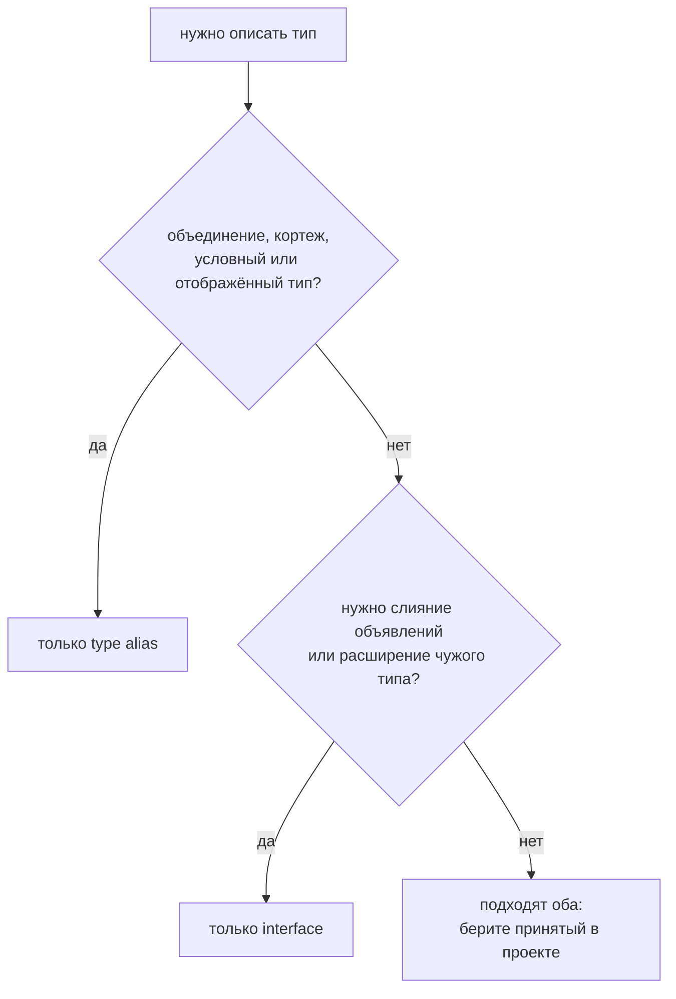

# Интерфейс и псевдоним типа

## Связь с предыдущей главой

Мы изучили `type` и `interface`.

Оба инструмента могут описывать объектную форму, поэтому возникает практический вопрос выбора.

## Главный вопрос

> Когда использовать интерфейс, а когда псевдоним типа?

Короткий ответ: для объектных публичных договоров часто удобен интерфейс, а для именования разных видов типов и композиций — псевдоним.

## Мотивация

В команде важно не спорить о стиле в каждом файле.

Нужны простые правила, которые помогают писать единообразный TypeScript.

## Теория

### Оба описывают типы, но умеют разное

Для описания объекта интерфейс и псевдоним почти взаимозаменяемы. Различия начинаются за пределами этого случая.

### Что умеет только псевдоним

Псевдоним может назвать **любой** тип, а не только объектную форму:

```typescript
type Status = 'passed' | 'failed';        // объединение
type Handler = (event: string) => void;   // функция
type Pair = [number, string];             // кортеж
type Id = string;                         // примитив
```

Интерфейс так не может: он описывает форму объекта. Объединение литералов — самый частый тип в прикладном коде, и это главный аргумент в пользу псевдонима.

Сюда же относятся вычисляемые типы — сопоставленные и условные, которые разбираются позже.

### Что умеет только интерфейс

**Слияние объявлений.** Одно имя можно объявить несколько раз, и объявления сольются:

```typescript
interface Box { a: string }
interface Box { b: number }   // теперь у Box два свойства
```

Для псевдонима повторное объявление — ошибка «повторяющийся идентификатор».

Это нужно прежде всего для дополнения типов библиотек: добавить поле в чужой тип можно только слиянием.

### `extends` против пересечения при конфликте

Расширить договор можно двумя способами, и ведут они себя по-разному.

```typescript
interface Base { id: string }
interface Child extends Base { id: number }   // ошибка сразу
```

```typescript
type Conflict = { id: string } & { id: number };
// ошибки нет; тип свойства id становится never
```

Разница существенная: `extends` сообщает о конфликте **в месте объявления**, а пересечение молча создаёт тип, значение которого невозможно создать. Ошибка всплывёт позже — при попытке присвоить что-нибудь этому свойству.

Если тип задуман как расширяемый договор, `extends` безопаснее.

### Сообщения об ошибках

При несовпадении компилятор чаще показывает имя интерфейса, а пересечение разворачивает в полную структуру. На маленьких типах разница незаметна, на больших — сообщение может занять экран.

Это не правило выбора, но при прочих равных именованный интерфейс читается в диагностике лучше.

### Практическое правило

Спор «интерфейс или псевдоним» бессмысленен как спор о стиле. Рабочий ориентир:

| Что описываем | Чем |
| --- | --- |
| Объединение, функцию, кортеж, примитив | `type` |
| Объектный договор, который будут расширять | `interface` |
| Дополнение чужого типа | `interface` (слияние) |
| Форму данных внутри модуля | Любым — важнее единообразие |

Главное — последовательность в проекте. Смешение обоих инструментов в соседних файлах без причины вредит больше, чем неидеальный выбор.

### Оба исчезают после компиляции

Ни интерфейс, ни псевдоним не существуют во время выполнения. Выбор влияет на выразительность и читаемость, но не на поведение программы.

Выбор определяется задачей, а не вкусом:


```mermaid
flowchart TD
    A["нужно описать тип"] --> B{"объединение, кортеж,<br/>условный или отображённый тип?"}
    B -- "да" --> C["только type alias"]
    B -- "нет" --> D{"нужно слияние объявлений<br/>или расширение чужого типа?"}
    D -- "да" --> E["только interface"]
    D -- "нет" --> F["подходят оба:<br/>берите принятый в проекте"]
```

## Внутренний механизм

И `interface`, и `type alias` участвуют в проверке TypeScript и исчезают после компиляции.

Разница важна в выразительности и стиле проектирования.

В этом модуле достаточно практического правила, без погружения в будущие темы композиции типов.

### Где они действительно различаются

| Возможность | `interface` | `type` |
| --- | --- | --- |
| слияние объявлений | да | нет, повтор — ошибка |
| объединение `\|` | нет | да |
| кортеж, примитив, функция-тип | нет | да |
| `extends` с ранней ошибкой | да | пересечение даёт `never` молча |
| сообщения компилятора | показывает имя | часто разворачивает структуру |

Последняя строка заметна на практике: ошибка про `interface WorkItem` называет
тип по имени, а про сложный псевдоним — печатает его раскрытую форму на десять
строк.

### Практическое правило для тестового проекта

```text
форма объекта, публичный договор слоя   → interface
объединение, кортеж, тип функции        → type
производный тип (Omit, Pick, mapped)    → type
```

Правило не про «что лучше», а про то, какая возможность нужна. Договор, который
чужой код может дополнить (типы фикстур), обязан быть интерфейсом; тип, который
существует как выражение над другими типами, интерфейсом быть не может.

Смешивать их в одном проекте нормально — они участвуют в одной проверке и
одинаково исчезают при компиляции.

## Главная ментальная модель

Интерфейс — публичный объектный договор.

Псевдоним типа — имя для типа.

Если это правило помогает читать код, оно уже полезно.

## Практические примеры

Примеры находятся в:

```text
examples/02-typescript/chapter-113/
```

`01-interface-contract.ts` показывает интерфейс для поведения.

`02-type-alias-data.ts` показывает псевдоним для данных.

`03-practical-choice.ts` показывает оба инструмента рядом.

## Automation QA

Для поведения отчётности удобно использовать интерфейс:

```typescript
interface Reporter {
  write(message: string): void;
}
```

Для данных запроса на вход удобно использовать псевдоним типа:

```typescript
type LoginPayload = {
  email: string;
  password: string;
};
```

### Правило выбора для тестового проекта

Разница между ними в повседневной работе почти исчезает, поэтому полезно
договориться заранее, а не решать каждый раз.

| Что описываем | Чем |
| --- | --- |
| поведение, которое кто-то реализует | интерфейс |
| данные: тело запроса, ответ, запись отчёта | псевдоним типа |
| объединение, пересечение, кортеж, условный тип | псевдоним типа (интерфейс так не умеет) |
| расширение чужих типов — фикстур Playwright, `ProcessEnv` | интерфейс (сливается с существующим) |

Последняя строка — единственное место, где выбор не стилистический:
слияние объявлений работает только у интерфейсов.

### Почему это важнее договорённости о стиле

Смешение приводит к попытке «расширить» псевдоним и к переписыванию модели
данных в интерфейс ради одного объединения. Обе правки дешёвые по отдельности,
но они расходятся по проекту, и через полгода одна и та же сущность описана
двумя способами в разных слоях.

## Распространённые ошибки

### Ошибка 1. Считать один инструмент всегда правильным

В реальном проекте важнее последовательность и читаемость.

### Ошибка 2. Выбирать инструмент без назначения типа

Сначала нужно понять, что описывается: поведение объекта или форма данных.

### Ошибка 3. Превращать тему в спор о стиле

Цель — поддерживаемый код, а не победа одного синтаксиса над другим.

## Распространённые мифы

**Миф: интерфейс и псевдоним полностью взаимозаменяемы.**
Для объектов почти да. Псевдоним умеет называть объединения и функции, интерфейс умеет сливаться.

**Миф: `A & B` — то же самое, что `interface C extends A, B`.**
При конфликте свойств `extends` даёт ошибку сразу, а пересечение молча порождает `never`.

**Миф: один из инструментов «правильный».**
Оба нужны. Важнее последовательность в проекте, чем выбор победителя.

**Миф: выбор влияет на скомпилированный код.**
Оба конструкта стираются. Разница только в проверке и читаемости.

## Частые вопросы

**Чем описать статусы: `type` или `interface`?**
Только `type`: объединение литералов интерфейсом не выразить.

**Почему пересечение не сообщило о конфликте?**
Оно создало тип `never` для конфликтного свойства. Ошибка появится позже, при попытке присвоить значение.

**Как добавить поле в тип из библиотеки?**
Слиянием объявлений интерфейса. Псевдоним для этого не подходит.

**Что выбрать для формы данных внутри модуля?**
Любой вариант, лишь бы один и тот же во всём проекте.

## Проверьте себя

1. Какие типы может назвать псевдоним, но не может описать интерфейс?
2. Что умеет интерфейс, чего не умеет псевдоним?
3. Чем отличается поведение `extends` и пересечения при конфликте свойств?
4. Почему конфликт в пересечении обнаруживается позже?
5. Какой критерий выбора важнее любого из перечисленных различий?

### Ответы

1. Объединения, кортежи, условные и отображённые типы, а также имена для примитивов.
2. Объединение одноимённых объявлений и более понятные сообщения об ошибках при расширении через `extends`.
3. `extends` требует совместимости и сообщает об ошибке сразу, в месте объявления. Пересечение конфликтующих свойств даёт тип `never` для такого свойства и молчит.
4. Потому что само пересечение создаётся без ошибки. Проблема всплывает при попытке присвоить значение свойству типа `never` — обычно далеко от объявления.
5. Единообразие в проекте. Оба средства покрывают почти все задачи, и разнобой в файлах вредит больше, чем любой из перечисленных нюансов.

## Практика

Практика находится в:

```text
practice/02-typescript/113-interface-vs-type-alias.md
```

Решения находятся в:

```text
solutions/02-typescript/113-interface-vs-type-alias.md
```

## Краткие итоги

Главное:

* интерфейс удобен для объектных договоров;
* псевдоним типа даёт имя типу;
* оба исчезают после компиляции;
* выбор должен помогать читаемости;
* команда должна придерживаться понятного правила.

## Переход

Мы умеем описывать договоры и давать им имена.

Последний шаг модуля — понять, почему TypeScript сравнивает не имя договора, а структуру объекта.
