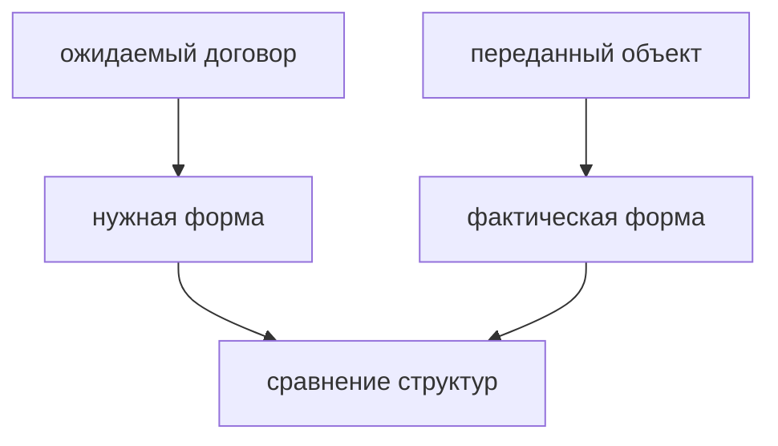

# Structural Typing

## Связь с предыдущей главой

Предыдущие главы показали object types, type aliases и interfaces.

Теперь нужно понять, как TypeScript решает, совместимы ли два объекта.

## Главный вопрос

> Почему TypeScript сравнивает структуру, а не имя типа?

Короткий ответ: TypeScript использует structural typing: объект совместим с договором, если имеет нужную форму.

## Мотивация

JavaScript работает с объектами по их свойствам.

Если объект имеет нужный метод, код может его вызвать.

TypeScript сохраняет эту JavaScript-идею, но проверяет форму заранее.

## Теория

Два разных типа могут быть совместимы, если их структура совпадает:

```typescript
interface Logger {
  log(message: string): void;
}

const consoleLike = {
  log(message: string): void {
    console.log(message);
  },
};

const logger: Logger = consoleLike;
```

Имя `consoleLike` не важно.

Важна форма объекта.

## Внутренний механизм

TypeScript сравнивает свойства и методы.

Если ожидается `Logger`, объект должен иметь совместимый метод `log`.

Для свежих object literals TypeScript также внимательнее проверяет лишние свойства, чтобы поймать вероятные ошибки при создании объекта.

Важно: это не означает, что TypeScript использует exact object types.

Если объект сначала сохранен в переменную, а потом присваивается более узкому договору, лишние свойства сами по себе не делают присваивание ошибочным:

```typescript
type User = {
  id: number;
};

const source = {
  id: 1,
  name: 'Vlad',
};

const user: User = source;
```

TypeScript проверяет, что у `source` есть все свойства, нужные для `User`. Дополнительное свойство `name` остается частью исходного объекта, но не мешает совместимости по структуре.

## Главная ментальная модель



Structural typing — это проверка формы, а не имени.

## Практические примеры

Примеры находятся в:

```text
examples/02-typescript/chapter-114/
```

`01-shape-compatibility.ts` показывает совместимость по форме.

`02-extra-properties.ts` показывает разницу между свежим object literal и присваиванием через переменную.

`03-module-like-objects.ts` показывает объекты из разных частей проекта.

## Automation QA

Если helper ожидает `Logger`, ему не важно, из какого файла пришел объект.

Важно, чтобы у объекта был метод `log(message: string): void`.

Так можно заменять реализации, сохраняя общий договор.

## Распространённые ошибки

### Ошибка 1. Ожидать сравнение по имени типа

TypeScript сравнивает структуру, а не название.

### Ошибка 2. Считать excess property checking универсальным запретом

Лишнее свойство в свежем object literal часто означает опечатку или неверную форму данных.

Но TypeScript не запрещает объекту иметь дополнительные свойства во всех ситуациях.

### Ошибка 3. Думать, что structural typing проверяет runtime-объекты из сети

TypeScript проверяет код, но внешние данные требуют runtime-проверок.

## Практика

Практика находится в:

```text
practice/02-typescript/114-structural-typing.md
```

Решения находятся в:

```text
solutions/02-typescript/114-structural-typing.md
```

## Краткие итоги

Главное:

* TypeScript использует structural typing;
* важна форма объекта, а не имя типа;
* свойства и методы должны быть совместимы;
* свежие object literals проверяются особенно внимательно;
* TypeScript не использует exact object types;
* structural typing хорошо соответствует JavaScript-модели объектов.

## Переход

Модуль объектных контрактов завершен.

Дальше TypeScript начнет использовать значения как типы и собирать более точные состояния из уже известных строительных блоков.
