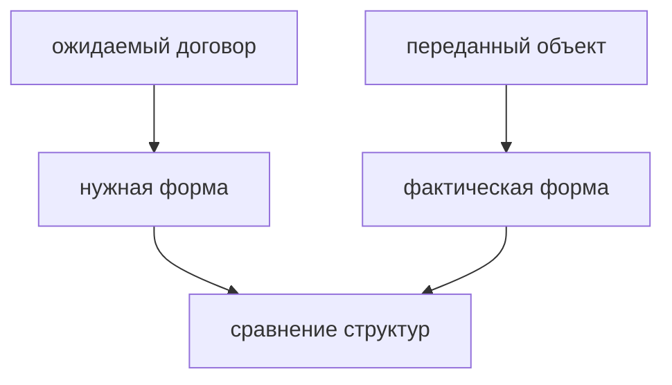

# Structural Typing

## Связь с предыдущей главой

Предыдущие главы показали object types, type aliases и interfaces.

Теперь нужно понять, как TypeScript решает, совместимы ли два объекта.

## Главный вопрос

> Почему TypeScript сравнивает структуру, а не имя типа?

Короткий ответ: TypeScript использует structural typing: объект совместим с договором, если имеет нужную форму.

## Мотивация

JavaScript работает с объектами по их свойствам.

Если объект имеет нужный метод, код может его вызвать.

TypeScript сохраняет эту JavaScript-идею, но проверяет форму заранее.

## Теория

### Совместимость по форме, а не по имени

Два типа совместимы, если совпадает их структура:

```typescript
interface Logger {
  log(message: string): void;
}

const consoleLike = {
  log(message: string): void {
    console.log(message);
  },
};

const logger: Logger = consoleLike;
```

Имя `consoleLike` не играет роли. Объект не объявлял, что реализует `Logger`, и всё равно подходит.

Это отличает TypeScript от языков с номинальной типизацией, где совместимость требует явного наследования или объявления.

### Направление совместимости

Правило звучит парадоксально, но логично: **объект с бо́льшим числом свойств подходит туда, где требуется меньше**.

```typescript
type User = { id: number };

const source = { id: 1, name: 'Vlad' };
const user: User = source;   // допустимо
```

Функция, принимающая `User`, обратится только к `id`. Лишнее свойство ей не мешает. Обратное неверно: объект без `id` не подойдёт.

### Исключение для литералов

Если бы правило работало всегда, опечатки проходили бы незамеченными. Поэтому для объектных литералов на месте присваивания действует дополнительная проверка:

```typescript
const direct: User = { id: 1, name: 'Vlad' };   // ошибка: лишнее свойство
```

Логика такая: литерал создаётся прямо здесь и нигде больше не используется, значит лишнее свойство почти наверняка означает опечатку или неверное представление о форме.

Важно: это **не** означает, что TypeScript поддерживает точные типы объектов. Через переменную тот же объект пройдёт.

### Функции сравниваются по сигнатуре

Структурная совместимость распространяется и на функции. Ключевое правило: **функция с меньшим числом параметров подходит туда, где ожидается функция с бо́льшим**.

```typescript
const codes = [1, 2, 3];

codes.map((value) => value * 2);            // индекс и массив не нужны
codes.map((value, index) => value + index); // а здесь нужны
```

`map` передаёт три аргумента, но колбэк вправе принять один. Лишние аргументы просто игнорируются — это поведение JavaScript, и система типов ему не мешает.

### Риск случайного совпадения формы

У структурной проверки есть обратная сторона: типы, совпадающие по форме, взаимозаменяемы, даже если по смыслу совершенно разные.

```typescript
type UserId = { value: string };
type OrderId = { value: string };

const orderId: OrderId = { value: 'o-1' };
const userId: UserId = orderId;   // допустимо, хотя это ошибка по смыслу
```

Компилятор не может знать, что смешивать их нельзя: он видит одинаковую форму.

### Номинальность через метку

Когда смешение недопустимо, различие добавляют искусственно — полем-меткой, которого нет во время выполнения:

```typescript
type UserId = string & { readonly __brand: 'UserId' };
type OrderId = string & { readonly __brand: 'OrderId' };
```

Такие типы называют branded. Значения создаются через функцию-конструктор с проверкой, а компилятор перестаёт считать их взаимозаменяемыми. Приём не бесплатный — он добавляет церемоний, — поэтому его применяют точечно: к идентификаторам, денежным суммам, единицам измерения.

## Внутренний механизм

TypeScript сравнивает свойства и методы.

Если ожидается `Logger`, объект должен иметь совместимый метод `log`.

Для свежих object literals TypeScript также внимательнее проверяет лишние свойства, чтобы поймать вероятные ошибки при создании объекта.

Важно: это не означает, что TypeScript использует exact object types.

Если объект сначала сохранен в переменную, а потом присваивается более узкому договору, лишние свойства сами по себе не делают присваивание ошибочным:

```typescript
type User = {
  id: number;
};

const source = {
  id: 1,
  name: 'Vlad',
};

const user: User = source;
```

TypeScript проверяет, что у `source` есть все свойства, нужные для `User`. Дополнительное свойство `name` остается частью исходного объекта, но не мешает совместимости по структуре.

## Главная ментальная модель



Structural typing — это проверка формы, а не имени.

## Практические примеры

Примеры находятся в:

```text
examples/02-typescript/chapter-114/
```

`01-shape-compatibility.ts` показывает совместимость по форме.

`02-extra-properties.ts` показывает разницу между свежим object literal и присваиванием через переменную.

`03-module-like-objects.ts` показывает объекты из разных частей проекта.

## Automation QA

Если helper ожидает `Logger`, ему не важно, из какого файла пришел объект.

Важно, чтобы у объекта был метод `log(message: string): void`.

Так можно заменять реализации, сохраняя общий договор.

## Распространённые ошибки

### Ошибка 1. Ожидать сравнение по имени типа

TypeScript сравнивает структуру, а не название.

### Ошибка 2. Считать excess property checking универсальным запретом

Лишнее свойство в свежем object literal часто означает опечатку или неверную форму данных.

Но TypeScript не запрещает объекту иметь дополнительные свойства во всех ситуациях.

### Ошибка 3. Думать, что structural typing проверяет runtime-объекты из сети

TypeScript проверяет код, но внешние данные требуют runtime-проверок.

## Распространённые мифы

**Миф: объект с лишними свойствами не подойдёт под более узкий тип.**
Подойдёт, если приходит через переменную. Запрет действует только для литералов.

**Миф: проверка на лишние свойства означает точные типы объектов.**
Нет. Это отдельная эвристика для литералов, а не свойство системы типов.

**Миф: колбэк обязан принимать все аргументы.**
Функция с меньшим числом параметров совместима. Именно поэтому работает `map(x => ...)`.

**Миф: если типы называются по-разному, они несовместимы.**
Совместимость определяется формой. Одинаковые по структуре типы взаимозаменяемы.

## Частые вопросы

**Почему литерал с опечаткой в имени поля даёт ошибку, а переменная — нет?**
Проверка на лишние свойства применяется к литералам: там лишнее поле почти всегда опечатка.

**Как запретить смешивание двух одинаковых по форме типов?**
Добавить метку — приём branded types. Он работает только на уровне проверки и требует функции-конструктора.

**Почему функция с одним параметром подходит вместо функции с тремя?**
Так устроен JavaScript: лишние аргументы игнорируются. Система типов это отражает.

**Нужно ли объявлять `implements`, чтобы объект подошёл под interface?**
Нет. Достаточно совпадения формы. `implements` нужен для проверки класса при его объявлении.

## Проверьте себя

1. Что сравнивает TypeScript при проверке совместимости?
2. Почему объект с лишними свойствами подходит туда, где нужно меньше?
3. В каком случае лишнее свойство всё же вызывает ошибку и почему?
4. Почему `codes.map(value => value * 2)` компилируется, хотя `map` передаёт три аргумента?
5. Как добиться того, чтобы `UserId` и `OrderId` перестали быть взаимозаменяемыми?

## Практика

Практика находится в:

```text
practice/02-typescript/114-structural-typing.md
```

Решения находятся в:

```text
solutions/02-typescript/114-structural-typing.md
```

## Краткие итоги

Главное:

* TypeScript использует structural typing;
* важна форма объекта, а не имя типа;
* свойства и методы должны быть совместимы;
* свежие object literals проверяются особенно внимательно;
* TypeScript не использует exact object types;
* structural typing хорошо соответствует JavaScript-модели объектов.

## Переход

Модуль объектных контрактов завершен.

Дальше TypeScript начнет использовать значения как типы и собирать более точные состояния из уже известных строительных блоков.
