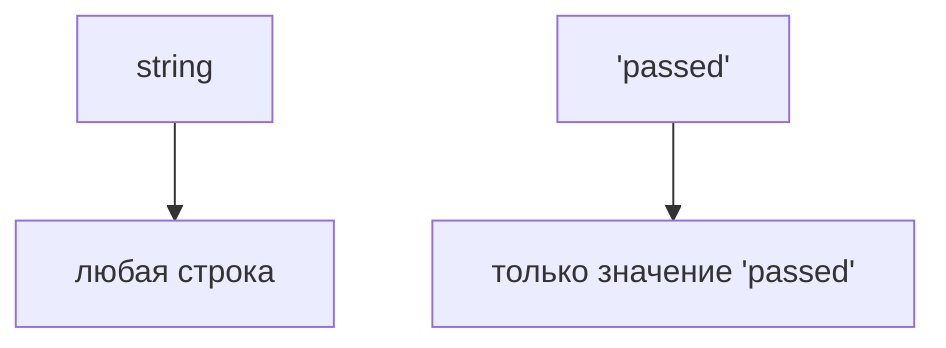

# Literal Types

## Связь с предыдущей главой

Предыдущий модуль показал, как описывать объектные контракты.

Теперь мы начнем точнее описывать не только форму объекта, но и конкретные допустимые значения.

## Главный вопрос

> Как разрешить только конкретные значения?

Короткий ответ: литеральный тип описывает не весь `string`, `number` или `boolean`, а одно конкретное значение.

## Мотивация

В JavaScript строка `'passed'` и строка `'unknown'` имеют один общий тип значения — строка.

Но для тестового статуса часто допустимы только конкретные значения.

TypeScript позволяет превратить такие значения в контракт на этапе проверки.

## Теория

Обычная аннотация `string` разрешает любую строку:

```typescript
const status: string = 'passed';
```

Литеральный тип разрешает только конкретное значение:

```typescript
const status: 'passed' = 'passed';
```

Для чисел и boolean работает та же идея:

```typescript
const retryCount: 3 = 3;
const isCritical: true = true;
```

Литеральный тип может появиться и через вывод типа:

```typescript
const mode = 'test';
let mutableMode = 'test';
```

Для простой `const`-переменной TypeScript сохраняет тип `'test'`, потому что переменную нельзя переназначить. Для `let` значение обычно расширяется до `string`, потому что позже в переменную можно записать другую строку.



## Внутренний механизм

Литеральный тип существует только на этапе проверки TypeScript.

Во время выполнения значение остается обычной строкой, числом или boolean.

TypeScript просто не позволит присвоить значение, которое не входит в описанный контракт.

Важно: обычная `const`-переменная и обычный `const`-объект ведут себя по-разному. `const mode = 'test'` сохраняет точный тип переменной, но `const config = { mode: 'test' }` не делает свойство `mode` readonly и не обязан сохранять его как точный литеральный тип. Для таких случаев следующая глава вводит `as const`.

## Главная ментальная модель

Литеральный тип — это точная метка на значении.

`string` говорит: "подойдет любая строка".

`'staging'` говорит: "подойдет только строка staging".

## Практические примеры

Примеры находятся в:

```text
examples/02-typescript/chapter-115/
```

`01-string-literal.ts` показывает строковый литеральный тип.

`02-number-boolean-literals.ts` показывает числовой и boolean литеральные типы.

`03-environment-name.ts` показывает название окружения.

## Automation QA

Литеральные типы полезны для статусов, окружений и режимов запуска:

```typescript
const environment: 'staging' = 'staging';
const status: 'passed' = 'passed';
```

Так код явно показывает, какие значения считаются допустимыми в конкретном месте.

## Распространённые ошибки

### Ошибка 1. Путать `string` и конкретную строку

`string` шире, чем `'passed'`.

### Ошибка 2. Ожидать проверку во время выполнения

Литеральный тип не проверяет внешние данные во время выполнения.

### Ошибка 3. Использовать литеральный тип там, где значение должно быть свободным

Если допустима любая строка, точный литеральный тип только мешает.

## Практика

Практика находится в:

```text
practice/02-typescript/115-literal-types.md
```

Решения находятся в:

```text
solutions/02-typescript/115-literal-types.md
```

## Краткие итоги

Главное:

* литеральный тип описывает конкретное значение;
* `string` шире, чем строковый литеральный тип;
* литеральные типы работают на этапе проверки;
* значения во время выполнения остаются обычными JavaScript-значениями;
* точные значения полезны для статусов и окружений.

## Переход

Теперь мы умеем описывать конкретные значения.

Дальше разберем, как сохранить такие точные типы в объектах и tuple без ручного повторения.
