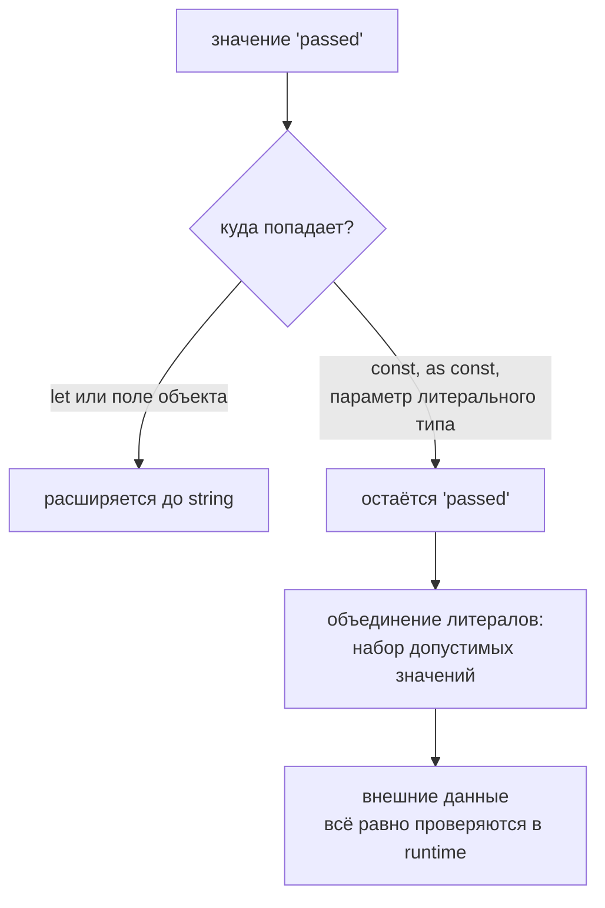

# Литеральные типы

## Связь с предыдущей главой

Предыдущий модуль показал, как описывать объектные контракты.

Теперь мы начнем точнее описывать не только форму объекта, но и конкретные допустимые значения.

## Главный вопрос

> Как разрешить только конкретные значения?

Короткий ответ: литеральный тип описывает не весь `string`, `number` или `boolean`, а одно конкретное значение.

## Мотивация

В JavaScript строка `'passed'` и строка `'unknown'` имеют один общий тип значения — строка.

Но для тестового статуса часто допустимы только конкретные значения.

TypeScript позволяет превратить такие значения в контракт на этапе проверки.

## Теория

### Литерал как тип

Обычная аннотация допускает любое значение своего вида:

```typescript
const status: string = 'passed';
```

Литеральный тип допускает **ровно одно** значение:

```typescript
const status: 'passed' = 'passed';
```

Для чисел и логических значений работает та же идея:

```typescript
const retryCount: 3 = 3;
const isCritical: true = true;
```

### Расширение типа и как его остановить

Литеральный тип часто появляется сам, но легко теряется.

```typescript
const mode = 'test';        // тип: 'test'
let mutableMode = 'test';   // тип: string
```

Для `const` компилятор сохраняет точный тип: переменную нельзя переприсвоить. Для `let` тип расширяется, потому что позже значение может измениться.

Со свойствами объекта расширение происходит даже при `const`:

```typescript
const config = { mode: 'test' };   // mode: string, а не 'test'
```

Причина та же: свойство объекта изменяемо, значит точный тип не гарантирован. Остановить расширение позволяет `as const` — тема следующей главы.

### Настоящая польза появляется в объединении

Сам по себе тип `'passed'` почти бесполезен: он допускает единственное значение, которое и так известно.

Ценность появляется, когда литералы объединяются:

```typescript
type Status = 'passed' | 'failed' | 'skipped';
```

Теперь компилятор ловит опечатки, подсказывает допустимые значения при вводе и — вместе с сужением — позволяет разобрать все варианты с проверкой полноты. Подробно объединения разбираются в главе 118.

Именно в таком виде литеральные типы и встречаются в реальном коде: статусы, роли, окружения, методы HTTP.

### Литерал в параметре функции

Сравните два варианта одной функции:

```typescript
function runOn(environment: string) { }
function runOn(environment: 'local' | 'staging' | 'production') { }
```

Первая примет `'stagng'` с опечаткой и упадёт во время выполнения. Вторая не скомпилируется.

Это самый дешёвый способ превратить договорённость «сюда передают одно из трёх» в проверяемое правило.

### Литеральный тип не проверяет внешние данные

Как и всё в системе типов, литерал стирается. Если строка пришла из переменной окружения или ответа API, её реальное значение компилятору неизвестно:

```typescript
const env = process.env.ENVIRONMENT as 'local' | 'staging';
```

Такое утверждение ничего не проверяет. Значение нужно проверить во время выполнения — например, поиском в списке допустимых.

### Когда литерал мешает

Если значение действительно свободно — имя теста, текст сообщения, идентификатор — литеральный тип только создаёт неудобства. Он уместен там, где множество допустимых значений конечно и известно заранее.

Литеральный тип сохраняется не везде:


```mermaid
flowchart TD
    A["значение 'passed'"] --> B{"куда попадает?"}
    B -- "let или поле объекта" --> C["расширяется до string"]
    B -- "const, as const,<br/>параметр литерального типа" --> D["остаётся 'passed'"]
    D --> E["объединение литералов:<br/>набор допустимых значений"]
    E --> F["внешние данные<br/>всё равно проверяются в runtime"]
```

## Внутренний механизм

Литеральный тип существует только на этапе проверки TypeScript.

Во время выполнения значение остаётся обычной строкой, числом или булевым значением.

TypeScript просто не позволит присвоить значение, которое не входит в описанный контракт.

Важно: обычная переменная `const` и обычный объект в `const` ведут себя по-разному. `const mode = 'test'` сохраняет точный тип переменной, но `const config = { mode: 'test' }` не делает свойство `mode` неизменяемым и не обязан сохранять его как точный литеральный тип. Для таких случаев следующая глава вводит `as const`.

### Литерал сохраняется или расширяется

```ts
const mode = "smoke";          // тип "smoke"
let   mode2 = "smoke";         // тип string — расширен

const config = { mode: "smoke" };   // тип { mode: string } — тоже расширен
```

Правило одно: значение, которое можно переприсвоить, получает широкий тип.
Свойство объекта изменяемо, поэтому литерал в нём не сохраняется — даже если сам
объект объявлен через `const`.

Отсюда частая ошибка: объект конфигурации, переданный в функцию, ожидающую
`"smoke" | "regression"`, не подходит, хотя значение верное.

| Что нужно | Чем достигается |
| --- | --- |
| сохранить литерал в свойстве | `as const` |
| принять литерал в параметре | параметр типа с модификатором `const` |
| перечислить допустимые значения | объединение литералов |

### Объединение литералов против `enum`

```ts
type Status = "NEW" | "IN_PROGRESS" | "DONE";   // исчезает при компиляции
enum  Status2 { New, InProgress, Done }          // остаётся объектом в JS
```

Для тестов обычно нужен первый вариант: значения приходят из ответа сервиса
строками, и объединение литералов описывает их напрямую. Числовой `enum`
номинален — строка `"NEW"` в него не подойдёт, и потребуется преобразование.

## Главная ментальная модель

Литеральный тип — это точная метка на значении.

`string` говорит: "подойдет любая строка".

`'staging'` говорит: «подойдёт только строка `staging`».

## Практические примеры

Примеры находятся в:

```text
examples/02-typescript/chapter-115/
```

`01-string-literal.ts` показывает строковый литеральный тип.

`02-number-boolean-literals.ts` показывает числовой и булев литеральные типы.

`03-environment-name.ts` показывает название окружения.

## Automation QA

Литеральные типы полезны для статусов, окружений и режимов запуска:

```typescript
const environment: 'staging' = 'staging';
const status: 'passed' = 'passed';
```

Так код явно показывает, какие значения считаются допустимыми в конкретном месте.

### Литералы делают опечатку ошибкой компиляции

Сами по себе литеральные типы полезны в объединении: они превращают набор
допустимых строк в контракт, который проверяется до запуска.

```typescript
type Environment = 'local' | 'preview' | 'ci';

function baseUrl(environment: Environment): string {
  switch (environment) {
    case 'local':   return 'http://127.0.0.1:4310';
    case 'preview': return 'https://preview.example.test';
    case 'ci':      return 'https://ci.example.test';
  }
}
```

`baseUrl('stagingg')` не скомпилируется. Без литеральных типов такая опечатка
дошла бы до запуска и дала невнятную ошибку соединения.

### Граница: строка из окружения остаётся строкой

Значение переменной окружения имеет тип `string | undefined`, и литеральный
тип на него не распространяется. Между внешним значением и типом нужна
проверка во время выполнения — та самая, что разбирается в главе 218.

## Распространённые ошибки

### Ошибка 1. Путать `string` и конкретную строку

`string` шире, чем `'passed'`.

### Ошибка 2. Ожидать проверку во время выполнения

Литеральный тип не проверяет внешние данные во время выполнения.

### Ошибка 3. Использовать литеральный тип там, где значение должно быть свободным

Если допустима любая строка, точный литеральный тип только мешает.

## Распространённые мифы

**Миф: `const` всегда сохраняет литеральный тип.**
Для переменной — да, для свойства объекта — нет: свойство изменяемо, поэтому тип расширяется.

**Миф: литеральный тип проверяет значение во время выполнения.**
Он стирается вместе с остальными типами. Внешние значения нужно проверять отдельно.

**Миф: один литеральный тип уже полезен.**
Польза появляется в объединении: тогда компилятор ловит опечатки и помогает разобрать варианты.

**Миф: `as 'local' | 'staging'` гарантирует, что значение одно из двух.**
Утверждение ничего не проверяет. Реальное значение может быть любым.

## Частые вопросы

**Почему `config.mode` получил тип `string`, хотя объект объявлен через `const`?**
`const` запрещает переприсваивать переменную, но свойство объекта изменяемо. Нужен `as const`.

**Когда использовать объединение литералов вместо `string`?**
Когда множество значений конечно и известно: статусы, окружения, роли, методы. Это превращает договорённость в проверку.

**Как безопасно получить литеральный тип из переменной окружения?**
Проверить значение во время выполнения — например, поиском в массиве допустимых — и только после этого сузить тип.

**Не будет ли объединение литералов мешать при расширении списка?**
Наоборот: при добавлении значения компилятор покажет все места, которые нужно обновить.

## Проверьте себя

1. Чем `const status: string = 'passed'` отличается от `const status: 'passed' = 'passed'`?
2. Почему `let` расширяет литеральный тип, а `const` — нет?
3. Почему свойство объекта расширяется даже при `const`?
4. В каком случае литеральный тип становится по-настоящему полезным?
5. Что на самом деле делает `as 'local' | 'staging'` для значения из окружения?

### Ответы

1. В первом случае тип расширен до `string`, и любое строковое значение допустимо. Во втором допустимо ровно значение `'passed'`.
2. `let` может быть переприсвоена, поэтому вывод расширяет тип до общего. `const` переприсвоить нельзя, и точный литеральный тип остаётся верным всё время.
3. Свойства объекта изменяемы независимо от того, как объявлена переменная. Поэтому вывод расширяет их типы; сохранить литеральные помогает `as const`.
4. В объединении: перечень допустимых значений превращает опечатку и неверный вариант в ошибку компиляции.
5. Утверждает то, что не проверено. Переменная окружения — обычная строка, и в ней может оказаться что угодно; приведение лишь скрывает это от компилятора.

## Практика

Практика находится в:

```text
practice/02-typescript/115-literal-types.md
```

Решения находятся в:

```text
solutions/02-typescript/115-literal-types.md
```

## Краткие итоги

Главное:

* литеральный тип описывает конкретное значение;
* `string` шире, чем строковый литеральный тип;
* литеральные типы работают на этапе проверки;
* значения во время выполнения остаются обычными JavaScript-значениями;
* точные значения полезны для статусов и окружений.

## Переход

Теперь мы умеем описывать конкретные значения.

Дальше разберём, как сохранить такие точные типы в объектах и кортежах без ручного повторения.
