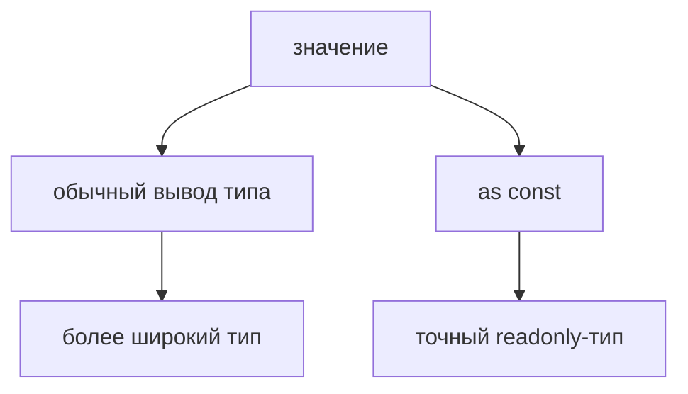

# as const

## Связь с предыдущей главой

Литеральные типы позволяют описывать конкретные значения.

Но TypeScript не всегда сохраняет максимально точный тип сам, особенно внутри объектов и массивов.

## Главный вопрос

> Как сохранить максимально точные типы значений?

Короткий ответ: `as const` просит TypeScript сохранить литеральные типы и сделать структуру readonly на этапе проверки.

## Мотивация

В QA-проекте часто есть набор постоянных окружений, статусов или режимов запуска.

Если TypeScript расширяет `'staging'` до `string`, часть полезной информации теряется.

`as const` помогает сохранить точные значения как часть типа.

## Теория

Без `as const` свойство объекта часто получает широкий тип:

```typescript
const config = {
  environment: 'staging',
};
```

С `as const` TypeScript сохраняет конкретное значение:

```typescript
const config = {
  environment: 'staging',
} as const;
```

Для tuple `as const` фиксирует порядок, длину и значения:

```typescript
const statusOrder = ['passed', 'failed'] as const;
```



## Внутренний механизм

`as const` влияет на TypeScript-проверку.

Он не вызывает `Object.freeze` и не создает защиту во время выполнения.

TypeScript начинает видеть свойства как readonly и сохраняет литеральные типы там, где обычно вывел бы более широкий тип.

Если внутри такого литерального выражения есть вложенные объекты или массивы, TypeScript тоже сохраняет для них более точные readonly-типы. Это все равно только ограничение на этапе проверки: `as const` не выполняет глубокую заморозку во время выполнения.

## Главная ментальная модель

`as const` — это команда компилятору: "не расширяй это значение".

Значение во время выполнения остается тем же, но TypeScript хранит о нем больше точной информации.

## Практические примеры

Примеры находятся в:

```text
examples/02-typescript/chapter-116/
```

`01-literal-inference.ts` показывает сохранение точного значения.

`02-readonly-object.ts` показывает readonly-свойства.

`03-readonly-tuple.ts` показывает readonly tuple.

## Automation QA

`as const` полезен для констант окружений:

```typescript
const environments = ['local', 'staging', 'production'] as const;
```

Так TypeScript сохраняет конкретные значения, а не просто массив строк.

## Распространённые ошибки

### Ошибка 1. Считать `as const` заморозкой во время выполнения

Это TypeScript-механизм, а не JavaScript-защита объекта.

### Ошибка 2. Использовать `as const` для изменяемых данных

Если данные должны изменяться, readonly-тип будет мешать.

### Ошибка 3. Путать `const` и `as const`

`const` запрещает переназначение переменной, а `as const` уточняет тип значения.

## Практика

Практика находится в:

```text
practice/02-typescript/116-as-const.md
```

Решения находятся в:

```text
solutions/02-typescript/116-as-const.md
```

## Краткие итоги

Главное:

* `as const` сохраняет литеральные типы;
* объектные свойства становятся readonly на этапе проверки;
* массив может стать readonly tuple;
* значение во время выполнения не замораживается автоматически;
* механизм полезен для стабильных наборов значений.

## Переход

Теперь мы умеем фиксировать конкретные значения.

Следующая глава показывает другой способ описывать ограниченные наборы значений — `enum`.
