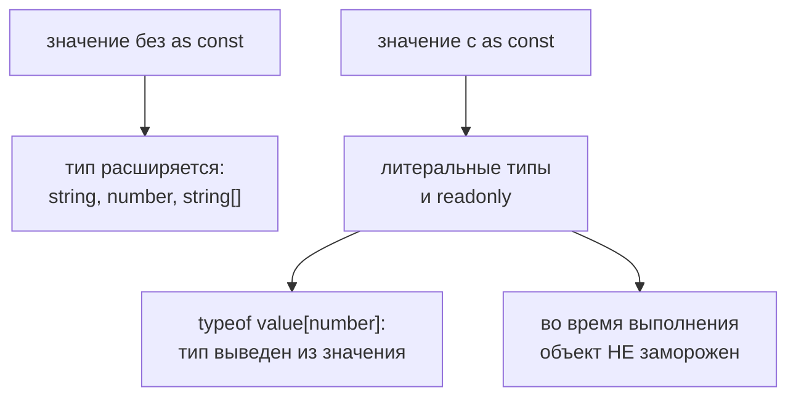

# Утверждение `as const`

## Связь с предыдущей главой

Литеральные типы позволяют описывать конкретные значения.

Но TypeScript не всегда сохраняет максимально точный тип сам, особенно внутри объектов и массивов.

## Главный вопрос

> Как сохранить максимально точные типы значений?

Короткий ответ: `as const` просит TypeScript сохранить литеральные типы и сделать структуру неизменяемой на этапе проверки.

## Мотивация

В QA-проекте часто есть набор постоянных окружений, статусов или режимов запуска.

Если TypeScript расширяет `'staging'` до `string`, часть полезной информации теряется.

`as const` помогает сохранить точные значения как часть типа.

## Теория

### Что делает `as const`

`as const` запрещает компилятору расширять тип выражения.

Без него свойство получает широкий тип:

```typescript
const config = { environment: 'staging' };   // environment: string
```

С ним сохраняется точное значение:

```typescript
const config = { environment: 'staging' } as const;   // environment: 'staging'
```

Одновременно все свойства становятся `readonly`.

### Объекты, массивы и вложенность

Для массива `as const` фиксирует не только значения, но и длину с порядком — получается неизменяемый кортеж:

```typescript
const statusOrder = ['passed', 'failed'] as const;
// readonly ['passed', 'failed']
```

Действие распространяется вглубь: вложенные объекты и массивы тоже получают точные неизменяемые типы. Отдельно помечать их не нужно.

### Главный приём: тип из значения

Самое полезное применение — вывести тип из уже существующих данных, не дублируя их.

```typescript
const environments = ['local', 'staging', 'production'] as const;

type Environment = typeof environments[number];
// 'local' | 'staging' | 'production'
```

Читается так: `typeof environments` — тип массива, `[number]` — тип элемента по любому числовому индексу, то есть объединение всех элементов.

Ценность в том, что **список существует в одном месте**. Массив можно перебрать во время выполнения, а тип получается из него автоматически. Добавили окружение в массив — объединение расширилось само, и компилятор указал на места, которые нужно обновить.

Без `as const` этот приём не работает: тип элемента был бы `string`.

### Тот же приём для объектов

```typescript
const roles = { admin: 'admin', viewer: 'viewer' } as const;

type Role = typeof roles[keyof typeof roles];   // 'admin' | 'viewer'
```

Запись плотнее, но идея та же: значение — источник истины, тип выводится из него.

### Это не заморозка

`as const` влияет только на проверку. Он не вызывает `Object.freeze` и не защищает данные во время выполнения:

```typescript
const config = { environment: 'staging' } as const;
(config as { environment: string }).environment = 'local';   // сработает
```

Защита действует ровно до тех пор, пока код проверяется компилятором. Для настоящей неизменяемости нужен `Object.freeze`.

### `const` и `as const` — разные вещи

`const` относится к **переменной**: её нельзя переприсвоить.
`as const` относится к **значению**: его тип не будет расширен.

Поэтому `const config = { mode: 'test' }` не сохраняет литеральный тип свойства: переменная защищена, а объект — нет.

### Когда не нужен

Если данные предназначены для изменения, неизменяемые типы будут мешать: в такой массив нельзя добавить элемент, у такого объекта нельзя изменить свойство. `as const` уместен для констант и справочников, а не для рабочих структур.

Что меняет `as const`, а что остаётся прежним:


```mermaid
flowchart TD
    A["значение без as const"] --> B["тип расширяется:<br/>string, number, string[]"]
    C["значение с as const"] --> D["литеральные типы<br/>и readonly"]
    D --> E["typeof value[number]:<br/>тип выведен из значения"]
    D --> F["во время выполнения<br/>объект НЕ заморожен"]
```

## Внутренний механизм

`as const` влияет на TypeScript-проверку.

Он не вызывает `Object.freeze` и не создает защиту во время выполнения.

TypeScript начинает видеть свойства как неизменяемые и сохраняет литеральные типы там, где обычно вывел бы более широкий тип.

Если внутри такого литерального выражения есть вложенные объекты или массивы, TypeScript тоже сохраняет для них более точные неизменяемые типы. Это всё равно только ограничение на этапе проверки: `as const` не выполняет глубокой заморозки во время выполнения.

### Что меняется в выведенном типе

```ts
const a = { mode: "smoke", retries: [1, 2] };
// { mode: string; retries: number[] }

const b = { mode: "smoke", retries: [1, 2] } as const;
// { readonly mode: "smoke"; readonly retries: readonly [1, 2] }
```

Три изменения сразу: литералы сохраняются, свойства становятся `readonly`,
массивы — кортежами фиксированной длины. Применяется это рекурсивно, ко всем
уровням.

### Откуда берутся допустимые значения

```ts
const STATUSES = ["NEW", "IN_PROGRESS", "DONE"] as const;

type Status = typeof STATUSES[number];   // "NEW" | "IN_PROGRESS" | "DONE"
```

Без `as const` тип массива — `string[]`, и `typeof STATUSES[number]` дал бы
просто `string`. Этот приём и есть основной способ держать список значений в
**одном** месте: массив используется в прогоне (для перебора в
параметризованном тесте), а тип выводится из него.

То же работает для объекта: `typeof obj[keyof typeof obj]` даёт объединение
значений — но опять-таки только под `as const`.

### Граница

| Даёт | Не даёт |
| --- | --- |
| литеральные типы и `readonly` | защиту во время выполнения |
| кортежи вместо массивов | `Object.freeze` |
| источник для вывода объединений | проверку внешних данных |

Правый столбец стоит помнить при работе со справочниками тестовых данных:
`as const` поймает присваивание при компиляции, но массив останется изменяемым в
прогоне.

## Главная ментальная модель

`as const` — это команда компилятору: "не расширяй это значение".

Значение во время выполнения остается тем же, но TypeScript хранит о нем больше точной информации.

## Практические примеры

Примеры находятся в:

```text
examples/02-typescript/chapter-116/
```

`01-literal-inference.ts` показывает сохранение точного значения.

`02-readonly-object.ts` показывает неизменяемые свойства.

`03-readonly-tuple.ts` показывает неизменяемый кортеж.

## Automation QA

`as const` полезен для констант окружений:

```typescript
const environments = ['local', 'staging', 'production'] as const;
```

Так TypeScript сохраняет конкретные значения, а не просто массив строк.

### Один источник для типа и для проверки

Из замороженного списка получается и тип, и значение для проверки во время
выполнения. Добавление окружения в массив автоматически расширяет тип —
дублировать список в двух местах не нужно.

```typescript
const ENVIRONMENTS = ['local', 'preview', 'ci'] as const;

type Environment = (typeof ENVIRONMENTS)[number];

function readEnvironment(raw: string | undefined): Environment {
  if (!ENVIRONMENTS.includes(raw as Environment)) {
    throw new Error(`неизвестное окружение: ${raw}`);
  }

  return raw as Environment;
}
```

Список существует после компиляции, поэтому `includes` работает во время
выполнения, а тип `Environment` ловит опечатки до запуска.

### Граница: `as const` не делает объект неизменяемым

`as const` — указание компилятору, а не заморозка. Массив по-прежнему можно
изменить через приведение типа или из кода на JavaScript. Если список
конфигурации действительно не должен меняться в течение запуска, нужен
`Object.freeze` — он работает во время выполнения.

## Распространённые ошибки

### Ошибка 1. Считать `as const` заморозкой во время выполнения

Это TypeScript-механизм, а не JavaScript-защита объекта.

### Ошибка 2. Использовать `as const` для изменяемых данных

Если данные должны изменяться, неизменяемый тип будет мешать.

### Ошибка 3. Путать `const` и `as const`

`const` запрещает переназначение переменной, а `as const` уточняет тип значения.

## Распространённые мифы

**Миф: `as const` замораживает объект.**
Он влияет только на проверку типов. Во время выполнения значение остаётся обычным.

**Миф: `const` и `as const` делают одно и то же.**
`const` защищает переменную от переприсваивания, `as const` не даёт расширить тип значения.

**Миф: вложенные объекты нужно помечать отдельно.**
Действие распространяется вглубь автоматически.

**Миф: `as const` — это утверждение типа вроде `as string`.**
Синтаксис похож, смысл другой: он не подменяет тип, а запрещает его расширение.

## Частые вопросы

**Зачем `typeof arr[number]`, если можно написать объединение руками?**
Чтобы список значений существовал в одном месте. Массив можно перебрать во время выполнения, а тип выводится из него и не расходится с данными.

**Почему без `as const` приём не работает?**
Без него тип элемента расширяется до `string`, и объединение теряется.

**Можно ли применить `as const` к части объекта?**
Да, к любому выражению: например, только к массиву внутри объекта.

**Что выбрать для настоящей неизменяемости?**
`Object.freeze` во время выполнения. `as const` защищает от собственных ошибок в коде, а не от изменения извне.

## Проверьте себя

1. Что именно делает `as const` с типом выражения?
2. Какой тип получит `['a', 'b'] as const` и чем он отличается от `string[]`?
3. Как из массива значений получить объединение их литеральных типов?
4. Почему `const config = { mode: 'test' }` не сохраняет литеральный тип свойства?
5. Чем `as const` отличается от `Object.freeze`?

### Ответы

1. Делает тип максимально узким: литеральные типы вместо расширенных и `readonly` для всех свойств и позиций.
2. `readonly ['a', 'b']` — кортеж фиксированной длины из литеральных типов. `string[]` не ограничивает ни длину, ни значения.
3. Через `typeof` и индексный доступ: `type Mode = typeof modes[number]`.
4. Свойства объекта изменяемы, поэтому вывод расширяет их тип до `string`. `as const` это поведение отменяет.
5. `as const` действует только при компиляции и ничего не меняет во время выполнения. `Object.freeze` действительно запрещает изменение объекта, но только на верхнем уровне.

## Практика

Практика находится в:

```text
practice/02-typescript/116-as-const.md
```

Решения находятся в:

```text
solutions/02-typescript/116-as-const.md
```

## Краткие итоги

Главное:

* `as const` сохраняет литеральные типы;
* свойства объекта становятся неизменяемыми на этапе проверки;
* массив может стать неизменяемым кортежем;
* значение во время выполнения не замораживается автоматически;
* механизм полезен для стабильных наборов значений.

## Переход

Теперь мы умеем фиксировать конкретные значения.

Следующая глава показывает другой способ описывать ограниченные наборы значений — `enum`.
