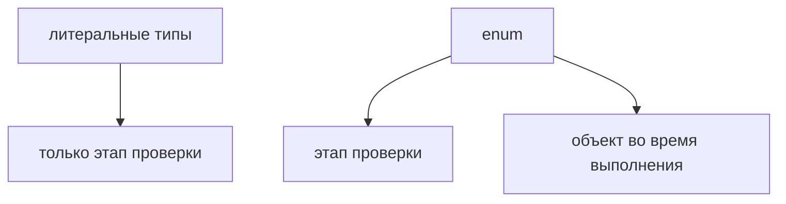

# Enum

## Связь с предыдущей главой

Мы уже умеем описывать конкретные значения через литеральные типы и сохранять их через `as const`.

Но в TypeScript есть отдельная конструкция для именованных наборов значений — `enum`.

## Главный вопрос

> Когда нужен enum, если есть литеральные типы?

Короткий ответ: `enum` задает именованный набор значений и существует в сгенерированном JavaScript.

## Мотивация

Иногда команде нужен общий список именованных значений: например, статусы отчета или режимы запуска.

Литеральные типы существуют только для проверки.

`enum` отличается тем, что после компиляции остается объект во время выполнения.

## Теория

Строковый enum явно задает строковые значения:

```typescript
enum TestStatus {
  Passed = 'passed',
  Failed = 'failed',
}

const status: TestStatus = TestStatus.Passed;
```

Числовой enum использует числовые значения:

```typescript
enum RetryMode {
  Off,
  On,
}
```



## Внутренний механизм

TypeScript проверяет, что значение соответствует enum.

После компиляции обычный `enum` остается в JavaScript как объект.

Это важно: enum не является только типом, в отличие от type alias или interface.

У числового enum во время выполнения есть отображение имени в число и обратное отображение числа в имя. У строкового enum обратного отображения нет: объект хранит имена элементов и их строковые значения.

## Главная ментальная модель

Enum — это именованный список значений, который виден и TypeScript, и коду во время выполнения.

Если объект во время выполнения не нужен, литеральные типы часто оказываются проще.

## Практические примеры

Примеры находятся в:

```text
examples/02-typescript/chapter-117/
```

`01-string-enum.ts` показывает string enum.

`02-numeric-enum.ts` показывает numeric enum.

`03-status-enum.ts` показывает статус отчета.

## Automation QA

Enum может описывать статусы отчета:

```typescript
enum ReportStatus {
  Passed = 'passed',
  Failed = 'failed',
}
```

Так код использует именованные значения вместо случайных строк.

## Распространённые ошибки

### Ошибка 1. Использовать enum для любого набора строк

Если объект во время выполнения не нужен, литеральные типы могут быть проще.

### Ошибка 2. Забывать, что enum остается в JavaScript

Обычный enum не исчезает после компиляции.

### Ошибка 3. Смешивать enum и произвольные строки

Если функция ожидает `TestStatus`, лучше передавать значение enum, а не случайную строку.

## Практика

Практика находится в:

```text
practice/02-typescript/117-enum.md
```

Решения находятся в:

```text
solutions/02-typescript/117-enum.md
```

## Краткие итоги

Главное:

* enum описывает именованный набор значений;
* string enum явно хранит строковые значения;
* numeric enum использует числа;
* обычный enum существует во время выполнения;
* enum стоит применять осознанно, а не вместо всех литеральных типов.

## Переход

Теперь мы умеем ограничивать значение одним вариантом или именованным набором.

Дальше разберем ситуацию, когда значение может быть одним из нескольких допустимых вариантов.
