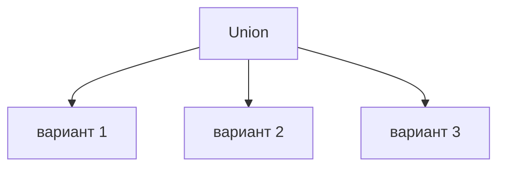

# Union Types

## Связь с предыдущей главой

Литеральные типы и enum ограничивают допустимые значения.

Union type позволяет описать несколько допустимых вариантов в одном типе.

## Главный вопрос

> Как описать значение, у которого есть несколько допустимых вариантов?

Короткий ответ: union type говорит TypeScript, что значение может соответствовать одному из нескольких типов.

## Мотивация

В QA-коде статус теста может быть `'passed'`, `'failed'` или `'skipped'`.

API-операция может вернуть успешный или ошибочный результат.

TypeScript помогает явно описать такие варианты.

## Теория

Union type записывается через `|`:

```typescript
type TestStatus = 'passed' | 'failed' | 'skipped';

const status: TestStatus = 'passed';
```

Union может объединять не только литеральные типы:

```typescript
const id: string | number = 42;
```

Для результата операции удобно использовать общий признак:

```typescript
type ApiResult =
  | { status: 'success'; statusCode: number }
  | { status: 'error'; message: string };
```

Если варианты имеют общий литеральный признак вроде `status`, такой union называют discriminated union. На этом этапе достаточно понимать идею: общее поле помогает отличать варианты, но TypeScript все равно не проверяет внешний JSON сам по себе.



## Внутренний механизм

Union type существует только на этапе проверки.

TypeScript знает набор возможных вариантов, но не создает значения во время выполнения.

Если значение может быть строкой или числом, безопасны только действия, которые подходят для текущего известного варианта.

## Главная ментальная модель

Union type — это список допустимых возможностей.

Во время выполнения значение одно, но TypeScript заранее знает, какие варианты возможны.

## Практические примеры

Примеры находятся в:

```text
examples/02-typescript/chapter-118/
```

`01-status-union.ts` показывает union из литеральных типов.

`02-nullable-value.ts` показывает nullable value.

`03-api-result-union.ts` показывает варианты API result.

## Automation QA

Union types полезны для статусов и результатов:

```typescript
type CheckResult = 'passed' | 'failed';
```

Так helper не сможет вернуть случайный статус вроде `'done'`.

## Распространённые ошибки

### Ошибка 1. Думать, что union — это массив типов

Union описывает варианты значения, а не коллекцию.

### Ошибка 2. Считать optional property тем же самым, что `string | undefined`

Эти идеи связаны, но ведут себя одинаково не во всех контекстах.

### Ошибка 3. Ожидать проверку API-данных во время выполнения

Union type не проверяет внешний JSON сам по себе.

## Практика

Практика находится в:

```text
practice/02-typescript/118-union-types.md
```

Решения находятся в:

```text
solutions/02-typescript/118-union-types.md
```

## Краткие итоги

Главное:

* union type описывает несколько допустимых вариантов;
* значение соответствует одному из вариантов;
* union не создает значения во время выполнения;
* общий литеральный признак помогает различать варианты;
* внешние данные все равно требуют проверок во время выполнения.

## Переход

Union type описывает выбор между вариантами.

Следующая глава показывает обратную задачу: как объединить несколько требований к одному значению.
