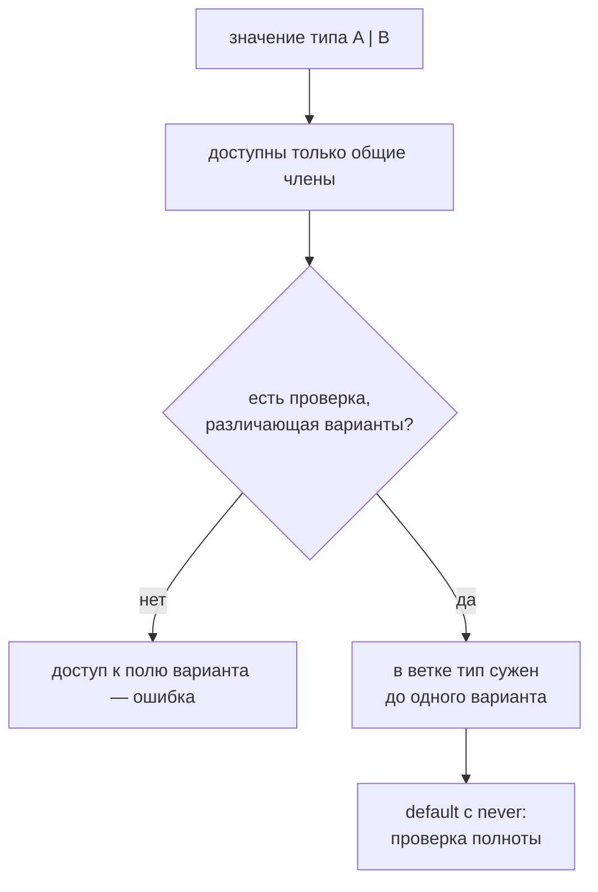

# Union Types

## Связь с предыдущей главой

Литеральные типы и enum ограничивают допустимые значения.

Union type позволяет описать несколько допустимых вариантов в одном типе.

## Главный вопрос

> Как описать значение, у которого есть несколько допустимых вариантов?

Короткий ответ: union type говорит TypeScript, что значение может соответствовать одному из нескольких типов.

## Мотивация

В QA-коде статус теста может быть `'passed'`, `'failed'` или `'skipped'`.

API-операция может вернуть успешный или ошибочный результат.

TypeScript помогает явно описать такие варианты.

## Теория

### Union — список возможностей

```typescript
type TestStatus = 'passed' | 'failed' | 'skipped';
```

Значение будет **одним** из вариантов. Компилятор заранее знает весь набор и не позволит выйти за него.

Объединять можно любые типы, не только литералы:

```typescript
type Id = string | number;
type MaybeUser = User | null;
```

### Доступны только общие члены

Пока вариант неизвестен, работать можно лишь с тем, что есть у всех:

```typescript
type Result =
  | { kind: 'ok'; value: number }
  | { kind: 'error'; message: string };

function read(result: Result) {
  result.kind;      // доступно: есть у обоих
  result.value;     // ошибка: у второго варианта нет
}
```

Это не ограничение, а защита: обращение к `value` упало бы во время выполнения, окажись значение вторым вариантом.

### Discriminated union — главный приём

Если у всех вариантов есть общее поле с **литеральным** типом, объединение становится размеченным. Проверка этого поля сужает тип:

```typescript
function describe(result: Result): string {
  if (result.kind === 'ok') {
    return `значение ${result.value}`;    // здесь доступен value
  }

  return `ошибка: ${result.message}`;     // а здесь message
}
```

Компилятор понимает, что внутри ветки возможен только один вариант, и открывает доступ к его полям.

Это основной способ моделировать «результат бывает таким или таким» — гораздо надёжнее, чем объект со всеми полями сразу, половина из которых необязательна.

### Проверка полноты

Вместе с `never` размеченное объединение даёт защиту от забытых вариантов:

```typescript
switch (result.kind) {
  case 'ok': return 'успех';
  case 'error': return 'ошибка';
  default: {
    const exhaustive: never = result;
    throw new Error(`Неизвестный вариант: ${String(exhaustive)}`);
  }
}
```

Добавили третий вариант — присваивание сломалось, и компилятор указал на функцию, которую нужно обновить.

### Сужение по инициализатору

Полезная деталь: переменная, объявленная с конкретным значением, сужается сразу.

```typescript
const result: Result = { kind: 'ok', value: 1 };
result.value;   // доступно: тип уже сужен до первого варианта
```

Ограничение «только общие члены» действует там, где вариант действительно неизвестен — например, у параметра функции.

### Union и необязательность

`status?: string` и `status: string | undefined` связаны, но не равны: первое разрешает не указывать свойство вовсе, второе требует указать его явно. Подробнее — в главе про необязательные свойства.

### Union не проверяет внешние данные

Как и всё остальное, объединение стирается. Ответ API не станет размеченным объединением сам по себе — форму нужно проверить во время выполнения, и только потом сужать.

Union сужается проверкой, а не желанием:



## Внутренний механизм

Union type существует только на этапе проверки.

TypeScript знает набор возможных вариантов, но не создает значения во время выполнения.

Если значение может быть строкой или числом, безопасны только действия, которые подходят для текущего известного варианта.

## Главная ментальная модель

Union type — это список допустимых возможностей.

Во время выполнения значение одно, но TypeScript заранее знает, какие варианты возможны.

## Практические примеры

Примеры находятся в:

```text
examples/02-typescript/chapter-118/
```

`01-status-union.ts` показывает union из литеральных типов.

`02-nullable-value.ts` показывает nullable value.

`03-api-result-union.ts` показывает варианты API result.

## Automation QA

Union types полезны для статусов и результатов:

```typescript
type CheckResult = 'passed' | 'failed';
```

Так helper не сможет вернуть случайный статус вроде `'done'`.

## Распространённые ошибки

### Ошибка 1. Думать, что union — это массив типов

Union описывает варианты значения, а не коллекцию.

### Ошибка 2. Считать optional property тем же самым, что `string | undefined`

Эти идеи связаны, но ведут себя одинаково не во всех контекстах.

### Ошибка 3. Ожидать проверку API-данных во время выполнения

Union type не проверяет внешний JSON сам по себе.

## Распространённые мифы

**Миф: union — это коллекция типов.**
Это список возможностей для **одного** значения, а не контейнер.

**Миф: у значения union доступны все поля всех вариантов.**
Доступны только общие. Остальные открываются после сужения.

**Миф: разметка объединения — опциональное украшение.**
Без общего литерального поля сузить тип проверкой становится заметно сложнее.

**Миф: если тип описан как union, данные из API ему соответствуют.**
Тип описывает ожидание. Реальную форму нужно проверять во время выполнения.

## Частые вопросы

**Почему компилятор не даёт обратиться к полю варианта?**
Потому что значение может оказаться другим вариантом, и обращение упадёт. Нужно сначала сузить.

**Что выбрать в качестве поля-признака?**
Строковый литерал с понятным именем: `kind`, `status`, `type`. Важно, чтобы значения не пересекались между вариантами.

**Чем размеченное объединение лучше объекта с необязательными полями?**
Оно не допускает невозможных сочетаний: нельзя одновременно иметь и `value`, и `message`.

**Как поймать забытый вариант при расширении?**
Присвоить значение переменной типа `never` в ветке по умолчанию.

## Проверьте себя

1. Что описывает union — набор значений или набор возможностей для одного значения?
2. Почему у параметра типа union доступны только общие члены?
3. Что делает объединение размеченным и зачем это нужно?
4. Как устроена проверка полноты через `never`?
5. Почему у переменной с конкретным инициализатором доступны поля варианта сразу?

## Практика

Практика находится в:

```text
practice/02-typescript/118-union-types.md
```

Решения находятся в:

```text
solutions/02-typescript/118-union-types.md
```

## Краткие итоги

Главное:

* union type описывает несколько допустимых вариантов;
* значение соответствует одному из вариантов;
* union не создает значения во время выполнения;
* общий литеральный признак помогает различать варианты;
* внешние данные все равно требуют проверок во время выполнения.

## Переход

Union type описывает выбор между вариантами.

Следующая глава показывает обратную задачу: как объединить несколько требований к одному значению.
