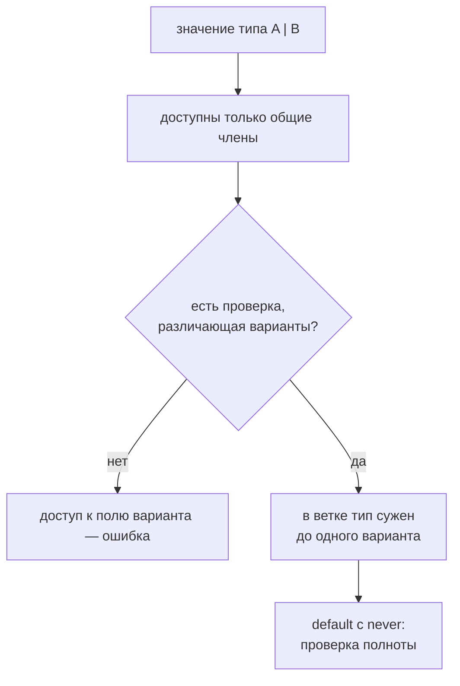

# Объединения типов

## Связь с предыдущей главой

Литеральные типы и enum ограничивают допустимые значения.

Union type позволяет описать несколько допустимых вариантов в одном типе.

## Главный вопрос

> Как описать значение, у которого есть несколько допустимых вариантов?

Короткий ответ: объединение говорит TypeScript, что значение может соответствовать одному из нескольких типов.

## Мотивация

В QA-коде статус теста может быть `'passed'`, `'failed'` или `'skipped'`.

API-операция может вернуть успешный или ошибочный результат.

TypeScript помогает явно описать такие варианты.

## Теория

### Объединение — список возможностей

```typescript
type TestStatus = 'passed' | 'failed' | 'skipped';
```

Значение будет **одним** из вариантов. Компилятор заранее знает весь набор и не позволит выйти за него.

Объединять можно любые типы, не только литералы:

```typescript
type Id = string | number;
type MaybeUser = User | null;
```

### Доступны только общие члены

Пока вариант неизвестен, работать можно лишь с тем, что есть у всех:

```typescript
type Result =
  | { kind: 'ok'; value: number }
  | { kind: 'error'; message: string };

function read(result: Result) {
  result.kind;      // доступно: есть у обоих
  result.value;     // ошибка: у второго варианта нет
}
```

Это не ограничение, а защита: обращение к `value` упало бы во время выполнения, окажись значение вторым вариантом.

### Размеченное объединение — главный приём

Если у всех вариантов есть общее поле с **литеральным** типом, объединение становится размеченным. Проверка этого поля сужает тип:

```typescript
function describe(result: Result): string {
  if (result.kind === 'ok') {
    return `значение ${result.value}`;    // здесь доступен value
  }

  return `ошибка: ${result.message}`;     // а здесь message
}
```

Компилятор понимает, что внутри ветки возможен только один вариант, и открывает доступ к его полям.

Это основной способ моделировать «результат бывает таким или таким» — гораздо надёжнее, чем объект со всеми полями сразу, половина из которых необязательна.

### Проверка полноты

Вместе с `never` размеченное объединение даёт защиту от забытых вариантов:

```typescript
switch (result.kind) {
  case 'ok': return 'успех';
  case 'error': return 'ошибка';
  default: {
    const exhaustive: never = result;
    throw new Error(`Неизвестный вариант: ${String(exhaustive)}`);
  }
}
```

Добавили третий вариант — присваивание сломалось, и компилятор указал на функцию, которую нужно обновить.

### Сужение по инициализатору

Полезная деталь: переменная, объявленная с конкретным значением, сужается сразу.

```typescript
const result: Result = { kind: 'ok', value: 1 };
result.value;   // доступно: тип уже сужен до первого варианта
```

Ограничение «только общие члены» действует там, где вариант действительно неизвестен — например, у параметра функции.

### Объединение и необязательность

`status?: string` и `status: string | undefined` связаны, но не равны: первое разрешает не указывать свойство вовсе, второе требует указать его явно. Подробнее — в главе про необязательные свойства.

### Объединение не проверяет внешних данных

Как и всё остальное, объединение стирается. Ответ API не станет размеченным объединением сам по себе — форму нужно проверить во время выполнения, и только потом сужать.

Объединение сужается проверкой, а не желанием:


```mermaid
flowchart TD
    A["значение типа A | B"] --> B["доступны только общие члены"]
    B --> C{"есть проверка,<br/>различающая варианты?"}
    C -- "нет" --> D["доступ к полю варианта — ошибка"]
    C -- "да" --> E["в ветке тип сужен<br/>до одного варианта"]
    E --> F["default с never:<br/>проверка полноты"]
```

## Внутренний механизм

Объединение существует только на этапе проверки.

TypeScript знает набор возможных вариантов, но не создает значения во время выполнения.

Если значение может быть строкой или числом, безопасны только действия, которые подходят для текущего известного варианта.

### Доступно только общее

```ts
function show(v: string | number) {
  v.toFixed(2);      // ошибка: у string этого нет
  v.toString();      // разрешено: есть у обоих
}
```

Компилятор разрешает операции, безопасные **для каждого** варианта. Проверять
это надо именно на параметре: переменная с конкретным инициализатором сужается
сразу по нему, и ограничение не проявится.

### Размеченное объединение

```ts
type Result =
  | { ok: true; value: WorkItem }
  | { ok: false; error: string };

if (result.ok) {
  result.value;    // сужено к первому варианту
} else {
  result.error;    // сужено ко второму
}
```

Общее поле-признак (`ok`, `kind`, `type`) с литеральными типами позволяет
компилятору выбрать вариант по проверке этого поля. Это основа типизированного
результата клиента API из главы 158: отказ становится значением, а не
исключением, и остаётся проверяемым.

### Граница

| Компилятор знает | Компилятор не знает |
| --- | --- |
| список вариантов | какой вариант пришёл в прогоне |
| что общее у вариантов | что ответ сервиса вообще соответствует типу |

Объединение описывает ожидание. Выбор варианта во время выполнения делает код —
проверкой поля-признака или стражем.

## Главная ментальная модель

Объединение — это список допустимых возможностей.

Во время выполнения значение одно, но TypeScript заранее знает, какие варианты возможны.

## Практические примеры

Примеры находятся в:

```text
examples/02-typescript/chapter-118/
```

`01-status-union.ts` показывает объединение из литеральных типов.

`02-nullable-value.ts` показывает значение, которого может не быть.

`03-api-result-union.ts` показывает варианты результата API.

## Automation QA

Объединения полезны для статусов и результатов:

```typescript
type CheckResult = 'passed' | 'failed';
```

Так вспомогательная функция не сможет вернуть случайный статус вроде `'done'`.

### Размеченное объединение для результата шага

Объединение становится по-настоящему полезным, когда варианты несут разные
данные. Успешный шаг возвращает значение, неуспешный — причину, и компилятор
не даст прочитать не то поле.

```typescript
type StepResult =
  | { ok: true; value: string }
  | { ok: false; reason: string };

function describe(result: StepResult): string {
  if (result.ok) return `готово: ${result.value}`;

  // Здесь доступен только reason: value в этой ветке не существует.
  return `не выполнено: ${result.reason}`;
}
```

Поле `ok` работает различителем. Без него пришлось бы объявлять оба поля
необязательными — и проверять их наличие вручную в каждом месте.

### Почему это важнее, чем кажется

Тест, который читает `result.value` при неуспехе, получит `undefined` и
сравнит его с ожиданием. Сравнение провалится, но сообщение будет говорить о
значении, а не о том, что шаг вообще не выполнился. Размеченное объединение
переносит эту ошибку из отчёта в компиляцию.

## Распространённые ошибки

### Ошибка 1. Думать, что объединение — это массив типов

Объединение описывает варианты значения, а не коллекцию.

### Ошибка 2. Считать необязательное свойство тем же самым, что `string | undefined`

Эти идеи связаны, но ведут себя одинаково не во всех контекстах.

### Ошибка 3. Ожидать проверку API-данных во время выполнения

Объединение само по себе не проверяет внешнего JSON.

## Распространённые мифы

**Миф: объединение — это коллекция типов.**
Это список возможностей для **одного** значения, а не контейнер.

**Миф: у значения-объединения доступны все поля всех вариантов.**
Доступны только общие. Остальные открываются после сужения.

**Миф: разметка объединения — опциональное украшение.**
Без общего литерального поля сузить тип проверкой становится заметно сложнее.

**Миф: если тип описан объединением, данные из API ему соответствуют.**
Тип описывает ожидание. Реальную форму нужно проверять во время выполнения.

## Частые вопросы

**Почему компилятор не даёт обратиться к полю варианта?**
Потому что значение может оказаться другим вариантом, и обращение упадёт. Нужно сначала сузить.

**Что выбрать в качестве поля-признака?**
Строковый литерал с понятным именем: `kind`, `status`, `type`. Важно, чтобы значения не пересекались между вариантами.

**Чем размеченное объединение лучше объекта с необязательными полями?**
Оно не допускает невозможных сочетаний: нельзя одновременно иметь и `value`, и `message`.

**Как поймать забытый вариант при расширении?**
Присвоить значение переменной типа `never` в ветке по умолчанию.

## Проверьте себя

1. Что описывает объединение — набор значений или набор возможностей для одного значения?
2. Почему у параметра типа-объединения доступны только общие члены?
3. Что делает объединение размеченным и зачем это нужно?
4. Как устроена проверка полноты через `never`?
5. Почему у переменной с конкретным инициализатором доступны поля варианта сразу?

### Ответы

1. Набор возможностей для одного значения: в каждый момент оно относится ровно к одному из вариантов.
2. Компилятор не знает, какой это вариант, поэтому разрешает только то, что есть во всех. Остальное доступно после сужения типа.
3. Общее поле-признак с литеральными типами в каждом варианте. По нему компилятор сужает объединение до одного варианта.
4. В ветке по умолчанию значение присваивается переменной типа `never`. Пока разобраны все варианты, тип там сужен до `never`; новый вариант ломает компиляцию.
5. Вывод сужает тип по инициализатору. Объединение появляется там, где значение действительно может быть любым из вариантов — например, в параметре.

## Практика

Практика находится в:

```text
practice/02-typescript/118-union-types.md
```

Решения находятся в:

```text
solutions/02-typescript/118-union-types.md
```

## Краткие итоги

Главное:

* объединение описывает несколько допустимых вариантов;
* значение соответствует одному из вариантов;
* объединение не создаёт значения во время выполнения;
* общий литеральный признак помогает различать варианты;
* внешние данные все равно требуют проверок во время выполнения.

## Переход

Объединение описывает выбор между вариантами.

Следующая глава показывает обратную задачу: как объединить несколько требований к одному значению.
