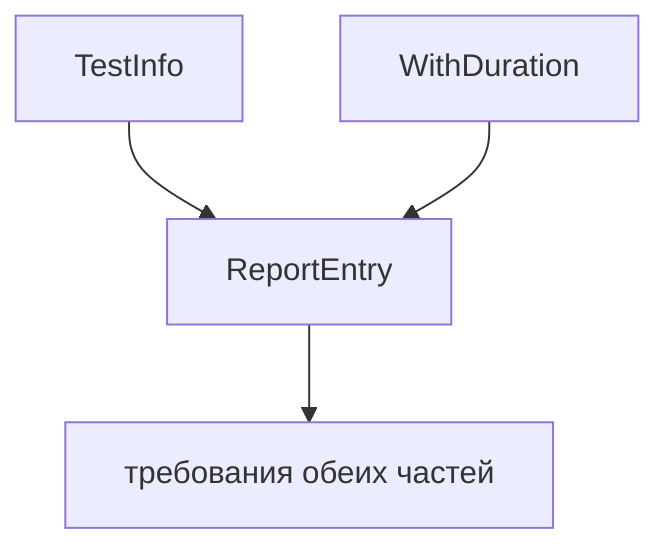

# Intersection Types

## Связь с предыдущей главой

Union type описывает выбор: значение подходит под один из вариантов.

Intersection type описывает объединение требований: значение должно удовлетворять всем частям сразу.

## Главный вопрос

> Как объединить несколько требований к одному значению?

Короткий ответ: intersection type соединяет несколько типов через `&`, и итоговое значение должно соответствовать каждому из них.

## Мотивация

В QA-проекте отчетная запись может иметь данные теста и общие метаданные.

Не хочется копировать одни и те же свойства в каждый тип.

Intersection позволяет собрать один контракт из нескольких частей.

## Теория

Intersection type записывается через `&`:

```typescript
type TestInfo = {
  title: string;
};

type WithDuration = {
  durationMs: number;
};

type ReportEntry = TestInfo & WithDuration;
```

`ReportEntry` должен иметь свойства из обеих частей:

```typescript
const entry: ReportEntry = {
  title: 'login',
  durationMs: 120,
};
```



## Внутренний механизм

Intersection type работает только на этапе проверки TypeScript.

Он не вызывает `Object.assign` и не объединяет объекты во время выполнения.

Если две части требуют несовместимые типы одного свойства, итоговое требование может стать невозможным для нормального значения.

Например, если одно требование говорит `id: string`, а другое — `id: number`, TypeScript не выбирает "последнее" свойство и не объединяет объект во время выполнения. Он требует значение, которое одновременно удовлетворяет обоим условиям, а для обычного `string` и `number` такого значения нет.

## Главная ментальная модель

Intersection type — это "и то, и другое".

Значение должно пройти все проверки сразу.

## Практические примеры

Примеры находятся в:

```text
examples/02-typescript/chapter-119/
```

`01-object-intersection.ts` показывает объединение объектных требований.

`02-shared-metadata.ts` показывает общие метаданные.

`03-conflicting-intersection.ts` показывает конфликт требований.

## Automation QA

Intersection удобен для отчетных объектов:

```typescript
type ReportEntry = TestInfo & WithDuration;
```

Так общий блок метаданных можно переиспользовать без копирования свойств.

## Распространённые ошибки

### Ошибка 1. Считать `&` JavaScript-оператором AND

В позиции типа `&` означает intersection type.

### Ошибка 2. Ожидать слияние объектов во время выполнения

Intersection не создает новый объект во время выполнения.

### Ошибка 3. Использовать intersection вместо понятного interface extends без причины

Если нужен публичный объектный договор с расширением, interface может быть читабельнее.

## Практика

Практика находится в:

```text
practice/02-typescript/119-intersection-types.md
```

Решения находятся в:

```text
solutions/02-typescript/119-intersection-types.md
```

## Краткие итоги

Главное:

* intersection type объединяет требования;
* значение должно удовлетворять всем частям;
* intersection работает на этапе проверки;
* объекты во время выполнения не объединяются автоматически;
* конфликтующие требования могут сделать тип практически непригодным.

## Переход

Теперь мы знаем union и intersection.

Осталось собрать эти инструменты в практическую модель данных для QA-проекта.
