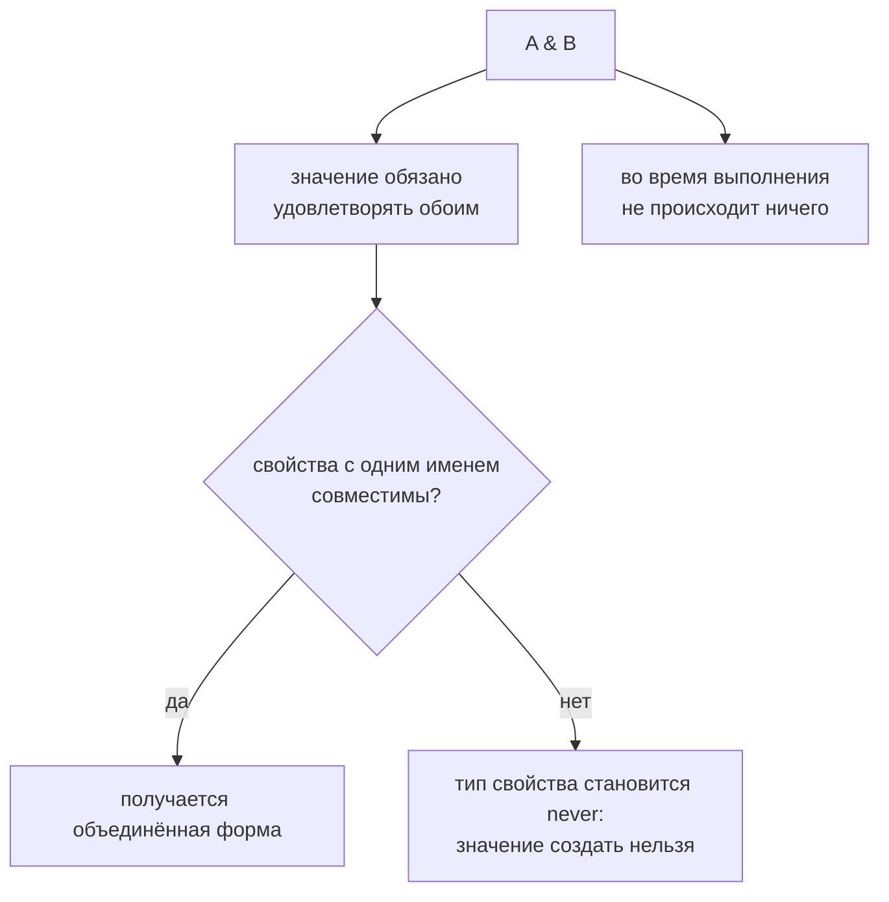

# Пересечения типов

## Связь с предыдущей главой

Union type описывает выбор: значение подходит под один из вариантов.

Intersection type описывает объединение требований: значение должно удовлетворять всем частям сразу.

## Главный вопрос

> Как объединить несколько требований к одному значению?

Короткий ответ: пересечение соединяет несколько типов через `&`, и итоговое значение должно соответствовать каждому из них.

## Мотивация

В QA-проекте отчетная запись может иметь данные теста и общие метаданные.

Не хочется копировать одни и те же свойства в каждый тип.

Intersection позволяет собрать один контракт из нескольких частей.

## Теория

### «И то, и другое»

Пересечение требует, чтобы значение удовлетворяло **всем** частям сразу:

```typescript
type TestInfo = { title: string };
type WithDuration = { durationMs: number };

type ReportEntry = TestInfo & WithDuration;

const entry: ReportEntry = { title: 'login', durationMs: 120 };
```

Полезная симметрия с объединением: `|` требует соответствия **любому** варианту, `&` — **каждому**.

Порядок частей значения не имеет: `A & B` и `B & A` — один и тот же тип.

### Конфликт свойств порождает `never`

Если части требуют несовместимые типы одного свойства, компилятор не выбирает «последнее» и не объединяет объекты:

```typescript
type Conflict = { id: string } & { id: number };
```

Тип свойства `id` становится `never` — типом, у которого нет значений. Ошибки в объявлении не будет; она появится при попытке что-нибудь присвоить.

Это существенное отличие от `interface extends`, который сообщает о конфликте сразу в месте объявления. Подробнее сравнение — в главе 113.

### Пересечение функций — это перегрузка

Менее известное, но полезное свойство:

```typescript
type F = ((a: string) => number) & ((a: number) => string);
```

Значение такого типа можно вызвать обоими способами: со строкой — получить число, с числом — строку. Компилятор выберет подходящую сигнатуру по аргументу.

Так описывают функции с разным поведением для разных типов аргументов — альтернатива перегрузкам, которые разбираются в главе 124.

### Пересечение примитивов бессмысленно

`string & number` — тип без значений, то есть `never`. Никакое значение не может быть одновременно строкой и числом.

Исключение — приём с меткой из главы 114: `string & { __brand: 'UserId' }` работает именно потому, что помечающая часть существует только при проверке и не требует настоящего свойства.

### Ничего не происходит во время выполнения

Пересечение не вызывает `Object.assign` и не создаёт нового объекта. Это требование к значению, а не операция над ним.

Собрать объект по-прежнему нужно самому — например, распространением свойств.

### Когда пересечение, а когда `extends`

Практический ориентир:

| Ситуация | Инструмент |
| --- | --- |
| Публичный объектный договор, который расширяют | `interface extends` |
| Добавить общий блок полей к нескольким типам | `&` |
| Части приходят из разных модулей и не образуют иерархию | `&` |
| Нужна ранняя диагностика конфликта | `interface extends` |

Пересечение требует выполнить оба договора сразу:


```mermaid
flowchart TD
    A["A & B"] --> B["значение обязано<br/>удовлетворять обоим"]
    B --> C{"свойства с одним именем<br/>совместимы?"}
    C -- "да" --> D["получается объединённая форма"]
    C -- "нет" --> E["тип свойства становится never:<br/>значение создать нельзя"]
    A --> F["во время выполнения<br/>не происходит ничего"]
```

## Внутренний механизм

Пересечение работает только на этапе проверки TypeScript.

Он не вызывает `Object.assign` и не объединяет объекты во время выполнения.

Если две части требуют несовместимые типы одного свойства, итоговое требование может стать невозможным для нормального значения.

Например, если одно требование говорит `id: string`, а другое — `id: number`, TypeScript не выбирает "последнее" свойство и не объединяет объект во время выполнения. Он требует значение, которое одновременно удовлетворяет обоим условиям, а для обычного `string` и `number` такого значения нет.

### Пересечение требует всё сразу

```ts
type WithId = { id: string };
type WithTitle = { title: string };

const item: WithId & WithTitle = { id: "1", title: "Отчёт" };
```

Значение обязано удовлетворять обеим частям одновременно. Никакого объединения
объектов во время выполнения не происходит: `Object.assign` пишет разработчик
сам, а тип лишь описывает результат.

### Конфликт даёт `never`, и делает это молча

```ts
type Bad = { id: string } & { id: number };
// id: string & number = never — ошибки на объявлении НЕТ

const x: Bad = { id: "1" };   // ошибка здесь: string не подходит под never
const y: Bad = { id: 1 };     // и здесь тоже
```

Тип объявлен успешно, но заполнить его невозможно. Ошибка приходит в месте
присваивания и звучит непонятно — про `never`, а не про конфликт описаний.

Поэтому для наследования договора предпочитают `interface extends`: там
несовместимое свойство даёт ошибку сразу на объявлении.

### Пересечение функций работает как перегрузка

```ts
type F = ((x: string) => number) & ((x: number) => string);
```

Такой тип принимает оба варианта вызова. Приём встречается в описаниях чужих
библиотек; в своём коде для этого обычно пишут перегрузки, они читаются проще.

## Главная ментальная модель

Пересечение — это «и то, и другое».

Значение должно пройти все проверки сразу.

## Практические примеры

Примеры находятся в:

```text
examples/02-typescript/chapter-119/
```

`01-object-intersection.ts` показывает объединение объектных требований.

`02-shared-metadata.ts` показывает общие метаданные.

`03-conflicting-intersection.ts` показывает конфликт требований.

## Automation QA

Пересечение удобно для объектов отчёта:

```typescript
type ReportEntry = TestInfo & WithDuration;
```

Так общий блок метаданных можно переиспользовать без копирования свойств.

### Слои контекста запуска

Пересечение хорошо ложится на слои, которые в главе 248 разделены по смыслу:
идентичность запуска, идентичность сущности и диагностика. Каждый слой
описывается отдельно, а запись отчёта собирается из них.

```typescript
type RunIdentity = { project: string; shard: string; retry: number };
type DomainIdentity = { entityId: string | null };
type Diagnostics = { correlationId: string; attachments: string[] };

type FailureRecord = RunIdentity & DomainIdentity & Diagnostics;
```

Слои можно переиспользовать по отдельности: успешному прогону нужна
`RunIdentity`, а `Diagnostics` подключается только там, где собираются
доказательства.

### Граница: конфликт свойств даёт `never`

Если два типа объявляют одно свойство с несовместимыми типами, пересечение не
ошибается сразу — оно даёт свойство типа `never`, и ошибка появляется лишь при
попытке что-то туда записать.

```typescript
type A = { retry: number };
type B = { retry: string };

type Broken = A & B;   // retry: never
```

Поэтому пересекать стоит слои с непересекающимися наборами полей. Если поля
совпадают по имени, но различаются по смыслу, нужен не `&`, а переименование.

## Распространённые ошибки

### Ошибка 1. Считать `&` оператором JavaScript

В позиции типа `&` означает пересечение типов.

### Ошибка 2. Ожидать слияние объектов во время выполнения

Пересечение не создаёт нового объекта во время выполнения.

### Ошибка 3. Использовать пересечение вместо понятного расширения интерфейса без причины

Если нужен публичный объектный договор с расширением, интерфейс может быть читабельнее.

## Распространённые мифы

**Миф: `&` в позиции типа — это логическое И из JavaScript.**
Это отдельный оператор системы типов. К значениям он отношения не имеет.

**Миф: пересечение объединяет объекты во время выполнения.**
Оно описывает требование к значению. Объект нужно собрать самому.

**Миф: при конфликте свойств побеждает последнее.**
Тип свойства становится `never`, и создать такое значение невозможно.

**Миф: пересечение и `extends` взаимозаменяемы.**
`extends` сообщает о конфликте в объявлении, пересечение — молчит до использования.

## Частые вопросы

**Почему объект с конфликтом не удаётся создать?**
Свойство получило тип `never`, а значений такого типа не существует.

**Зачем пересекать функции?**
Чтобы описать разное поведение для разных типов аргументов — компилятор выберет подходящую сигнатуру.

**Имеет ли значение порядок частей?**
Нет, `A & B` и `B & A` эквивалентны.

**Когда предпочесть `extends`?**
Когда описывается расширяемый объектный договор и важно раннее обнаружение конфликта.

## Проверьте себя

1. Чем требование `&` отличается от требования `|`?
2. Что произойдёт со свойством, которое части требуют с несовместимыми типами?
3. Почему конфликт в пересечении обнаруживается позже, чем в `interface extends`?
4. Что означает пересечение двух типов функций?
5. Почему `string & { __brand: 'UserId' }` работает, хотя `string & number` бессмысленно?

### Ответы

1. `&` требует соответствия всем частям одновременно. `|` — хотя бы одной.
2. Его тип станет пересечением несовместимых типов, то есть `never`. Присвоить ему что-либо станет невозможно.
3. Само пересечение создаётся без ошибки. Проблема проявляется только при попытке присвоить значение, обычно далеко от объявления типа.
4. Перегруженную функцию: значение должно соответствовать обеим сигнатурам сразу.
5. Потому что `string` и объект с полем — не противоречащие друг другу требования: значение остаётся строкой, а служебное поле существует только в типе. `string & number` противоречив, и результат — `never`.

## Практика

Практика находится в:

```text
practice/02-typescript/119-intersection-types.md
```

Решения находятся в:

```text
solutions/02-typescript/119-intersection-types.md
```

## Краткие итоги

Главное:

* пересечение объединяет требования;
* значение должно удовлетворять всем частям;
* пересечение работает на этапе проверки;
* объекты во время выполнения не объединяются автоматически;
* конфликтующие требования могут сделать тип практически непригодным.

## Переход

Теперь мы знаем объединение и пересечение.

Осталось собрать эти инструменты в практическую модель данных для QA-проекта.
