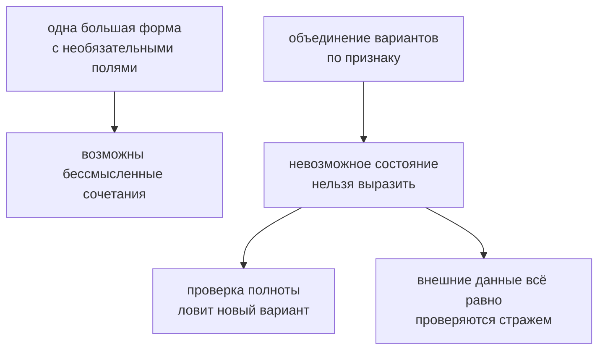

# Type Composition in Practice

## Связь с предыдущей главой

Мы изучили литеральные типы, `as const`, enum, union и intersection.

Теперь нужно собрать эти инструменты в одну практическую модель.

## Главный вопрос

> Как проектировать типы, чтобы они отражали реальные состояния системы?

Короткий ответ: композиция типов помогает описывать состояния, общие части и варианты данных без копирования одного и того же контракта.

## Мотивация

В Automation QA проекте тест может пройти, упасть или быть пропущен.

У каждого результата есть общие поля, но у разных состояний могут быть разные детали.

Композиция типов помогает выразить это явно.

## Теория

### Модель собирается из частей

Крупный тип редко пишут одним куском. Его собирают из частей, каждая из которых отвечает за свою идею.

Общие поля:

```typescript
type TestBase = {
  title: string;
  durationMs: number;
};
```

Варианты состояния:

```typescript
type TestOutcome =
  | { status: 'passed' }
  | { status: 'failed'; errorMessage: string }
  | { status: 'skipped'; reason: string };
```

Итоговая модель:

```typescript
type ReportEntry = TestBase & TestOutcome;
```

### Главная идея: невозможные состояния должны быть невыразимы

Сравните с распространённой альтернативой:

```typescript
type BadEntry = {
  title: string;
  status: string;
  errorMessage?: string;
  reason?: string;
};
```

Такой тип допускает бессмысленное: статус `'passed'` вместе с `errorMessage`, произвольную строку в статусе, отсутствие причины у пропущенного теста.

Размеченное объединение делает эти сочетания **невыразимыми**. Компилятор не даст создать запись с `status: 'passed'` и `errorMessage` — не потому, что это запрещено правилом, а потому что такого варианта в модели нет.

Это и есть смысл композиции: не описать все поля, а описать только допустимые сочетания.

### Каждое необязательное поле — это вопрос

Полезный приём при проектировании: увидев `?`, спросите, что означает отсутствие значения.

Часто ответ звучит как «оно есть только в одном состоянии» — и это признак, что состояний должно быть несколько, а поле должно принадлежать одному из них. Необязательные поля тогда исчезают, а модель становится точнее.

### Композиция не мешает расширению

Добавить новое состояние — значит добавить вариант в объединение. Компилятор сам покажет все места, где разбор стал неполным, если там есть проверка полноты через `never`.

Добавить общее поле — значит изменить базовую часть, и оно появится у всех вариантов сразу.

Обе операции локальны: правится одно место, а последствия компилятор находит сам.

### Где проходит граница композиции

Собирать модель из десятка мелких частей так же вредно, как писать её одним куском: чтобы понять итоговый тип, приходится открыть десять файлов.

Рабочий ориентир — части должны соответствовать понятиям предметной области: «общие сведения о тесте», «исход выполнения», «данные отчёта». Если часть не называется одним осмысленным словом, она, скорее всего, лишняя.

### Модель не проверяет внешние данные

Собранный тип описывает ожидание. JSON из отчёта или ответа API нужно проверить во время выполнения — и только после этого работать с ним как с моделью.

Здесь композиция помогает и практически: проверять размеченное объединение удобно, потому что поле-признак сразу указывает, какой вариант проверять дальше.

Композиция закрывает невозможные состояния:



## Внутренний механизм

Все эти операции происходят на этапе проверки.

TypeScript проверяет, что объект соответствует собранному типу.

Во время выполнения это остается обычный JavaScript-объект без автоматической проверки внешних данных.

## Главная ментальная модель

Композиция типов — это сборка договора из маленьких частей.

Каждая часть отвечает за свою идею: общие поля, допустимые статусы, детали конкретного состояния.

## Практические примеры

Примеры находятся в:

```text
examples/02-typescript/chapter-120/
```

`01-test-status-model.ts` показывает модель статуса.

`02-report-entry.ts` показывает отчетную запись.

`03-api-result-model.ts` показывает результат API-операции.

## Automation QA

Композиция типов полезна для отчетов:

```typescript
type ReportEntry = TestBase & TestOutcome;
```

Так отчетная модель показывает, какие поля общие, а какие зависят от состояния.

## Распространённые ошибки

### Ошибка 1. Смешивать все свойства в один огромный тип

Такой тип сложнее читать и поддерживать.

### Ошибка 2. Описывать состояние слишком широко

Если `status: string`, TypeScript не знает допустимые варианты.

### Ошибка 3. Путать композицию типов с преобразованием во время выполнения

Композиция типов не меняет объект во время выполнения.

## Распространённые мифы

**Миф: чем больше полей в типе, тем он выразительнее.**
Выразительность в том, какие сочетания тип **запрещает**, а не сколько полей допускает.

**Миф: необязательные поля — удобный способ описать варианты.**
Они допускают бессмысленные сочетания. Варианты описываются размеченным объединением.

**Миф: композиция типов меняет объект во время выполнения.**
Это только описание. Объект собирается кодом.

**Миф: чем мельче части, тем лучше модель.**
Слишком мелкое дробление заставляет собирать смысл из множества файлов.

## Частые вопросы

**Как понять, что вместо необязательных полей нужны варианты?**
Если отсутствие поля означает «мы в другом состоянии» — это варианты, а не необязательность.

**Как добавить новое состояние безопасно?**
Добавить вариант в объединение. Проверка полноты через `never` покажет все места, требующие обновления.

**Не станет ли модель сложнее для чтения?**
Наоборот: вместо одного типа с десятком условных полей появляется список понятных состояний.

**Нужно ли отдельно проверять данные из отчёта?**
Да. Модель описывает ожидание; форму данных проверяют во время выполнения.

## Проверьте себя

1. Что означает принцип «невозможные состояния должны быть невыразимы»?
2. Чем размеченное объединение лучше объекта с необязательными полями?
3. О чём сигнализирует необязательное поле при проектировании модели?
4. Что произойдёт при добавлении нового варианта, если есть проверка полноты?
5. По какому признаку понять, что часть модели выделена неудачно?

## Практика

Практика находится в:

```text
practice/02-typescript/120-type-composition-in-practice.md
```

Решения находятся в:

```text
solutions/02-typescript/120-type-composition-in-practice.md
```

## Краткие итоги

Главное:

* композиция типов помогает собирать типы из частей;
* литеральные типы описывают точные состояния;
* union описывает варианты;
* intersection добавляет общие требования;
* итоговая модель остается договором на этапе проверки.

## Переход

Модуль значений как типов и композиции завершен.

Следующий модуль переходит к функциям: TypeScript начнет проверять параметры, возвращаемые значения и callback-функции.
