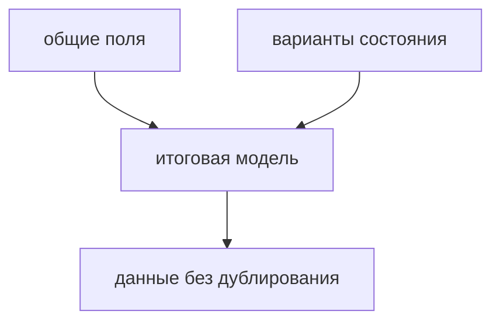

# Type Composition in Practice

## Связь с предыдущей главой

Мы изучили литеральные типы, `as const`, enum, union и intersection.

Теперь нужно собрать эти инструменты в одну практическую модель.

## Главный вопрос

> Как проектировать типы, чтобы они отражали реальные состояния системы?

Короткий ответ: композиция типов помогает описывать состояния, общие части и варианты данных без копирования одного и того же контракта.

## Мотивация

В Automation QA проекте тест может пройти, упасть или быть пропущен.

У каждого результата есть общие поля, но у разных состояний могут быть разные детали.

Композиция типов помогает выразить это явно.

## Теория

Общую часть можно вынести в отдельный type alias:

```typescript
type TestBase = {
  title: string;
  durationMs: number;
};
```

Состояния можно описать union type:

```typescript
type TestOutcome =
  | { status: 'passed' }
  | { status: 'failed'; errorMessage: string }
  | { status: 'skipped'; reason: string };
```

Итоговую запись можно собрать через intersection:

```typescript
type ReportEntry = TestBase & TestOutcome;
```



## Внутренний механизм

Все эти операции происходят на этапе проверки.

TypeScript проверяет, что объект соответствует собранному типу.

Во время выполнения это остается обычный JavaScript-объект без автоматической проверки внешних данных.

## Главная ментальная модель

Композиция типов — это сборка договора из маленьких частей.

Каждая часть отвечает за свою идею: общие поля, допустимые статусы, детали конкретного состояния.

## Практические примеры

Примеры находятся в:

```text
examples/02-typescript/chapter-120/
```

`01-test-status-model.ts` показывает модель статуса.

`02-report-entry.ts` показывает отчетную запись.

`03-api-result-model.ts` показывает результат API-операции.

## Automation QA

Композиция типов полезна для отчетов:

```typescript
type ReportEntry = TestBase & TestOutcome;
```

Так отчетная модель показывает, какие поля общие, а какие зависят от состояния.

## Распространённые ошибки

### Ошибка 1. Смешивать все свойства в один огромный тип

Такой тип сложнее читать и поддерживать.

### Ошибка 2. Описывать состояние слишком широко

Если `status: string`, TypeScript не знает допустимые варианты.

### Ошибка 3. Путать композицию типов с преобразованием во время выполнения

Композиция типов не меняет объект во время выполнения.

## Практика

Практика находится в:

```text
practice/02-typescript/120-type-composition-in-practice.md
```

Решения находятся в:

```text
solutions/02-typescript/120-type-composition-in-practice.md
```

## Краткие итоги

Главное:

* композиция типов помогает собирать типы из частей;
* литеральные типы описывают точные состояния;
* union описывает варианты;
* intersection добавляет общие требования;
* итоговая модель остается договором на этапе проверки.

## Переход

Модуль значений как типов и композиции завершен.

Следующий модуль переходит к функциям: TypeScript начнет проверять параметры, возвращаемые значения и callback-функции.
