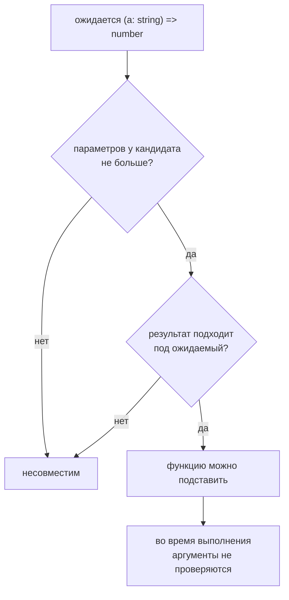

# Function Types

## Связь с предыдущей главой

Предыдущий модуль показал, как описывать значения, варианты и составные модели данных.

Теперь TypeScript начинает проверять не только данные, но и функции: какие аргументы они принимают и какой результат возвращают.

## Главный вопрос

> Как описать параметры и результат функции?

Короткий ответ: TypeScript позволяет задать типы параметров, тип результата и тип самой функции как вызываемого значения.

## Мотивация

В JavaScript функция может быть вызвана с неправильным аргументом, а ошибка часто проявится только во время выполнения.

В большом QA-проекте helper может ожидать статус проверки, имя окружения или объект результата.

TypeScript помогает обнаружить несогласованный вызов до запуска кода.

## Теория

### Договор вызова

Тип функции отвечает на два вопроса: что можно передать и что вернётся.

```typescript
function formatStatus(status: string): string {
  return `status: ${status}`;
}
```

Параметры аннотируются обязательно — выводить их не из чего. Возвращаемый тип компилятор обычно выводит сам.

### Функция как значение

Функцию можно описать отдельным типом:

```typescript
type StatusFormatter = (status: string) => string;
```

Такая запись называется function type expression. Она не создаёт функцию, а описывает, какие вызываемые значения подходят под договор — это важно для параметров, полей объектов и переменных.

### Когда аннотировать возвращаемый тип

Вывод почти всегда справляется, поэтому аннотация нужна в двух случаях:

1. Функция — публичная граница модуля, и договор должен читаться в сигнатуре.
2. Нужно зафиксировать намерение: если реализация начнёт возвращать другое, ошибка появится **в самой функции**, а не у того, кто её вызвал.

Для локальных вспомогательных функций явный тип чаще мешает, чем помогает.

### Совместимость: параметры и результат

Одна функция подходит вместо другой по двум правилам.

**Параметров может быть меньше.** Лишние аргументы просто игнорируются:

```typescript
const handler: (value: string, index: number) => void = (value) => { };
```

Именно поэтому работает `map(item => ...)`, хотя `map` передаёт три аргумента.

**Результат должен подходить.** Функция, возвращающая более узкий тип, годится там, где ожидается более широкий — но не наоборот.

Отдельный случай — `void` в позиции результата: реализация вправе вернуть значение, оно будет проигнорировано. Подробно это разобрано в главе 105.

### Обязательные аргументы пропустить нельзя

В отличие от JavaScript, где недостающий аргумент просто станет `undefined`, компилятор требует передать все обязательные параметры. Лишние аргументы при обычном вызове тоже считаются ошибкой.

Необязательные параметры, значения по умолчанию и остаточные параметры — тема главы 122.

### Функция в объекте: метод или свойство

Ту же функцию внутри типа объекта можно записать двумя способами, и проверяются они по-разному:

```typescript
type A = { handle(value: string): void };      // метод
type B = { handle: (value: string) => void };  // свойство-функция
```

Метод проверяется мягче, свойство-функция — строже. Для колбэков, где важна точность параметров, предпочтительнее вторая запись. Разбор этого различия — в главе 112.

### Типы не проверяют аргументы во время выполнения

Сигнатура стирается. Если аргумент пришёл из внешних данных, его нужно проверить самостоятельно — тип функции такую проверку не выполняет.

Совместимость функций проверяется не построчно:



## Внутренний механизм

Во время проверки TypeScript сравнивает вызов функции с ее сигнатурой.

Он проверяет:

* какие аргументы переданы;
* подходят ли типы аргументов;
* какой тип возвращает функция;
* можно ли присвоить функцию переменной с указанным типом функции.

Обязательные аргументы нельзя пропустить, а лишние аргументы в обычном вызове считаются ошибкой проверки типов.

Во время выполнения остается обычная JavaScript-функция. Аннотации типов не валидируют внешние данные сами по себе.

## Главная ментальная модель

Тип функции — это договор вызова.

Он отвечает на два вопроса:

* что можно передать в функцию;
* что можно ожидать обратно.

## Практические примеры

Примеры находятся в:

```text
examples/02-typescript/chapter-121/
```

`01-parameter-and-return.ts` показывает типы параметров и результата.

`02-function-type-expression.ts` показывает function type expression.

`03-method-signature.ts` показывает сигнатуру метода в объектном контракте.

## Automation QA

Типы функций полезны для helper-функций:

```typescript
type StatusFormatter = (status: 'passed' | 'failed') => string;
```

Так отчетный helper не сможет случайно принять неизвестный статус.

## Распространённые ошибки

### Ошибка 1. Думать, что аннотация проверяет данные во время выполнения

TypeScript проверяет код до запуска, но не заменяет проверки внешних данных.

### Ошибка 2. Ставить явный возвращаемый тип везде без причины

Для локальных функций вывод типа часто достаточно понятен.

### Ошибка 3. Путать тип функции с самой функцией

Тип функции описывает вызываемое значение, но не создает реализацию.

## Распространённые мифы

**Миф: тип функции создаёт функцию.**
Он описывает договор вызова. Реализацию пишет код.

**Миф: возвращаемый тип нужно указывать всегда.**
Вывод справляется почти везде. Аннотация полезна на публичных границах и для фиксации намерения.

**Миф: функция обязана принимать все аргументы, которые ей передают.**
Функция с меньшим числом параметров совместима: лишние аргументы игнорируются.

**Миф: сигнатура защищает от неверных данных во время выполнения.**
Она стирается. Внешние аргументы проверяются кодом.

## Частые вопросы

**Почему параметры нужно аннотировать, а результат — нет?**
У параметра нет значения в момент объявления, выводить не из чего. Результат выводится из тела функции.

**Когда полезен отдельный тип функции?**
Когда одна и та же сигнатура встречается в нескольких местах: параметр, поле объекта, переменная. Имя делает договор явным.

**Почему колбэк с одним параметром подходит вместо трёх?**
Так устроен JavaScript: лишние аргументы игнорируются. Система типов это отражает.

**Метод или свойство-функция в типе объекта?**
Для колбэков — свойство-функция: параметры проверяются строже.

## Проверьте себя

1. Почему параметры функции требуют аннотации, а возвращаемый тип обычно нет?
2. В каких двух случаях стоит аннотировать результат явно?
3. Почему функция с меньшим числом параметров совместима с типом, ожидающим больше?
4. Чем различаются запись метода и свойства-функции в типе объекта?
5. Проверяет ли сигнатура аргументы, пришедшие из внешних данных?

## Практика

Практика находится в:

```text
practice/02-typescript/121-function-types.md
```

Решения находятся в:

```text
solutions/02-typescript/121-function-types.md
```

## Краткие итоги

Главное:

* параметры можно аннотировать явно;
* тип результата можно указать явно или дать TypeScript вывести его;
* function type expression описывает вызываемое значение;
* method signature описывает метод объекта;
* типы функций работают на этапе проверки.

## Переход

Теперь мы умеем описывать базовый договор функции.

Дальше разберем функции, у которых аргументы могут быть необязательными, иметь значения по умолчанию или собираться через rest-параметр.
