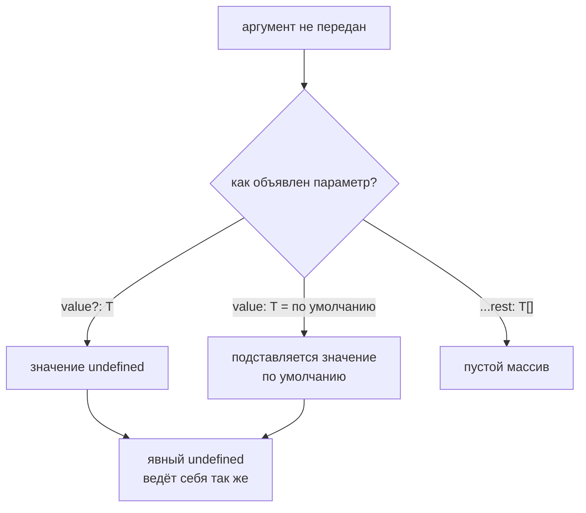

# Optional, Default and Rest Parameters

## Связь с предыдущей главой

Мы описали базовый договор функции: параметры и возвращаемое значение.

Теперь нужно описать функции, которые вызываются с разным количеством аргументов.

## Главный вопрос

> Как типизировать разные способы передачи аргументов?

Короткий ответ: TypeScript проверяет необязательные параметры, параметры со значением по умолчанию и rest-параметры как разные формы договора вызова.

## Мотивация

QA helper не всегда требует все настройки.

Иногда у параметра есть значение по умолчанию. Иногда функция принимает список сообщений, статусов или тегов.

TypeScript помогает явно описать, какие аргументы обязательны, какие можно пропустить, а какие собираются в массив.

## Теория

### Три способа сделать аргумент необязательным

Выглядят похоже, ведут себя по-разному.

**Необязательный параметр** — аргумент можно не передавать:

```typescript
function buildTitle(name: string, prefix?: string): string {
  return prefix ? `${prefix}: ${name}` : name;
}
```

Внутри функции тип `prefix` — это `string | undefined`, поэтому использовать его без проверки нельзя.

**Значение по умолчанию** — функция сама подставит значение:

```typescript
function retryLabel(retries = 2): string {
  return `retries: ${retries}`;
}
```

Внутри `retries` имеет тип `number` без `undefined`: значение гарантировано. Тип параметра выводится из значения по умолчанию, аннотация обычно не нужна.

**Остаточный параметр** — собирает всё оставшееся в массив:

```typescript
function joinTags(...tags: string[]): string {
  return tags.join(', ');
}
```

Он всегда последний и всегда массив — пустой, если аргументов не было.

### Явный `undefined` ведёт себя одинаково

Тонкость, о которой забывают: значение по умолчанию подставляется не только при отсутствии аргумента, но и при явно переданном `undefined`.

```typescript
retryLabel();            // 2
retryLabel(undefined);   // 2 — тоже сработает default
```

Это правило JavaScript, а не TypeScript. Оно удобно, когда аргумент собирается из необязательного поля конфигурации.

### Порядок параметров

Обязательный параметр не может стоять после необязательного:

```typescript
function wrong(a?: string, b: string) { }   // ошибка
```

Причина простая: вызывающему коду негде пропустить первый аргумент, чтобы передать второй. Договор вызова стал бы невыполнимым.

Параметр со значением по умолчанию формально может стоять не последним, но тогда его придётся «пропускать» через `undefined` — это неудобно и почти всегда означает неудачный порядок.

### Что выбрать

| Ситуация | Инструмент |
| --- | --- |
| Отсутствие значения несёт смысл | Необязательный параметр |
| Есть разумное значение по умолчанию | Значение по умолчанию |
| Количество аргументов заранее неизвестно | Остаточный параметр |

Практическое правило: если внутри функции сразу после проверки на `undefined` подставляется константа — это и было значение по умолчанию, и лучше выразить его в сигнатуре.

### Rest и spread — зеркальные операции

Их часто путают, потому что синтаксис один:

```typescript
function tags(...values: string[]) { }   // rest: собирает при объявлении
tags(...['a', 'b']);                     // spread: раскладывает при вызове
```

Rest живёт в объявлении функции, spread — в месте вызова.

### Слишком много параметров — признак проблемы

Функция с четырьмя-пятью необязательными параметрами превращает вызов в загадку: `build('a', undefined, undefined, true)`.

Обычное решение — объект настроек с именованными полями. Читается лучше, расширяется без изменения порядка и позволяет описать зависимости между полями через размеченное объединение.

Три способа не передавать аргумент — и разные последствия:



## Внутренний механизм

TypeScript проверяет сигнатуру функции на этапе компиляции.

Он видит, какие параметры обязательны, какие можно пропустить и какой тип у элементов rest-параметра.

Во время выполнения JavaScript использует обычные правила функций: параметр со значением по умолчанию подставляет значение, а rest-параметр становится массивом.

## Главная ментальная модель

Параметры функции — это входной договор.

Необязательный параметр говорит: "этот аргумент можно не передавать".

Параметр со значением по умолчанию говорит: "если аргумента нет, функция сама возьмет значение".

Rest-параметр говорит: "все оставшиеся аргументы будут массивом".

## Практические примеры

Примеры находятся в:

```text
examples/02-typescript/chapter-122/
```

`01-optional-and-default.ts` показывает необязательный параметр и параметр со значением по умолчанию.

`02-rest-parameters.ts` показывает rest-параметр.

`03-invalid-parameter-order.ts` показывает ошибку порядка параметров.

## Automation QA

Helper для формирования имени теста может иметь optional prefix:

```typescript
function testTitle(name: string, prefix?: string): string {
  return prefix ? `${prefix}: ${name}` : name;
}
```

А helper для тегов может принимать любое количество строк:

```typescript
function tags(...values: string[]): string[] {
  return values;
}
```

## Распространённые ошибки

### Ошибка 1. Путать необязательный параметр и union

`prefix?: string` означает, что аргумент можно пропустить. Это связано с `undefined`, но описывает именно параметр функции.

### Ошибка 2. Думать, что параметр со значением по умолчанию работает только при полном отсутствии аргумента

JavaScript также использует default value, если явно передан `undefined`.

### Ошибка 3. Путать rest-параметр и spread

Rest-параметр собирает аргументы внутри функции. Spread распаковывает значения при вызове.

## Распространённые мифы

**Миф: `prefix?: string` и `prefix: string | undefined` — одно и то же.**
Первое разрешает не передавать аргумент, второе требует передать его явно.

**Миф: значение по умолчанию срабатывает только при отсутствии аргумента.**
Явно переданный `undefined` тоже активирует default.

**Миф: параметр со значением по умолчанию обязан быть последним.**
Формально нет, но иначе его придётся пропускать через `undefined`.

**Миф: rest и spread — одно и то же.**
Rest собирает аргументы в объявлении, spread раскладывает значения при вызове.

## Частые вопросы

**Что выбрать: `?` или значение по умолчанию?**
Если есть разумное значение — default: внутри функции не придётся проверять `undefined`.

**Почему обязательный параметр нельзя поставить после необязательного?**
Вызывающему негде пропустить аргумент, чтобы добраться до следующего.

**Как быть, если параметров стало много?**
Заменить их объектом настроек с именованными полями.

**Какой тип у остаточного параметра внутри функции?**
Массив. Если аргументов не было — пустой, а не `undefined`.

## Проверьте себя

1. Какой тип имеет необязательный параметр внутри функции и почему?
2. Чем отличается тип параметра со значением по умолчанию?
3. Что произойдёт при явной передаче `undefined` в параметр со значением по умолчанию?
4. Почему обязательный параметр не может идти после необязательного?
5. Чем rest-параметр отличается от spread при вызове?

## Практика

Практика находится в:

```text
practice/02-typescript/122-optional-default-and-rest-parameters.md
```

Решения находятся в:

```text
solutions/02-typescript/122-optional-default-and-rest-parameters.md
```

## Краткие итоги

Главное:

* необязательный параметр можно пропустить;
* параметр со значением по умолчанию получает значение во время выполнения;
* rest-параметр внутри функции становится массивом;
* TypeScript проверяет типы переданных аргументов;
* порядок параметров должен оставаться понятным.

## Переход

Теперь мы умеем описывать разные формы аргументов.

Дальше разберем функции, которые передаются в другие функции как callbacks.
