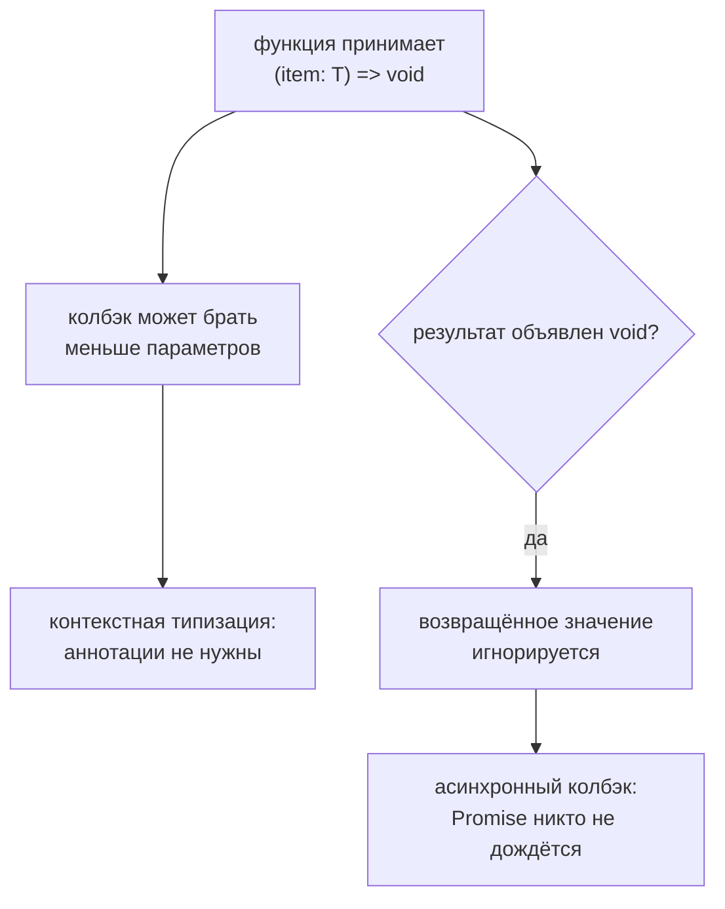

# Callback Types

## Связь с предыдущей главой

Мы научились описывать параметры самой функции.

Теперь функция станет аргументом другой функции.

## Главный вопрос

> Как типизировать функцию, которую передают в другую функцию?

Короткий ответ: тип callback описывает сигнатуру функции, которую вызывающий код передает как аргумент.

## Мотивация

В QA-коде часто есть обработчики результатов, фильтры, логгеры и функции повторной попытки.

Если callback принимает неправильные данные или возвращает не тот результат, ошибка может проявиться далеко от места передачи функции.

TypeScript делает договор callback явным.

## Теория

### Callback — договор на будущий вызов

Тип колбэка описывает функцию, которую вызовут позже:

```typescript
type ResultHandler = (message: string) => void;

function handleResult(message: string, handler: ResultHandler): void {
  handler(message);
}
```

Читается с позиции вызывающего: «когда я вызову эту функцию, я передам строку и результат использовать не буду».

### `void` в результате означает «результат не нужен»

Это не запрет что-то возвращать. Функция вправе вернуть значение — оно будет проигнорировано:

```typescript
const items: number[] = [];

[1, 2, 3].forEach((value) => items.push(value));   // push возвращает число
```

Если бы `void` означал «не возвращай ничего», такой код пришлось бы писать в фигурных скобках. Подробно правило разобрано в главе 105.

### Меньше параметров — тоже подходит

Колбэк не обязан принимать всё, что ему передают:

```typescript
[10, 20].map((value) => value * 2);            // индекс не нужен
[10, 20].map((value, index) => value + index); // а здесь нужен
```

Лишние аргументы игнорируются — это поведение JavaScript, и система типов ему следует. Благодаря этому колбэки остаются короткими.

### Контекстная типизация избавляет от аннотаций

Параметры колбэка обычно не аннотируют: их тип приходит из места использования.

```typescript
const codes = [200, 404];
codes.filter((code) => code >= 400);   // code: number, выведено из filter
```

Ручная аннотация здесь не только избыточна, но и вредна: она может разойтись с контекстом и заглушить полезную ошибку.

### Метод или свойство-функция

Когда колбэк объявляется полем объекта, способ записи влияет на строгость проверки:

```typescript
type A = { onResult(value: string): void };      // метод — мягче
type B = { onResult: (value: string) => void };  // свойство — строже
```

Для колбэков предпочтительнее вторая запись: при `strictFunctionTypes` она поймает несовместимые параметры. Разбор — в главе 112.

### Асинхронный колбэк

Если колбэк возвращает `Promise`, это нужно отразить в типе:

```typescript
type AsyncHandler = (message: string) => Promise<void>;
```

Иначе вызывающий код не дождётся завершения. Особенно важно в тестовых хелперах: колбэк типа `() => void`, внутри которого стоит `await`, приведёт к тому, что проверка завершится раньше самой операции.

### Слишком широкий колбэк бесполезен

`(value: any) => void` формально принимает что угодно и не даёт ни подсказок, ни проверок. Если тип аргумента действительно неизвестен — `unknown` и сужение внутри.

Договор колбэка проверяется в точке передачи:



## Внутренний механизм

TypeScript проверяет callback как обычное вызываемое значение.

Он проверяет параметры callback и то, как вызывающий код использует результат.

Во время выполнения callback остается обычной JavaScript-функцией и выполняется только тогда, когда его вызывает код программы.

## Главная ментальная модель

Тип callback — это договор для функции, которую вызывают позже.

Он говорит: "когда я вызову эту функцию, я передам такие данные и буду ожидать такой результат".

## Практические примеры

Примеры находятся в:

```text
examples/02-typescript/chapter-123/
```

`01-result-handler.ts` показывает callback для обработки результата.

`02-predicate-callback.ts` показывает predicate callback.

`03-void-callback.ts` показывает поведение callback с возвращаемым типом `void`.

## Automation QA

Тип callback полезен для обработчиков логов:

```typescript
type LogHandler = (message: string) => void;
```

Так helper знает, какие данные он передаст обработчику.

## Распространённые ошибки

### Ошибка 1. Думать, что callback выполняется на этапе проверки

TypeScript проверяет сигнатуру, но не выполняет callback.

### Ошибка 2. Путать `void` callback и запрет на return

Если тип callback возвращает `void`, вызывающий код просто не использует результат.

### Ошибка 3. Делать callback слишком широким

Если callback принимает `any`, TypeScript перестает помогать с параметрами.

## Распространённые мифы

**Миф: колбэк с типом `void` не может возвращать значение.**
Может: результат будет проигнорирован.

**Миф: колбэк обязан принимать все передаваемые аргументы.**
Функция с меньшим числом параметров совместима.

**Миф: параметры колбэка нужно аннотировать.**
Их тип обычно приходит из контекста; ручная аннотация может с ним разойтись.

**Миф: асинхронный колбэк можно описать как `() => void`.**
Тогда вызывающий код не дождётся его завершения. Нужен `Promise<void>`.

## Частые вопросы

**Почему `forEach(x => arr.push(x))` компилируется?**
`void` в результате означает «значение не используется», а не «его не должно быть».

**Как описать колбэк, результат которого важен?**
Указать конкретный тип результата вместо `void` — тогда компилятор проверит, что функция его возвращает.

**Что делать, если тип аргумента колбэка заранее неизвестен?**
Использовать `unknown` и сузить внутри. `any` отключает проверку целиком.

**Почему колбэк в тесте завершается раньше времени?**
Частая причина — асинхронный колбэк, объявленный как `() => void`: вызывающий код не ждёт `Promise`.

## Проверьте себя

1. Что означает `void` в позиции результата колбэка?
2. Почему колбэк с одним параметром подходит там, где передают три?
3. Откуда берётся тип параметра колбэка, если он не аннотирован?
4. Чем запись свойства-функции лучше метода для колбэка?
5. Чем опасен асинхронный колбэк с типом результата `void`?

## Практика

Практика находится в:

```text
practice/02-typescript/123-callback-types.md
```

Решения находятся в:

```text
solutions/02-typescript/123-callback-types.md
```

## Краткие итоги

Главное:

* тип callback описывает функцию-аргумент;
* параметры callback должны соответствовать месту вызова;
* predicate callback обычно возвращает boolean;
* `void` callback означает, что результат игнорируется;
* callback выполняется только во время выполнения программы.

## Переход

Теперь мы умеем описывать функции, передаваемые как значения.

Дальше разберем функции с несколькими корректными способами вызова.
