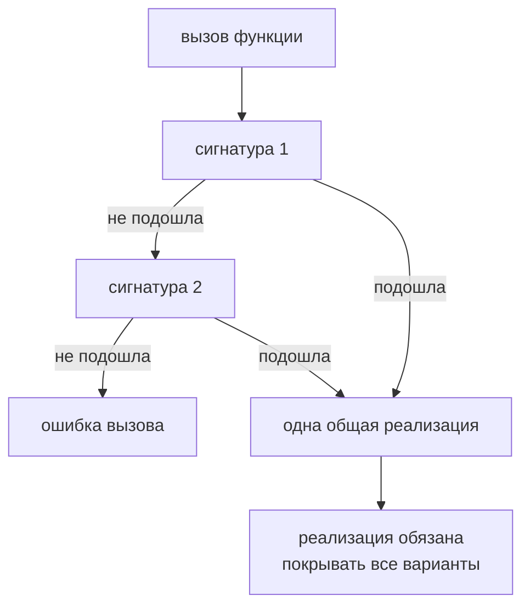

# Перегрузки функций

## Связь с предыдущей главой

Callbacks показали, что функция может быть значением с собственной сигнатурой.

Теперь разберем функцию, у которой есть несколько допустимых сигнатур вызова.

## Главный вопрос

> Как описать функцию с несколькими корректными способами вызова?

Короткий ответ: перегрузки позволяют показать несколько публичных способов вызова одной функции.

## Мотивация

Иногда helper принимает разные входные данные и возвращает результат, который зависит от формы вызова.

Например, поиск теста может работать по числовому id или по строковому title.

Union type подходит не всегда: иногда нужно сохранить связь между конкретным входом и конкретным выходом.

## Теория

### Несколько входов к одной реализации

Перегрузка объявляется сигнатурами без тела, после которых идёт единственная реализация:

```typescript
function findTest(id: number): TestById;
function findTest(title: string): TestByTitle;
function findTest(value: number | string): TestById | TestByTitle {
  if (typeof value === 'number') {
    return { source: 'id', id: value };
  }
  return { source: 'title', title: value };
}
```

Снаружи видны только сигнатуры перегрузки. Сигнатура реализации недоступна вызывающему коду — она нужна лишь для того, чтобы одна функция смогла обслужить все объявленные варианты.

Результат: `findTest(10)` даёт `TestById`, а `findTest('login')` — `TestByTitle`. Обычное объединение так не умеет: оно вернуло бы объединение обоих результатов.

### Выбор идёт сверху вниз

Компилятор проверяет сигнатуры по порядку и берёт **первую подходящую**. Отсюда практическое правило: более конкретные сигнатуры ставят выше более общих, иначе общая перехватит вызовы.

### Аргумент-объединение не подходит

Неочевидное следствие: если тип аргумента сам является объединением, ни одна перегрузка может не подойти.

```typescript
const value = Math.random() > 0.5 ? 1 : 'x';
findTest(value);   // ошибка: нет перегрузки для number | string
```

Каждая перегрузка описывает свой случай, а значение соответствует сразу двум. Это ограничение, а не дефект: именно оно не даёт вызвать функцию, не зная, какой результат ожидать.

### Реализация должна покрывать все варианты

Сигнатура реализации обязана быть совместима с каждой перегрузкой — её параметры шире, а результат покрывает все объявленные.

Важно: компилятор проверяет эту совместимость **не строго**. Ошибку в соответствии сигнатур легко не заметить, поэтому тело реализации стоит писать с явным разбором вариантов, а не полагаться на проверку.

### Когда перегрузка не нужна

Перегрузка оправдана, только если **результат зависит от входа**. Если результат один и тот же, объединение проще:

```typescript
function format(value: number | string): string { }
```

Это самый частый случай неудачного применения: три сигнатуры там, где хватило бы одной строки.

Второй частый случай — разное число параметров. Его обычно лучше выражать необязательными параметрами.

### Альтернатива: дженерик или пересечение

Когда связь входа и выхода регулярна, дженерик выражает её точнее и без дублирования сигнатур — это тема следующего модуля.

Пересечение типов функций даёт тот же эффект, что и перегрузка, но применимо к типу, а не только к объявлению функции: `((a: string) => number) & ((a: number) => string)`.

Перегрузки — это витрина, реализация одна:



## Внутренний механизм

TypeScript проверяет вызов по сигнатурам перегрузки сверху вниз.

Реализация должна быть совместима со всеми сигнатурами перегрузки.

Во время выполнения существует одна JavaScript-функция. Перегрузки не создают несколько реализаций.

### Сигнатуры проверяются сверху вниз

```ts
function get(id: string): WorkItem;
function get(ids: string[]): WorkItem[];
function get(arg: string | string[]): WorkItem | WorkItem[] { … }

get("1");                  // первая подходящая сигнатура
get(["1", "2"]);           // вторая
```

Выбирается **первая подходящая**, поэтому порядок значим: более общая сигнатура,
поставленная первой, перехватит вызовы, предназначенные более точной.

### Реализация видна только автору

```ts
declare const key: string | string[];

get(key);   // ОШИБКА: ни одна перегрузка не подходит
```

Сигнатура реализации в выборе не участвует и снаружи недоступна. Аргумент типа
объединения не подходит ни под одну перегрузку, хотя реализация его принимает —
это ожидаемое поведение, а не дефект.

### Когда перегрузки не нужны

| Ситуация | Лучше подходит |
| --- | --- |
| зависимость результата от типа аргумента | перегрузки |
| одинаковая обработка разных форм | объединение в одном параметре |
| набор необязательных настроек | объект параметров |
| зависимость результата от параметра типа | дженерик |

Последняя строка покрывает большинство случаев в тестовом коде: типизированный
клиент чаще нуждается в параметре типа, чем в двух сигнатурах.

Во время выполнения перегрузок не существует — есть одна функция, и разбирать
форму аргумента ей приходится самой.

## Главная ментальная модель

Перегрузки — это несколько публичных входов к одной реализации.

Снаружи видно несколько дверей, но внутри находится одна функция.

## Практические примеры

Примеры находятся в:

```text
examples/02-typescript/chapter-124/
```

`01-find-test-overload.ts` показывает сигнатуры перегрузки.

`02-union-vs-overload.ts` показывает случай, где объединение проще.

`03-invalid-overload.ts` показывает несовместимую перегрузку.

## Automation QA

Перегрузки могут быть полезны для интерфейса вспомогательной функции:

```typescript
type ConfigValue = 'baseUrl' | 'retries';

function readConfig(name: 'baseUrl'): string;
function readConfig(name: 'retries'): number;
function readConfig(name: ConfigValue): string | number {
  return name === 'baseUrl' ? 'https://service.local' : 2;
}
```

Так функция сохраняет связь между конкретным ключом настройки и типом результата.

### Когда перегрузки того не стоят

Для настроек тот же результат даёт обобщение по ключу — и без дублирования
сигнатур. Перегрузки в этом случае лишь удлиняют объявление.

```typescript
type Config = { baseUrl: string; retries: number };

function readConfig<K extends keyof Config>(name: K): Config[K] {
  const config: Config = { baseUrl: 'https://service.local', retries: 2 };

  return config[name];
}
```

Перегрузки оправданы там, где связь между аргументом и результатом **не
выражается** одним типом: например, функция принимает либо идентификатор и
возвращает объект, либо массив идентификаторов и возвращает массив.

### Реализация не проверяет перегрузки

Сигнатура реализации не видна вызывающему коду и **не сверяется** с
объявленными перегрузками построчно. Ошибка внутри — вернуть строку там, где
объявлено число, — компилятором не ловится.

Поэтому перегруженная функция требует тестов на каждую перегрузку: типы здесь
описывают намерение, а не доказывают его.

## Распространённые ошибки

### Ошибка 1. Думать, что перегрузки создают несколько функций

В JavaScript остается одна реализация.

### Ошибка 2. Делать перегрузку там, где достаточно объединения

Если результат не зависит от формы входа, объединение часто проще.

### Ошибка 3. Делать сигнатуру реализации уже сигнатур перегрузки

Реализация должна уметь обработать все заявленные варианты.

## Распространённые мифы

**Миф: перегрузки создают несколько функций.**
Реализация одна. Перегрузки существуют только при проверке.

**Миф: сигнатура реализации доступна снаружи.**
Вызывающий код видит только объявленные перегрузки.

**Миф: порядок сигнатур не важен.**
Компилятор берёт первую подходящую, поэтому общие сигнатуры должны идти после конкретных.

**Миф: перегрузка — более мощная замена объединению.**
Она нужна, когда результат зависит от входа. В остальных случаях объединение проще.

## Частые вопросы

**Почему вызов с аргументом-объединением не компилируется?**
Значение подходит сразу под несколько перегрузок, и компилятор не может выбрать результат. Нужно сузить тип до вызова.

**Как понять, нужна ли перегрузка?**
Задать вопрос: меняется ли тип результата в зависимости от аргумента. Если нет — достаточно объединения.

**Почему ошибку в реализации компилятор не заметил?**
Совместимость сигнатуры реализации проверяется нестрого. Разбирайте варианты явно.

**Чем дженерик лучше перегрузок?**
Он выражает регулярную связь входа и выхода одной сигнатурой, без дублирования.

## Проверьте себя

1. Что видит вызывающий код: сигнатуры перегрузки или сигнатуру реализации?
2. В каком порядке компилятор выбирает перегрузку и что из этого следует?
3. Почему аргумент типа `number | string` может не подойти ни под одну перегрузку?
4. В каком единственном случае перегрузка действительно нужна?
5. Какие две альтернативы перегрузкам существуют?

### Ответы

1. Только сигнатуры перегрузки. Сигнатура реализации снаружи не видна и вызываемой не является.
2. Сверху вниз, до первой подходящей. Поэтому более частные сигнатуры ставят выше общих.
3. Перегрузка выбирается целиком по одной сигнатуре: объединение должно подойти под неё полностью, а не частями. Если такой сигнатуры нет, вызов не компилируется.
4. Когда тип результата зависит от типа аргумента и описать это одной сигнатурой нельзя.
5. Объединение типов параметров с сужением внутри и дженерик, связывающий тип аргумента с типом результата.

## Практика

Практика находится в:

```text
practice/02-typescript/124-function-overloads.md
```

Решения находятся в:

```text
solutions/02-typescript/124-function-overloads.md
```

## Краткие итоги

Главное:

* сигнатуры перегрузки описывают публичные варианты вызова;
* сигнатура реализации принадлежит одной реализации;
* во время выполнения остается одна функция;
* реализация должна быть совместима со всеми перегрузками;
* объединение часто лучше, если перегрузка не добавляет ясности.

## Переход

Теперь мы умеем описывать несколько способов вызова функции.

Дальше вернемся к JavaScript-модели `this` и посмотрим, как TypeScript помогает контролировать контекст вызова.
