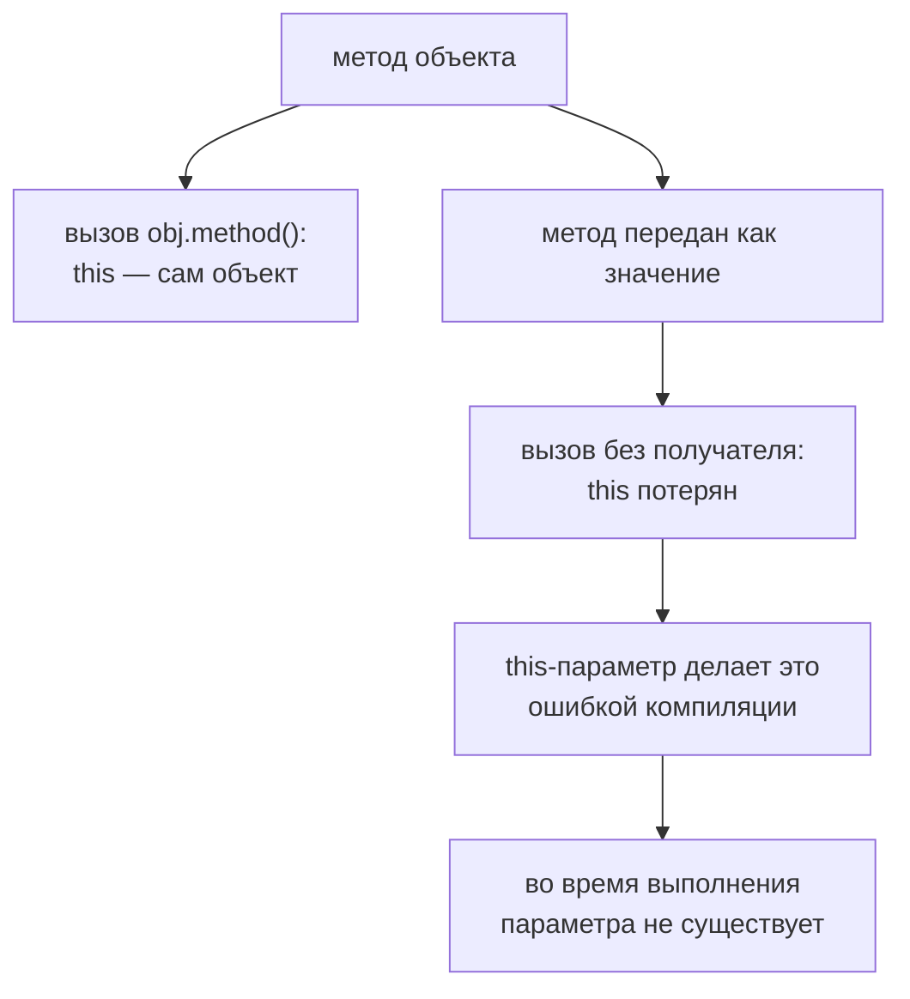

# Параметр `this`

## Связь с предыдущей главой

Мы описали разные сигнатуры вызова функции.

Теперь важно вспомнить, что в JavaScript результат функции может зависеть не только от аргументов, но и от `this`.

## Главный вопрос

> Как TypeScript помогает контролировать `this` в функциях?

Короткий ответ: специальный параметр `this` описывает, каким должен быть контекст вызова функции.

## Мотивация

В JavaScript метод можно отделить от объекта и потерять исходный `this`.

В QA-коде это особенно опасно для объектных helpers и Page Object-подобных структур: метод ожидает состояние объекта, но вызывается как обычная функция.

TypeScript помогает явно описать ожидаемый `this`.

## Теория

### `this` — скрытый аргумент вызова

В JavaScript `this` определяется **способом вызова**, а не местом объявления функции. Одна и та же функция получит разный `this` в зависимости от того, как её вызвали.

TypeScript позволяет описать ожидание явно:

```typescript
type Counter = { value: number };

function increment(this: Counter, step: number): number {
  return this.value + step;
}
```

`this` записан первым параметром, но аргументом не является: он исчезает после компиляции и не сдвигает нумерацию остальных параметров. `increment` по-прежнему вызывается с одним аргументом.

### Что это даёт

Компилятор начинает проверять контекст вызова:

```typescript
const counter: Counter = { value: 1 };

increment.call(counter, 1);        // допустимо
increment.call({ other: 1 }, 1);   // ошибка: неподходящий контекст
```

Без объявления `this` такая ошибка нашлась бы только во время выполнения — и выглядела бы как обращение к свойству `undefined`.

### Метод и свободная функция

У метода объекта `this` выводится автоматически:

```typescript
const counter = {
  value: 1,
  increment(step: number): number {
    return this.value + step;   // this выведен как тип объекта
  },
};
```

Явный `this`-параметр нужен там, где функция объявлена отдельно от объекта, но рассчитывает быть вызванной как его метод.

### Потеря контекста

Главная практическая проблема: при передаче метода как значения связь с объектом теряется.

```typescript
const formatter = {
  prefix: '[report]',
  format(message: string) {
    return `${this.prefix} ${message}`;
  },
};

messages.map(formatter.format);   // this потерян
```

Функция передана без объекта, поэтому `this` внутри уже не тот. Решения стандартные: обернуть в стрелочную функцию, привязать через `bind` или изначально не зависеть от `this`.

### Стрелочная функция не имеет своего `this`

Стрелочная функция берёт `this` из окружающего кода и не может получить его при вызове. Поэтому:

- как **метод объекта** стрелочная функция обычно неуместна: `this` не будет указывать на объект;
- как **колбэк внутри метода** — наоборот, идеальна: она сохраняет `this` внешнего метода.

По той же причине `this`-параметр нельзя объявить у стрелочной функции.

### Практический вывод

Зависимость от `this` — источник хрупкости. В тестовом коде надёжнее проектировать хелперы так, чтобы они не опирались на `this`: принимать нужные данные параметрами, а состояние держать в замыкании.

Тогда функцию можно свободно передавать куда угодно, и вопрос контекста просто не возникает.

`this`-параметр проверяется до запуска и исчезает после:



## Внутренний механизм

TypeScript не меняет правила привязки `this`.

Он только проверяет, что функция с таким параметром вызывается с подходящим контекстом.

Если функция передаётся как обратный вызов, контекст может потеряться. Поэтому его нужно описывать явно или избегать зависимости от `this`.

### Псевдопараметр, которого нет в вызове

```ts
function report(this: Reporter, line: string) {
  this.lines.push(line);
}

report.call(reporter, "готово");   // проверяется тип reporter
report("готово");                  // ошибка: this не того типа
```

`this` объявляется первым параметром, но аргументом не является: он исчезает при
компиляции и не сдвигает нумерацию остальных. Его единственная задача —
проверить, **как** функция вызывается.

### Что компилятор ловит, а что нет

| Ситуация | Обнаружит |
| --- | --- |
| вызов метода без объекта | да, если объявлен `this` |
| передача метода как обратного вызова | да |
| потеря `this` из-за `bind` третьей стороны | нет |
| `this` внутри стрелочной функции | не применимо: она берёт внешний |

Вторая строка — то, ради чего параметр и нужен: `retry(page.open)` перестаёт
компилироваться, а `retry(() => page.open())` проходит.

Правила привязки при этом не меняются — TypeScript только проверяет. Надёжнее
всего от них не зависеть: методы объектов страниц вызывают через объект, а
общее состояние держат в замыкании, а не в `this`.

## Главная ментальная модель

Параметр `this` — это невидимый во время выполнения договор об объекте выполнения.

Он говорит TypeScript: "эта функция ожидает, что ее вызовут с таким объектом в роли `this`".

## Практические примеры

Примеры находятся в:

```text
examples/02-typescript/chapter-125/
```

`01-this-parameter.ts` показывает явный параметр `this`.

`02-method-vs-function.ts` показывает метод и функцию.

`03-callback-context.ts` показывает потерю контекста при передаче обратного вызова.

## Automation QA

В объектных вспомогательных функциях лучше не терять контекст:

```typescript
const reportHelper = {
  prefix: '[report]',
  format(message: string): string {
    return `${this.prefix} ${message}`;
  },
};
```

### Параметр `this` ловит оторванный метод

Главная опасность таких помощников — передача метода в обратный вызов: объект
слева от точки исчезает, и `this` теряется. Явный параметр `this` превращает
это из ошибки времени выполнения в ошибку компиляции.

```typescript
type Reporter = { prefix: string };

function format(this: Reporter, message: string): string {
  return `${this.prefix} ${message}`;
}

const reporter: Reporter = { prefix: '[report]' };

console.log(format.call(reporter, 'шаг пройден'));
```

Параметр `this` не существует после компиляции и в аргументы не попадает:
`format.call(reporter, 'шаг')` передаёт одно значение, а не два.

### Стрелка как альтернатива

Если помощник должен работать в любом месте, надёжнее вообще не зависеть от
`this`: замыкание над нужными данными делает функцию переносимой.

```typescript
function createFormatter(prefix: string) {
  return (message: string) => `${prefix} ${message}`;
}
```

Такую функцию можно передать в `map`, в обработчик события и в фикстуру — она
не потеряет контекст, потому что его у неё нет.

Если метод зависит от `this`, его нельзя бездумно передавать как обычный обратный вызов.

## Распространённые ошибки

### Ошибка 1. Думать, что параметр `this` передаётся аргументом

Он нужен только TypeScript и не становится реальным параметром функции.

### Ошибка 2. Ожидать, что TypeScript привяжет `this`

TypeScript проверяет контекст, но не выполняет `bind`.

### Ошибка 3. Передавать метод как обратный вызов без учёта контекста

Так можно потерять объект, от которого метод зависит.

## Распространённые мифы

**Миф: `this`-параметр передаётся при вызове.**
Он существует только при проверке и исчезает после компиляции.

**Миф: TypeScript привязывает `this` автоматически.**
Он только проверяет контекст. Привязку выполняет `bind` или способ вызова.

**Миф: стрелочная функция — универсальная замена обычной.**
У неё нет своего `this`, поэтому как метод объекта она обычно не подходит.

**Миф: если метод работает при обычном вызове, он будет работать и как колбэк.**
При передаче как значения контекст теряется.

## Частые вопросы

**Когда объявлять `this`-параметр явно?**
Когда функция объявлена отдельно, но рассчитана на вызов в роли метода.

**Как безопасно передать метод как колбэк?**
Обернуть в стрелочную функцию или привязать через `bind`. Надёжнее — не зависеть от `this`.

**Почему у стрелочной функции нельзя объявить `this`-параметр?**
У неё нет собственного `this`: он берётся из окружающего кода.

**Как спроектировать хелпер без зависимости от `this`?**
Передавать нужные данные параметрами, а состояние держать в замыкании функции-фабрики.

## Проверьте себя

1. Чем определяется значение `this` в JavaScript?
2. Почему `this`-параметр не сдвигает нумерацию обычных параметров?
3. Что происходит с контекстом при передаче метода как значения?
4. Почему стрелочная функция неудачна как метод объекта, но удобна как колбэк внутри метода?
5. Какой способ проектирования снимает вопрос контекста целиком?

### Ответы

1. Формой вызова, а не местом объявления функции.
2. Это не настоящий параметр: он существует только для проверки типов и стирается при компиляции.
3. Связь с объектом теряется: при последующем вызове без точки `this` окажется не тем, который ожидался.
4. У стрелочной функции нет своего `this` — как метод объекта она не получит сам объект. Внутри метода это же свойство удобно: вложенная стрелка видит `this` метода.
5. Не полагаться на `this` вовсе: передавать нужное состояние аргументами или держать его в замыкании.

## Практика

Практика находится в:

```text
practice/02-typescript/125-this-parameter.md
```

Решения находятся в:

```text
solutions/02-typescript/125-this-parameter.md
```

## Краткие итоги

Главное:

* параметр `this` описывает ожидаемый контекст вызова;
* он не является аргументом во время выполнения;
* TypeScript не меняет JavaScript-правила `this`;
* методы и свободные функции могут вести себя по-разному;
* обратный вызов может потерять контекст.

## Переход

Теперь мы описали синхронные функции, обратные вызовы, перегрузки и `this`.

Осталось типизировать функции, которые возвращают асинхронный результат.
