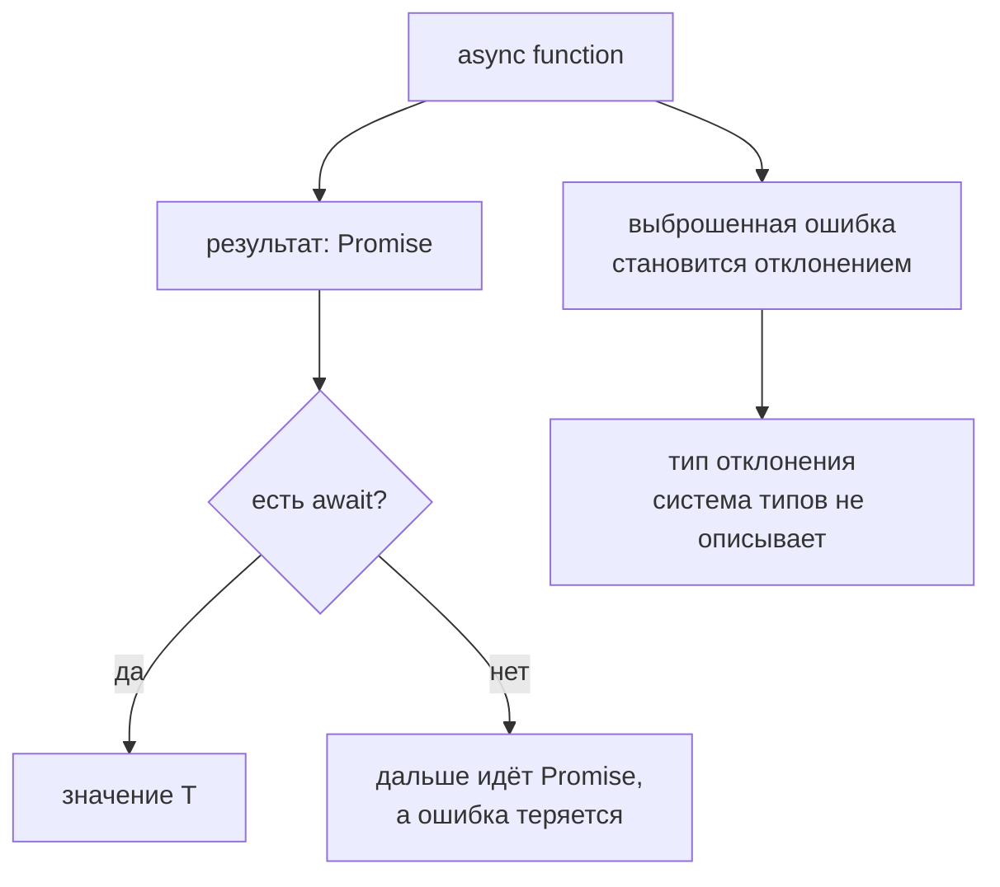

# Async Function Types

## Связь с предыдущей главой

Мы описали обычные функции и контекст `this`.

Теперь вернемся к уже знакомому JavaScript-механизму `async` и посмотрим, как TypeScript описывает его результат.

## Главный вопрос

> Как типизировать асинхронный результат?

Короткий ответ: асинхронная функция всегда возвращает `Promise`, а TypeScript описывает значение внутри него через `Promise<T>`.

## Мотивация

QA helpers часто читают данные, готовят окружение или получают ответ API асинхронно.

Если тип асинхронного результата не описан, вызывающий код может ожидать не те данные.

TypeScript помогает сделать договор асинхронной функции явным.

## Теория

### Результат всегда обёрнут в Promise

Асинхронная функция возвращает `Promise<T>`, даже если внутри возвращается обычное значение:

```typescript
async function loadStatus(): Promise<string> {
  return 'passed';
}
```

Аннотировать результат как `string` нельзя — это ошибка компиляции. Тип обязан быть `Promise<T>`.

Обратная сторона правила: результат нельзя использовать напрямую.

```typescript
const status: string = loadStatus();   // ошибка: это Promise<string>
```

Нужен `await` или обработка через `then`.

### Ошибка превращается в отклонённый Promise

```typescript
async function failSetup(): Promise<void> {
  throw new Error('setup failed');
}
```

Функция не выбрасывает исключение синхронно — она возвращает Promise, который будет отклонён. Поэтому обычный `try/catch` вокруг **вызова без `await`** ничего не поймает:

```typescript
try {
  failSetup();          // исключение не поймается
} catch { }

try {
  await failSetup();    // а так поймается
} catch { }
```

Это одна из самых частых причин, по которой ошибка в тесте остаётся незамеченной.

### Тип не описывает отклонение

`Promise<string>` говорит только об успешном значении. Тип ошибки в сигнатуре выразить нельзя — в JavaScript выбросить можно что угодно.

Отсюда и правило работы с `catch`: пойманное значение имеет тип `unknown` и требует проверки перед использованием.

### Вложенные Promise разворачиваются

```typescript
async function load(): Promise<string> {
  return Promise.resolve('x');   // допустимо
}
```

`Promise<Promise<string>>` не возникает: и `async`, и `await` разворачивают вложенность автоматически. Поэтому оборачивать готовый Promise в `Promise.resolve` внутри `async`-функции не нужно.

### Забытый `await` — тихая ошибка

Самая дорогая ошибка в тестовом коде: вызов асинхронной функции без ожидания.

```typescript
async function prepare() { }

test('сценарий', async () => {
  prepare();          // не дождались
  expect(true).toBe(true);
});
```

Тест завершится раньше подготовки, а отклонение Promise всплывёт позже — возможно, уже в другом тесте, и будет выглядеть как нестабильность.

Компилятор по умолчанию об этом молчит. Ловят такие места правилами линтера для «плавающих» Promise; это тот случай, когда одно правило окупает настройку линтера целиком.

### `await` работает и с обычными значениями

```typescript
const value = await 'x';   // допустимо
```

Это делает код устойчивым: функцию можно сделать асинхронной, не переписывая места вызова. Обратное тоже верно — лишний `await` на синхронном значении безвреден, хотя и добавляет микрозадачу.

### Асинхронность в типах колбэков

Если колбэк выполняет асинхронную работу, его тип обязан это отражать: `(x: T) => Promise<void>`, а не `(x: T) => void`. Иначе вызывающий код не дождётся завершения — подробнее в главе 123.

Асинхронный результат всегда обёрнут:



## Внутренний механизм

TypeScript проверяет, что значение, возвращаемое из асинхронной функции, подходит для `Promise<T>`.

Во время выполнения работает обычная JavaScript-модель async/await: результат оборачивается в Promise, а ошибка превращается в rejection.

Тип `Promise<T>` — это договор о будущем значении, а не само значение прямо сейчас.

## Главная ментальная модель

Тип асинхронной функции — это договор о будущем результате.

`Promise<string>` говорит: "сейчас у нас Promise, а успешное значение внутри него будет string".

## Практические примеры

Примеры находятся в:

```text
examples/02-typescript/chapter-126/
```

`01-async-return-type.ts` показывает `Promise<T>`.

`02-rejected-promise.ts` показывает безопасную обработку rejection.

`03-async-helper-contract.ts` показывает договор асинхронного helper.

## Automation QA

Async helper может возвращать статус подготовки:

```typescript
async function prepareEnvironment(): Promise<'ready'> {
  return 'ready';
}
```

Вызывающий код понимает, что сначала нужно дождаться Promise, а затем работать со значением.

## Распространённые ошибки

### Ошибка 1. Указывать тип результата без `Promise`

Асинхронная функция не возвращает `string` напрямую. Она возвращает `Promise<string>`.

### Ошибка 2. Думать, что TypeScript обработает rejection

Ошибки async-функций нужно обрабатывать обычными средствами JavaScript.

### Ошибка 3. Создавать лишний вложенный Promise

Если функция уже `async`, обычно не нужно вручную оборачивать результат в `Promise.resolve`.

## Распространённые мифы

**Миф: `async`-функция может вернуть обычное значение.**
Возвращаемый тип всегда `Promise<T>`; аннотация без `Promise` — ошибка.

**Миф: `try/catch` вокруг вызова поймает ошибку асинхронной функции.**
Без `await` не поймает: функция вернула отклонённый Promise, а не выбросила исключение.

**Миф: тип может описать ошибку, с которой Promise отклонится.**
Не может. Выбросить в JavaScript можно что угодно, поэтому в `catch` попадает `unknown`.

**Миф: забытый `await` компилятор заметит.**
По умолчанию нет. Нужны правила линтера для плавающих Promise.

## Частые вопросы

**Почему `const s: string = loadStatus()` не компилируется?**
Функция возвращает `Promise<string>`. Значение появится только после `await`.

**Нужно ли оборачивать результат в `Promise.resolve`?**
Нет. Внутри `async`-функции вложенность разворачивается автоматически.

**Как поймать ошибку асинхронной функции?**
Поставить `await` внутри `try` либо обработать через `.catch()`.

**Безопасно ли ставить `await` перед обычным значением?**
Да. Это позволяет менять функцию с синхронной на асинхронную, не трогая места вызова.

## Проверьте себя

1. Почему `async function f(): string` — ошибка?
2. Что произойдёт с `try/catch`, если убрать `await` перед вызовом асинхронной функции?
3. Почему тип не может описать причину отклонения Promise?
4. Возникает ли `Promise<Promise<T>>` при возврате Promise из `async`-функции?
5. Чем опасен забытый `await` в тесте и чем его ловят?

## Практика

Практика находится в:

```text
practice/02-typescript/126-async-function-types.md
```

Решения находятся в:

```text
solutions/02-typescript/126-async-function-types.md
```

## Краткие итоги

Главное:

* асинхронная функция возвращает Promise;
* явный тип результата записывается как `Promise<T>`;
* обычное возвращаемое значение превращается в fulfilled Promise;
* выброшенная ошибка становится rejected Promise;
* TypeScript не обрабатывает асинхронные ошибки автоматически.

## Переход

Модуль типизации функций завершен.

Следующий модуль перейдет к narrowing: TypeScript начнет уточнять union types внутри веток кода.
