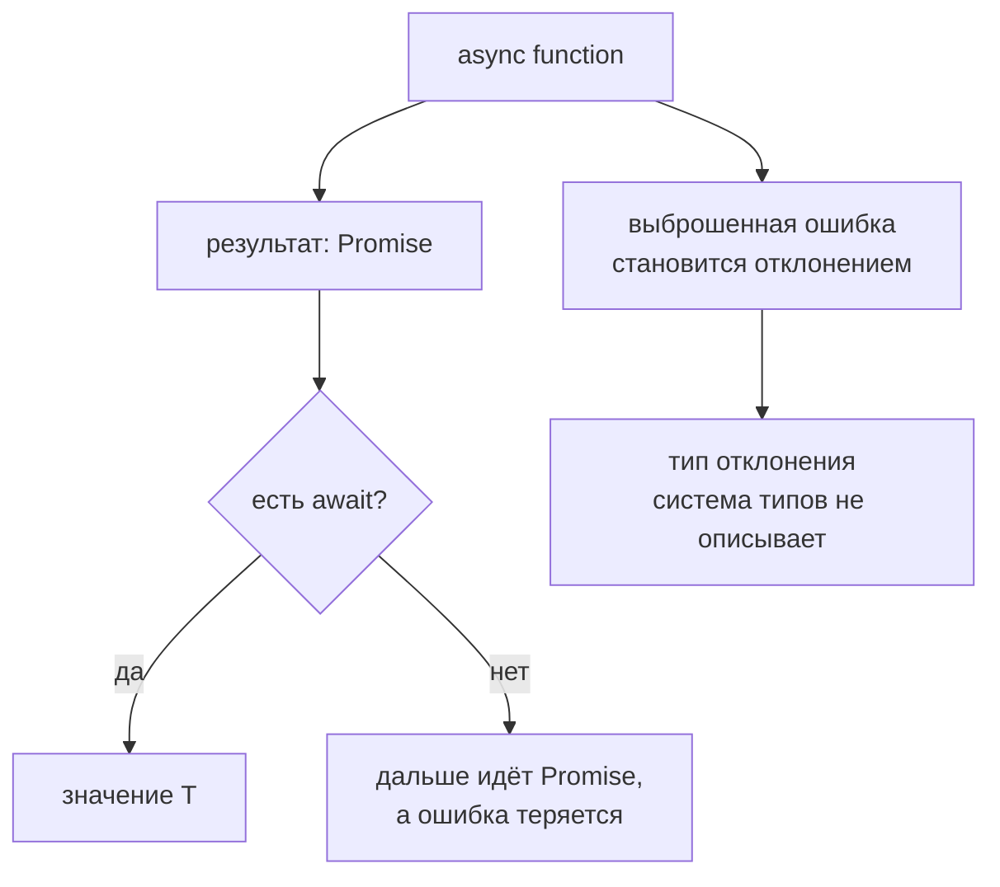

# Типы асинхронных функций

## Связь с предыдущей главой

Мы описали обычные функции и контекст `this`.

Теперь вернемся к уже знакомому JavaScript-механизму `async` и посмотрим, как TypeScript описывает его результат.

## Главный вопрос

> Как типизировать асинхронный результат?

Короткий ответ: асинхронная функция всегда возвращает `Promise`, а TypeScript описывает значение внутри него через `Promise<T>`.

## Мотивация

QA helpers часто читают данные, готовят окружение или получают ответ API асинхронно.

Если тип асинхронного результата не описан, вызывающий код может ожидать не те данные.

TypeScript помогает сделать договор асинхронной функции явным.

## Теория

### Результат всегда обёрнут в Promise

Асинхронная функция возвращает `Promise<T>`, даже если внутри возвращается обычное значение:

```typescript
async function loadStatus(): Promise<string> {
  return 'passed';
}
```

Аннотировать результат как `string` нельзя — это ошибка компиляции. Тип обязан быть `Promise<T>`.

Обратная сторона правила: результат нельзя использовать напрямую.

```typescript
const status: string = loadStatus();   // ошибка: это Promise<string>
```

Нужен `await` или обработка через `then`.

### Ошибка превращается в отклонённый Promise

```typescript
async function failSetup(): Promise<void> {
  throw new Error('setup failed');
}
```

Функция не выбрасывает исключение синхронно — она возвращает Promise, который будет отклонён. Поэтому обычный `try/catch` вокруг **вызова без `await`** ничего не поймает:

```typescript
try {
  failSetup();          // исключение не поймается
} catch { }

try {
  await failSetup();    // а так поймается
} catch { }
```

Это одна из самых частых причин, по которой ошибка в тесте остаётся незамеченной.

### Тип не описывает отклонение

`Promise<string>` говорит только об успешном значении. Тип ошибки в сигнатуре выразить нельзя — в JavaScript выбросить можно что угодно.

Отсюда и правило работы с `catch`: пойманное значение имеет тип `unknown` и требует проверки перед использованием.

### Вложенные Promise разворачиваются

```typescript
async function load(): Promise<string> {
  return Promise.resolve('x');   // допустимо
}
```

`Promise<Promise<string>>` не возникает: и `async`, и `await` разворачивают вложенность автоматически. Поэтому оборачивать готовый Promise в `Promise.resolve` внутри `async`-функции не нужно.

### Забытый `await` — тихая ошибка

Самая дорогая ошибка в тестовом коде: вызов асинхронной функции без ожидания.

```typescript
async function prepare() { }

test('сценарий', async () => {
  prepare();          // не дождались
  expect(true).toBe(true);
});
```

Тест завершится раньше подготовки, а отклонение Promise всплывёт позже — возможно, уже в другом тесте, и будет выглядеть как нестабильность.

Компилятор по умолчанию об этом молчит. Ловят такие места правилами линтера для «плавающих» Promise; это тот случай, когда одно правило окупает настройку линтера целиком.

### `await` работает и с обычными значениями

```typescript
const value = await 'x';   // допустимо
```

Это делает код устойчивым: функцию можно сделать асинхронной, не переписывая места вызова. Обратное тоже верно — лишний `await` на синхронном значении безвреден, хотя и добавляет микрозадачу.

### Асинхронность в типах колбэков

Если колбэк выполняет асинхронную работу, его тип обязан это отражать: `(x: T) => Promise<void>`, а не `(x: T) => void`. Иначе вызывающий код не дождётся завершения — подробнее в главе 123.

Асинхронный результат всегда обёрнут:


```mermaid
flowchart TD
    A["async function"] --> B["результат: Promise<T>"]
    B --> C{"есть await?"}
    C -- "да" --> D["значение T"]
    C -- "нет" --> E["дальше идёт Promise,<br/>а ошибка теряется"]
    A --> F["выброшенная ошибка<br/>становится отклонением"]
    F --> G["тип отклонения<br/>система типов не описывает"]
```

## Внутренний механизм

TypeScript проверяет, что значение, возвращаемое из асинхронной функции, подходит для `Promise<T>`.

Во время выполнения работает обычная модель `async` и `await`: результат оборачивается в промис, а ошибка превращается в отклонение.

Тип `Promise<T>` — это договор о будущем значении, а не само значение прямо сейчас.

### Возврат всегда оборачивается

```ts
async function load(): Promise<WorkItem> { … }
async function bad(): WorkItem { … }        // ошибка: тип должен быть Promise
```

Асинхронная функция не может объявить обычный тип результата — это не
соглашение, а следствие того, во что она превращается.

Вложенные промисы при этом разворачиваются: `Promise<Promise<T>>` не существует,
и `await` одного уровня достаточно. Утилита `Awaited<T>` в типах делает то же
самое.

### Где теряется ошибка

```ts
try {
  return createWorkItem(payload);          // без await: catch НЕ сработает
} catch (error) { … }

try {
  return await createWorkItem(payload);    // catch работает
} catch (error) { … }
```

Без `await` функция возвращает промис и выходит из блока `try` до того, как он
отклонится. Компилятор об этом не сообщает — обе формы корректны по типам.

| Форма | Ошибка ловится |
| --- | --- |
| `return promise` внутри `try` | нет |
| `return await promise` | да |
| `await` без `try` в вызывающем коде | да, у вызывающего |

Отдельно: пойманная ошибка имеет тип `unknown`, а не `Error`. Обратиться к
`error.message` без проверки нельзя — и это правильно, потому что в JavaScript
бросить можно что угодно.

## Главная ментальная модель

Тип асинхронной функции — это договор о будущем результате.

`Promise<string>` говорит: «сейчас у нас промис, а успешное значение внутри него будет строкой».

## Практические примеры

Примеры находятся в:

```text
examples/02-typescript/chapter-126/
```

`01-async-return-type.ts` показывает `Promise<T>`.

`02-rejected-promise.ts` показывает безопасную обработку отклонения.

`03-async-helper-contract.ts` показывает договор асинхронной вспомогательной функции.

## Automation QA

Асинхронная функция может возвращать статус подготовки:

```typescript
async function prepareEnvironment(): Promise<'ready'> {
  return 'ready';
}
```

Вызывающий код понимает, что сначала нужно дождаться промиса, а затем работать
со значением.

### Тип ловит забытый `await`

Самая дорогая ошибка в тестах — обращение к результату без ожидания. Тип
результата делает её ошибкой компиляции, если результат действительно
используется.

```typescript
async function readStatus(): Promise<string> {
  return 'NEW';
}

const status = readStatus();

// Ошибка компиляции: слева Promise<string>, а не string.
// console.log(status.toUpperCase());
```

Но защита неполна: `Promise<void>` без использования результата компилятор
пропустит молча. Именно этот случай разбирается в главе 167 — незавершённая
операция не падает, она теряется.

### `Promise<void>` — не то же, что отсутствие результата

Тип `Promise<void>` означает «дождаться нужно, а значения не будет». Если у
вспомогательной функции есть побочный эффект — создание записи, очистка,
запись в журнал, — её результат обязан быть промисом, даже когда возвращать
нечего. Иначе вызывающий код не узнает, что дожидаться вообще требуется.

## Распространённые ошибки

### Ошибка 1. Указывать тип результата без `Promise`

Асинхронная функция не возвращает `string` напрямую. Она возвращает `Promise<string>`.

### Ошибка 2. Думать, что TypeScript обработает отклонение

Ошибки асинхронных функций нужно обрабатывать обычными средствами JavaScript.

### Ошибка 3. Создавать лишний вложенный Promise

Если функция уже `async`, обычно не нужно вручную оборачивать результат в `Promise.resolve`.

## Распространённые мифы

**Миф: `async`-функция может вернуть обычное значение.**
Возвращаемый тип всегда `Promise<T>`; аннотация без `Promise` — ошибка.

**Миф: `try/catch` вокруг вызова поймает ошибку асинхронной функции.**
Без `await` не поймает: функция вернула отклонённый Promise, а не выбросила исключение.

**Миф: тип может описать ошибку, с которой Promise отклонится.**
Не может. Выбросить в JavaScript можно что угодно, поэтому в `catch` попадает `unknown`.

**Миф: забытый `await` компилятор заметит.**
По умолчанию нет. Нужны правила линтера для плавающих Promise.

## Частые вопросы

**Почему `const s: string = loadStatus()` не компилируется?**
Функция возвращает `Promise<string>`. Значение появится только после `await`.

**Нужно ли оборачивать результат в `Promise.resolve`?**
Нет. Внутри `async`-функции вложенность разворачивается автоматически.

**Как поймать ошибку асинхронной функции?**
Поставить `await` внутри `try` либо обработать через `.catch()`.

**Безопасно ли ставить `await` перед обычным значением?**
Да. Это позволяет менять функцию с синхронной на асинхронную, не трогая места вызова.

## Проверьте себя

1. Почему `async function f(): string` — ошибка?
2. Что произойдёт с `try/catch`, если убрать `await` перед вызовом асинхронной функции?
3. Почему тип не может описать причину отклонения Promise?
4. Возникает ли `Promise<Promise<T>>` при возврате Promise из `async`-функции?
5. Чем опасен забытый `await` в тесте и чем его ловят?

### Ответы

1. `async`-функция всегда возвращает промис, поэтому тип результата обязан быть `Promise<...>`.
2. Блок завершится до того, как промис отклонится, и `catch` ничего не поймает. Отклонение станет необработанным.
3. Система типов описывает только успешный результат. Бросить можно любое значение, и в типе это не выражается — поэтому пойманное проверяют во время выполнения.
4. Нет. Возвращаемый промис автоматически разворачивается: результат остаётся `Promise<T>`.
5. Тест продолжается, не дождавшись шага, и падает в другом месте или проходит ложно. Ловят правилом линтера о необработанных промисах и явным типом результата.

## Практика

Практика находится в:

```text
practice/02-typescript/126-async-function-types.md
```

Решения находятся в:

```text
solutions/02-typescript/126-async-function-types.md
```

## Краткие итоги

Главное:

* асинхронная функция возвращает Promise;
* явный тип результата записывается как `Promise<T>`;
* обычное возвращаемое значение превращается в исполненный промис;
* выброшенная ошибка делает промис отклонённым;
* TypeScript не обрабатывает асинхронные ошибки автоматически.

## Переход

Модуль типизации функций завершен.

Следующий модуль перейдёт к сужению типов: TypeScript начнёт уточнять объединения внутри веток кода.
