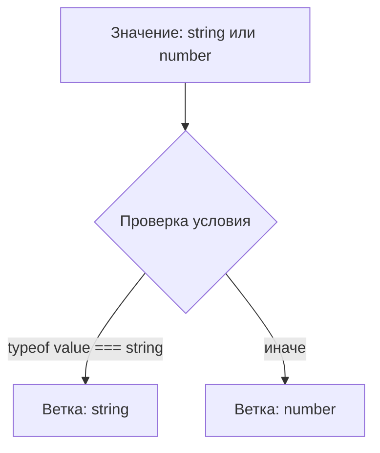
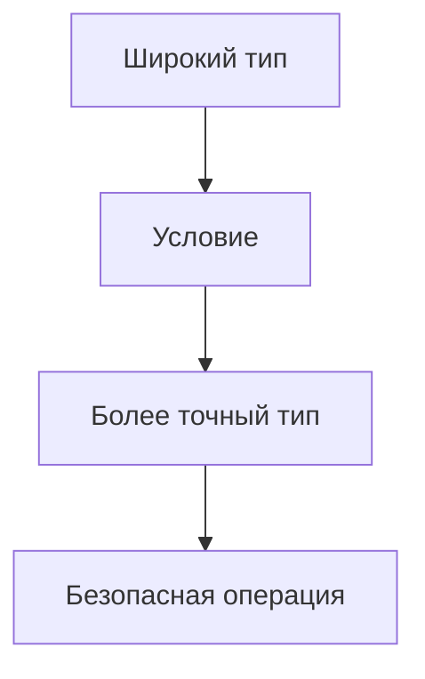

# Narrowing

## Связь с предыдущей главой

В главе про типизацию `async`-функций мы увидели, что TypeScript может описывать результат асинхронного кода до выполнения программы.

Теперь возникает следующий вопрос: если значение может иметь несколько вариантов типа, как TypeScript понимает, какой вариант доступен внутри конкретной ветки кода?

## Главный вопрос

Как TypeScript уточняет тип внутри ветки кода?

## Мотивация

В JavaScript часто встречаются значения, которые могут быть разными:

```ts
let result: string | Error;
```

Такой тип честно говорит: значение может быть строкой или объектом ошибки.

Но с union type нельзя сразу обращаться как с одним конкретным типом. TypeScript требует сначала доказать, какой вариант находится перед нами.

## Теория

### Сужение — это вывод компилятора

Narrowing уточняет тип значения на основе условий в коде:

```ts
function format(value: string | number): string {
  if (typeof value === "string") {
    return value.toUpperCase();
  }

  return value.toFixed(2);
}
```

В начале функции тип — `string | number`. Внутри первой ветки компилятор знает, что это `string`; после неё остаётся `number`.

Важно различать два процесса. Проверка `typeof` выполняется во время работы программы — это обычный JavaScript. Narrowing — это **вывод компилятора** о том, что проверка означает для типа. Значение при этом не меняется.

### Анализ потока учитывает выходы из функции

Компилятор смотрит не только на условие, но и на то, какие ветки уже завершились:

```ts
function normalize(message: string | undefined): string {
  if (message === undefined) {
    return "Без сообщения";
  }

  return message.trim();   // сюда дойдёт только определённое значение
}
```

Так же работают `throw`, `continue` и `break`. Ранний выход — самый читаемый способ сузить тип: он убирает вложенность и оставляет основной путь на верхнем уровне.

### Присваивание тоже сужает

```ts
let value: string | number;
value = "passed";
value.toUpperCase();   // компилятор знает, что сейчас это строка
```

И наоборот — присваивание **сбрасывает** ранее полученное сужение:

```ts
function reset(v: string | undefined, other: string | undefined) {
  if (v !== undefined) {
    v = other;
    v.trim();   // ошибка: после присваивания тип снова может быть undefined
  }
}
```

### Сужение в замыканиях

Внутри функции, созданной после проверки, сужение сохраняется — но только если переменную больше не переприсваивают:

```ts
const local = value;
if (local !== undefined) {
  const fn = () => local.trim();   // работает: local неизменяем
}
```

Если та же переменная объявлена через `let` и где-то ниже получает новое значение, компилятор перестаёт доверять сужению внутри замыкания: к моменту вызова там может оказаться что угодно.

Практический вывод: для значений, которые попадают в колбэки, предпочтительнее `const`.

### Где компилятор сознательно нестрог

Сужение свойства объекта **переживает вызов функции**:

```ts
if (box.value !== undefined) {
  sideEffect();          // функция могла обнулить box.value
  box.value.trim();      // компилятор всё равно считает значение определённым
}
```

Строго говоря, это небезопасно: вызванная функция могла изменить объект. TypeScript идёт на это сознательно — иначе любое обращение к свойству после любого вызова требовало бы повторной проверки, и код стал бы нечитаемым.

Знать об этом стоит: если объект действительно может измениться в процессе, сохраните значение в локальную переменную до проверки.

### Что не сужает

Обычная функция, возвращающая `boolean`, сужение не выполняет:

```ts
function isString(v: unknown) { return typeof v === "string"; }

if (isString(value)) {
  value.trim();   // ошибка: компилятор не знает, что означал true
}
```

Чтобы результат проверки влиял на тип, нужен предикат — тема главы 129.

## Внутренний механизм

TypeScript строит представление потока выполнения:



Компилятор смотрит не только на одно условие, но и на то, какие ветки уже завершились через `return`.

```ts
function normalize(message: string | undefined): string {
  if (message === undefined) {
    return "Без сообщения";
  }

  return message.trim();
}
```

После `return` TypeScript понимает: если выполнение дошло до последней строки, `message` уже не `undefined`.

## Главная ментальная модель



Narrowing превращает широкий тип в более точный только там, где код действительно это доказал.

## Практические примеры

```ts
type TestStatus = "passed" | "failed";

function formatStatus(status: TestStatus): string {
  if (status === "passed") {
    return "Тест прошел";
  }

  return "Тест упал";
}
```

```ts
function getErrorMessage(error: string | Error): string {
  if (typeof error === "string") {
    return error;
  }

  return error.message;
}
```

## Automation QA

В тестовом проекте один helper может возвращать разные состояния:

```ts
type LoginResult =
  | { status: "success"; userId: string }
  | { status: "failed"; reason: string };

function describeLogin(result: LoginResult): string {
  if (result.status === "success") {
    return `Пользователь: ${result.userId}`;
  }

  return `Ошибка входа: ${result.reason}`;
}
```

Условие по `status` помогает TypeScript понять, какие поля доступны в каждой ветке.

## Распространённые ошибки

Ошибка — обращаться к свойству до уточнения типа:

```ts
function print(value: string | number): void {
  // value.toUpperCase();
}
```

`toUpperCase()` есть у строки, но не у числа.

Еще одна ошибка — думать, что narrowing меняет значение. Он меняет только то, что TypeScript знает о значении в конкретной ветке.

## Распространённые мифы

**Миф: narrowing проверяет данные.**
Проверку выполняет JavaScript. Narrowing — это вывод компилятора о том, что проверка означает.

**Миф: сужение действует до конца функции.**
Присваивание сбрасывает его. В замыкании оно держится, только если переменную не переприсваивают.

**Миф: после вызова функции сужение свойства сбрасывается.**
Наоборот: оно сохраняется. Это осознанная нестрогость ради читаемости кода.

**Миф: любая функция, возвращающая `boolean`, сужает тип.**
Только функция с предикатом `value is T`.

## Частые вопросы

**Почему компилятор доверяет сужению свойства после вызова?**
Иначе после каждого вызова пришлось бы проверять всё заново. Это компромисс между строгостью и читаемостью.

**Как надёжно сузить свойство, которое может измениться?**
Сохранить его в локальную переменную до проверки и работать с ней.

**Почему сужение пропало внутри стрелочной функции?**
Скорее всего переменная объявлена через `let` и переприсваивается ниже. Используйте `const`.

**Чем ранний выход лучше вложенного условия?**
Он сужает тип для всего оставшегося кода и убирает вложенность.

## Проверьте себя

1. Чем проверка во время выполнения отличается от narrowing?
2. Как ранний `return` влияет на тип в оставшейся части функции?
3. Что сбрасывает уже полученное сужение?
4. При каком условии сужение сохраняется внутри замыкания?
5. Почему сужение свойства переживает вызов функции и чем это опасно?

## Практика

Практические задания находятся в конце страницы.

## Краткие итоги

- Narrowing уточняет union type внутри веток кода.
- TypeScript анализирует условия и поток выполнения.
- `return` может помогать компилятору исключать варианты.
- Narrowing не заменяет проверку внешних данных во время выполнения.
- Без narrowing нельзя безопасно использовать API конкретного варианта типа.

## Переход

Теперь мы понимаем общую идею narrowing. Следующий шаг — разобрать проверки, которые TypeScript уже умеет понимать без дополнительных функций.
