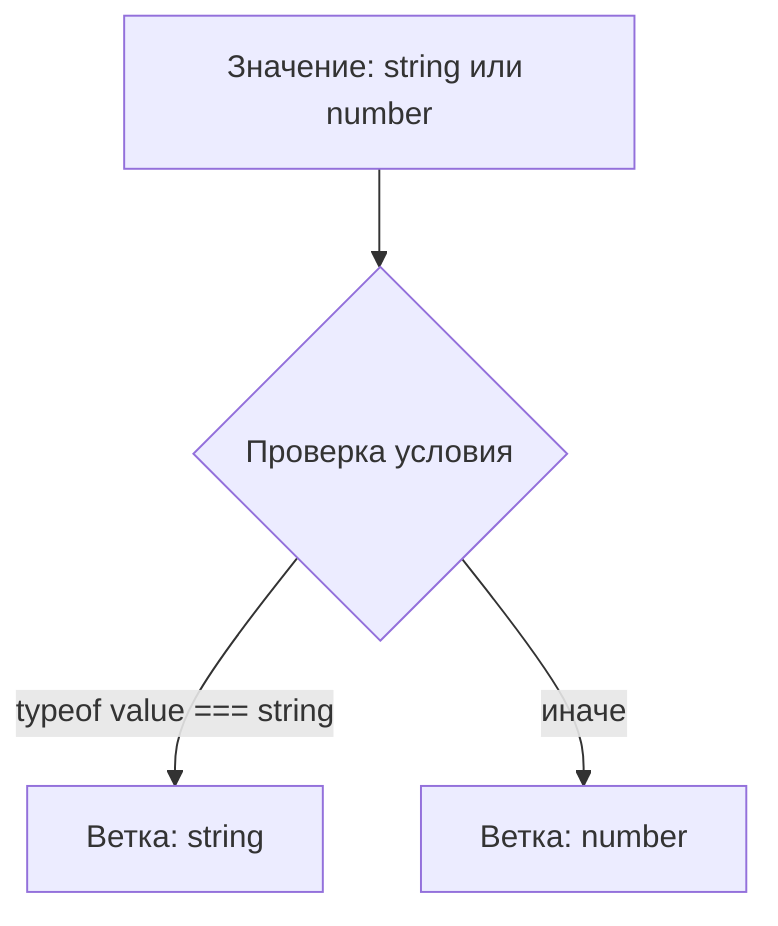
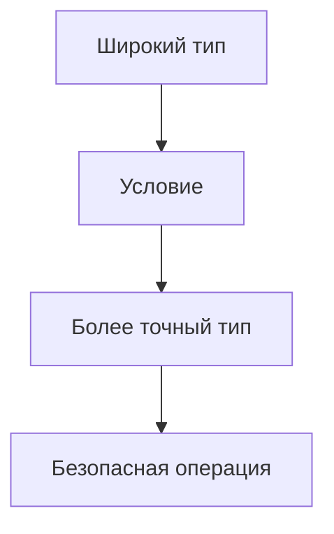

# Narrowing

## Связь с предыдущей главой

В главе про типизацию `async`-функций мы увидели, что TypeScript может описывать результат асинхронного кода до выполнения программы.

Теперь возникает следующий вопрос: если значение может иметь несколько вариантов типа, как TypeScript понимает, какой вариант доступен внутри конкретной ветки кода?

## Главный вопрос

Как TypeScript уточняет тип внутри ветки кода?

## Мотивация

В JavaScript часто встречаются значения, которые могут быть разными:

```ts
let result: string | Error;
```

Такой тип честно говорит: значение может быть строкой или объектом ошибки.

Но с union type нельзя сразу обращаться как с одним конкретным типом. TypeScript требует сначала доказать, какой вариант находится перед нами.

## Теория

Narrowing — это уточнение типа на основе условий.

TypeScript анализирует код и понимает:

```ts
function format(value: string | number): string {
  if (typeof value === "string") {
    return value.toUpperCase();
  }

  return value.toFixed(2);
}
```

В начале функции `value` имеет тип:

```ts
string | number
```

Внутри первой ветки TypeScript уточняет тип до:

```ts
string
```

После этой ветки остается:

```ts
number
```

Это не проверка данных во время выполнения. Проверка `typeof` выполняется в JavaScript во время работы программы, а narrowing — это вывод TypeScript на этапе проверки типов.

## Внутренний механизм

TypeScript строит представление потока выполнения:



Компилятор смотрит не только на одно условие, но и на то, какие ветки уже завершились через `return`.

```ts
function normalize(message: string | undefined): string {
  if (message === undefined) {
    return "Без сообщения";
  }

  return message.trim();
}
```

После `return` TypeScript понимает: если выполнение дошло до последней строки, `message` уже не `undefined`.

## Главная ментальная модель



Narrowing превращает широкий тип в более точный только там, где код действительно это доказал.

## Практические примеры

```ts
type TestStatus = "passed" | "failed";

function formatStatus(status: TestStatus): string {
  if (status === "passed") {
    return "Тест прошел";
  }

  return "Тест упал";
}
```

```ts
function getErrorMessage(error: string | Error): string {
  if (typeof error === "string") {
    return error;
  }

  return error.message;
}
```

## Automation QA

В тестовом проекте один helper может возвращать разные состояния:

```ts
type LoginResult =
  | { status: "success"; userId: string }
  | { status: "failed"; reason: string };

function describeLogin(result: LoginResult): string {
  if (result.status === "success") {
    return `Пользователь: ${result.userId}`;
  }

  return `Ошибка входа: ${result.reason}`;
}
```

Условие по `status` помогает TypeScript понять, какие поля доступны в каждой ветке.

## Распространённые ошибки

Ошибка — обращаться к свойству до уточнения типа:

```ts
function print(value: string | number): void {
  // value.toUpperCase();
}
```

`toUpperCase()` есть у строки, но не у числа.

Еще одна ошибка — думать, что narrowing меняет значение. Он меняет только то, что TypeScript знает о значении в конкретной ветке.

## Практика

Практические задания находятся в конце страницы.

## Краткие итоги

- Narrowing уточняет union type внутри веток кода.
- TypeScript анализирует условия и поток выполнения.
- `return` может помогать компилятору исключать варианты.
- Narrowing не заменяет проверку внешних данных во время выполнения.
- Без narrowing нельзя безопасно использовать API конкретного варианта типа.

## Переход

Теперь мы понимаем общую идею narrowing. Следующий шаг — разобрать проверки, которые TypeScript уже умеет понимать без дополнительных функций.
