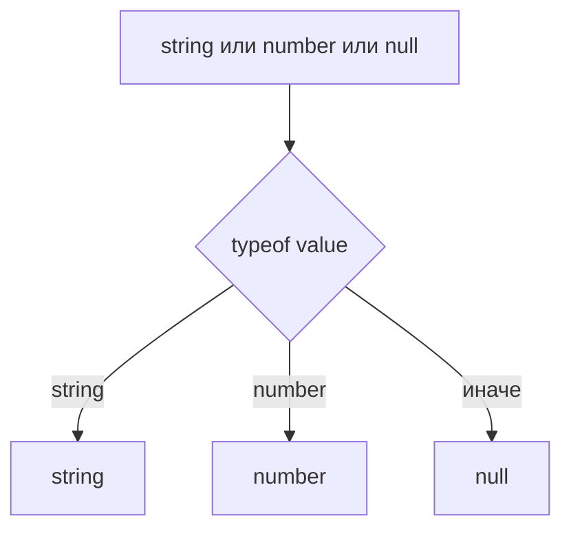
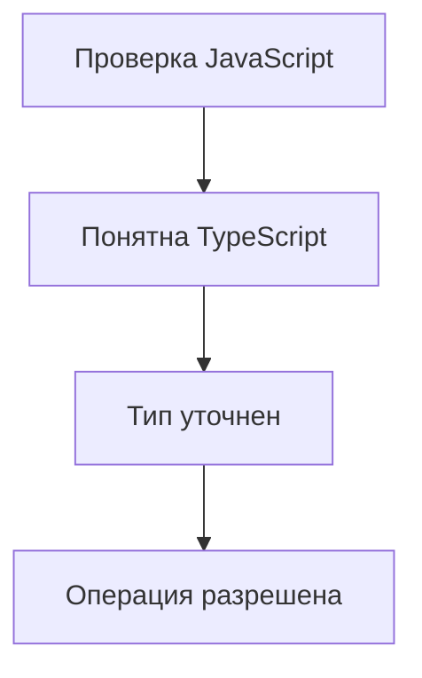

# Built-in Type Guards

## Связь с предыдущей главой

В предыдущей главе мы разобрали narrowing как уточнение union type внутри ветки кода.

Теперь нужно понять, какие проверки TypeScript распознает автоматически.

## Главный вопрос

Какие проверки TypeScript уже умеет понимать?

## Мотивация

В JavaScript проверки пишутся для выполнения программы:

```ts
typeof value === "string"
```

TypeScript использует такие проверки еще и для статического анализа. Если проверка достаточно понятна компилятору, она становится встроенным type guard.

## Теория

Built-in type guards — это стандартные JavaScript-проверки, которые TypeScript умеет использовать для сужения типа.

Основные проверки:

- `typeof`
- `instanceof`
- `in`
- сравнение значений
- проверка truthy/falsy

```ts
function format(value: string | number): string {
  if (typeof value === "number") {
    return value.toFixed(2);
  }

  return value.trim();
}
```

`typeof` хорошо подходит для примитивов.

Важно помнить границы `typeof`: для `null` результат будет `"object"`, массивы тоже дают `"object"`, а функции дают `"function"`. Поэтому `typeof` не проверяет форму объекта и не доказывает, какие поля внутри него есть.

## Внутренний механизм

TypeScript связывает проверку с возможными вариантами union type:



Проверка не делает данные правильными. Она только помогает компилятору понять, какая ветка соответствует какому типу.

## Главная ментальная модель



Встроенный type guard — это обычная проверка, которую TypeScript умеет читать.

## Практические примеры

`typeof`:

```ts
function normalize(value: string | number): string {
  if (typeof value === "string") {
    return value.trim();
  }

  return String(value);
}
```

`instanceof`:

```ts
function formatError(error: Error | string): string {
  if (error instanceof Error) {
    return error.message;
  }

  return error;
}
```

`instanceof` работает только с конструкторами, которые существуют во время выполнения, например `Error` или `Date`. Type alias и interface существуют только на этапе проверки TypeScript, поэтому их нельзя использовать справа от `instanceof`.

`in`:

```ts
type Success = { ok: true; data: string };
type Failure = { ok: false; error: string };

function read(response: Success | Failure): string {
  if ("data" in response) {
    return response.data;
  }

  return response.error;
}
```

Оператор `in` — это обычная JavaScript-проверка наличия ключа. Он учитывает собственные и унаследованные свойства. Сам факт наличия ключа не проверяет тип значения в этом свойстве и не делает весь внешний объект валидным.

## Automation QA

В Automation QA часто нужно обработать результат helper-функции:

```ts
type ApiResult =
  | { status: "ok"; body: string }
  | { status: "error"; message: string };

function getResultText(result: ApiResult): string {
  if (result.status === "ok") {
    return result.body;
  }

  return result.message;
}
```

Проверка `result.status === "ok"` уточняет тип результата внутри ветки.

## Распространённые ошибки

Ошибка — использовать truthiness там, где важно отличать пустую строку от отсутствующего значения:

```ts
function label(value: string | undefined): string {
  if (value) {
    return value;
  }

  return "Нет значения";
}
```

Пустая строка тоже falsy, поэтому такая проверка может быть логически неверной.

Другая ошибка — применять `in` к значению, которое может быть примитивом, без предварительной проверки.

## Практика

Практические задания находятся в конце страницы.

## Краткие итоги

- `typeof` уточняет примитивные типы.
- `instanceof` уточняет объекты, созданные через классы и встроенные конструкторы.
- `in` проверяет наличие свойства и помогает уточнять объектные union types.
- Наличие свойства не доказывает тип значения этого свойства.
- Equality narrowing полезен для literal types.
- Truthiness narrowing удобен, но может скрывать логические ошибки.

## Переход

Встроенных проверок хватает не всегда. В следующей главе мы научимся писать собственные функции-проверки, которые TypeScript тоже сможет понимать.
