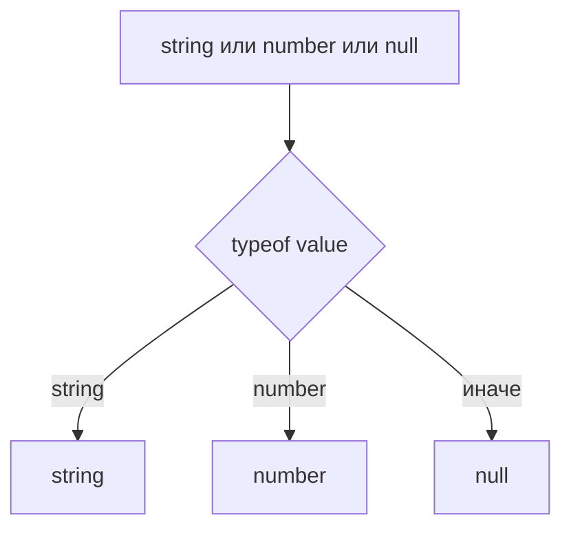
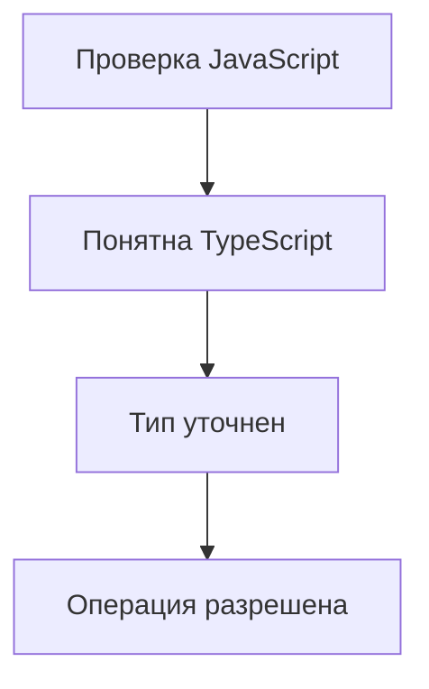

# Built-in Type Guards

## Связь с предыдущей главой

В предыдущей главе мы разобрали narrowing как уточнение union type внутри ветки кода.

Теперь нужно понять, какие проверки TypeScript распознает автоматически.

## Главный вопрос

Какие проверки TypeScript уже умеет понимать?

## Мотивация

В JavaScript проверки пишутся для выполнения программы:

```ts
typeof value === "string"
```

TypeScript использует такие проверки еще и для статического анализа. Если проверка достаточно понятна компилятору, она становится встроенным type guard.

## Теория

### Пять механизмов, которые компилятор понимает

Встроенные type guards — это обычные проверки JavaScript, значение которых компилятор умеет интерпретировать:

| Проверка | Для чего |
| --- | --- |
| `typeof` | Примитивы и функции |
| `instanceof` | Экземпляры классов |
| `in` | Наличие свойства у объекта |
| Сравнение с литералом | Размеченные объединения |
| Truthy/falsy | Отсечение `null` и `undefined` |

Ничего специального в них нет: это код, который выполнится и без TypeScript. Компилятор просто читает его смысл.

### `typeof` и его границы

`typeof` надёжен для примитивов, но об объектах говорит мало:

```ts
typeof null        // "object"  — историческая особенность JavaScript
typeof []          // "object"
typeof (() => {})  // "function"
```

Отсюда правило: проверка `typeof value === "object"` **не** доказывает, что перед вами объект нужной формы. Её почти всегда дополняют проверкой на `null` и на массив.

### `instanceof` требует конструктор

Справа от `instanceof` должно стоять то, что существует во время выполнения:

```ts
if (error instanceof Error) { }   // работает
if (value instanceof MyInterface) { }   // невозможно: интерфейс стёрт
```

Работает с `Error`, `Date`, `Map`, собственными классами. Не работает с `type` и `interface` — их после компиляции нет.

Отдельная тонкость: `instanceof` опирается на цепочку прототипов. Значение, пришедшее из другого контекста выполнения, может не пройти проверку, хотя выглядит как нужный класс.

### `in` проверяет ключ, а не тип

```ts
type Success = { ok: true; data: string };
type Failure = { ok: false; error: string };

if ("data" in response) {
  return response.data;
}
```

Оператор учитывает и унаследованные свойства. Он доказывает только **наличие ключа** — ни тип значения, ни корректность остального объекта из него не следуют.

Для размеченных объединений своих типов этого достаточно. Для внешних данных — нет.

### Сравнение с литералом

Основной приём для размеченных объединений:

```ts
if (result.status === "ok") {
  return result.body;
}
```

Он надёжнее `in`, потому что опирается на значение поля-признака, а не на присутствие ключа. Если варианты различаются признаком — используйте сравнение.

### Truthiness отсекает больше, чем ожидается

```ts
function label(value: string | undefined): string {
  if (value) {
    return value;
  }
  return "Нет значения";
}
```

Пустая строка тоже ложна, поэтому `""` попадёт в ветку «нет значения». То же с `0` для чисел.

Если различие важно, проверяйте явно: `value !== undefined`.

### `Array.isArray`

Единственный корректный способ отличить массив: `typeof` для него возвращает `"object"`, а `instanceof Array` ненадёжен между контекстами выполнения.

## Внутренний механизм

TypeScript связывает проверку с возможными вариантами union type:



Проверка не делает данные правильными. Она только помогает компилятору понять, какая ветка соответствует какому типу.

## Главная ментальная модель



Встроенный type guard — это обычная проверка, которую TypeScript умеет читать.

## Практические примеры

`typeof`:

```ts
function normalize(value: string | number): string {
  if (typeof value === "string") {
    return value.trim();
  }

  return String(value);
}
```

`instanceof`:

```ts
function formatError(error: Error | string): string {
  if (error instanceof Error) {
    return error.message;
  }

  return error;
}
```

`instanceof` работает только с конструкторами, которые существуют во время выполнения, например `Error` или `Date`. Type alias и interface существуют только на этапе проверки TypeScript, поэтому их нельзя использовать справа от `instanceof`.

`in`:

```ts
type Success = { ok: true; data: string };
type Failure = { ok: false; error: string };

function read(response: Success | Failure): string {
  if ("data" in response) {
    return response.data;
  }

  return response.error;
}
```

Оператор `in` — это обычная JavaScript-проверка наличия ключа. Он учитывает собственные и унаследованные свойства. Сам факт наличия ключа не проверяет тип значения в этом свойстве и не делает весь внешний объект валидным.

Запускаемые версии этих примеров находятся в:

```text
examples/02-typescript/chapter-128/
```

`01-typeof-and-truthiness.ts` — `typeof` для примитивов и ветка по умолчанию.

`02-in-and-instanceof.ts` — `in` для полей и `instanceof` для `Error`.

`03-invalid-in-on-unknown.ts` — `in` по значению `unknown` (намеренная ошибка).

## Automation QA

В Automation QA часто нужно обработать результат helper-функции:

```ts
type ApiResult =
  | { status: "ok"; body: string }
  | { status: "error"; message: string };

function getResultText(result: ApiResult): string {
  if (result.status === "ok") {
    return result.body;
  }

  return result.message;
}
```

Проверка `result.status === "ok"` уточняет тип результата внутри ветки.

## Распространённые ошибки

Ошибка — использовать truthiness там, где важно отличать пустую строку от отсутствующего значения:

```ts
function label(value: string | undefined): string {
  if (value) {
    return value;
  }

  return "Нет значения";
}
```

Пустая строка тоже falsy, поэтому такая проверка может быть логически неверной.

Другая ошибка — применять `in` к значению, которое может быть примитивом, без предварительной проверки.

## Распространённые мифы

**Миф: `typeof value === "object"` доказывает, что это объект нужной формы.**
Под это условие попадают и `null`, и массивы. Нужны дополнительные проверки.

**Миф: `instanceof` работает с любым типом.**
Только с тем, что существует во время выполнения. Интерфейсы и alias стёрты.

**Миф: `in` подтверждает тип значения.**
Он подтверждает только наличие ключа, включая унаследованные свойства.

**Миф: проверка на truthiness безопасна для строк.**
Пустая строка ложна и попадёт в ветку «значения нет».

## Частые вопросы

**Как правильно проверить, что значение — обычный объект?**
Три условия вместе: `typeof value === "object"`, `value !== null`, `!Array.isArray(value)`.

**Что выбрать для размеченного объединения: `in` или сравнение признака?**
Сравнение признака. Оно опирается на значение, а не на присутствие ключа.

**Почему `instanceof` иногда не срабатывает для правильного объекта?**
Значение может происходить из другого контекста выполнения с собственными прототипами.

**Когда truthiness всё-таки уместна?**
Когда пустая строка и ноль действительно должны обрабатываться как отсутствие значения.

## Проверьте себя

1. Какие пять проверок компилятор умеет использовать для сужения?
2. Почему `typeof null` возвращает `"object"` и к чему это обязывает?
3. Почему нельзя написать `value instanceof SomeInterface`?
4. Что именно доказывает оператор `in`?
5. Чем опасна проверка `if (value)` для строки?

## Практика

Практические задания находятся в конце страницы.

## Краткие итоги

- `typeof` уточняет примитивные типы.
- `instanceof` уточняет объекты, созданные через классы и встроенные конструкторы.
- `in` проверяет наличие свойства и помогает уточнять объектные union types.
- Наличие свойства не доказывает тип значения этого свойства.
- Equality narrowing полезен для literal types.
- Truthiness narrowing удобен, но может скрывать логические ошибки.

## Переход

Встроенных проверок хватает не всегда. В следующей главе мы научимся писать собственные функции-проверки, которые TypeScript тоже сможет понимать.
