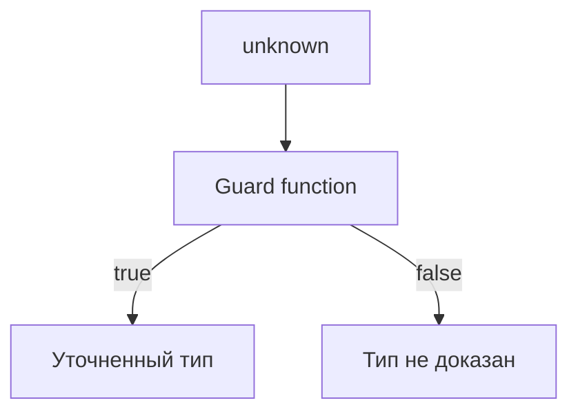
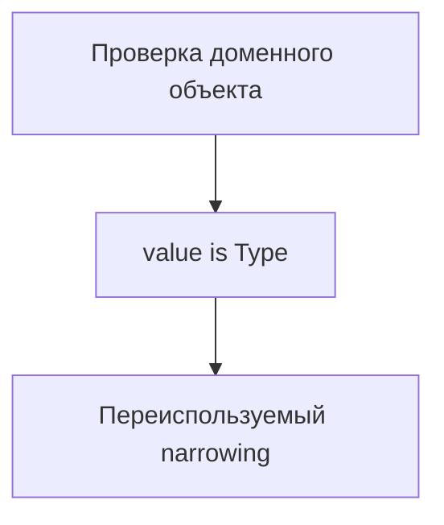

# User Defined Type Guards

## Связь с предыдущей главой

Мы уже знаем, что TypeScript понимает `typeof`, `instanceof`, `in` и сравнение значений.

Но в реальном проекте часто нужны проверки доменных объектов: ответа API, конфигурации, результата helper-функции.

## Главный вопрос

Как написать собственную проверку, которую понимает TypeScript?

## Мотивация

Обычная функция с результатом `boolean` говорит только:

```ts
true или false
```

Но TypeScript не всегда понимает, какой тип доказан этой функцией.

Пользовательский type guard позволяет описать это явно:

```ts
function isSuccess(value: unknown): value is Success
```

Такая функция сообщает TypeScript: если результат `true`, значение можно считать `Success`.

## Теория

Type predicate записывается так:

```ts
parameterName is Type
```

Пример:

```ts
type Success = {
  ok: true;
  data: string;
};

function isSuccess(value: unknown): value is Success {
  if (typeof value !== "object" || value === null || Array.isArray(value)) {
    return false;
  }

  return "ok" in value && value.ok === true && "data" in value && typeof value.data === "string";
}
```

После вызова guard-функции TypeScript уточняет тип:

```ts
function handle(value: unknown): string {
  if (isSuccess(value)) {
    return value.data;
  }

  return "Некорректный ответ";
}
```

## Внутренний механизм



TypeScript доверяет сигнатуре guard-функции. Поэтому если функция написана неверно, компилятор будет делать неверные выводы.

## Главная ментальная модель



Пользовательский type guard — это переиспользуемое сужение типа для своего домена.

## Практические примеры

```ts
type TestResult = {
  status: "passed" | "failed";
  durationMs: number;
};

function isTestResult(value: unknown): value is TestResult {
  if (typeof value !== "object" || value === null || Array.isArray(value)) {
    return false;
  }

  return (
    "status" in value &&
    (value.status === "passed" || value.status === "failed") &&
    "durationMs" in value &&
    typeof value.durationMs === "number"
  );
}
```

```ts
function format(value: unknown): string {
  if (!isTestResult(value)) {
    return "Неизвестный результат";
  }

  return `${value.status}: ${value.durationMs}ms`;
}
```

## Automation QA

В QA-проекте guard полезен на границе с внешними данными:

```ts
type ApiError = {
  errorCode: string;
  message: string;
};

function isApiError(value: unknown): value is ApiError {
  if (typeof value !== "object" || value === null || Array.isArray(value)) {
    return false;
  }

  return "errorCode" in value && typeof value.errorCode === "string" && "message" in value && typeof value.message === "string";
}
```

Такой guard можно использовать в API helper, чтобы дальше код работал с понятным типом.

## Распространённые ошибки

Главная ошибка — написать guard, который почти ничего не проверяет:

```ts
function isApiError(value: unknown): value is ApiError {
  return typeof value === "object";
}
```

Такая функция небезопасна: она обещает больше, чем реально проверяет. Для обычного объекта guard также должен учитывать, что массивы тоже являются объектами в JavaScript.

## Практика

Практические задания находятся в конце страницы.

## Краткие итоги

- Пользовательский type guard возвращает `value is Type`.
- Guard-функция должна реально проверять структуру значения.
- TypeScript доверяет сигнатуре guard.
- Неверный guard создает ложное чувство безопасности.
- В Automation QA guards полезны на границах с API, конфигурацией и внешними данными.

## Переход

Иногда TypeScript не может сам доказать тип, а разработчик знает больше о контексте. Следующая глава посвящена type assertions и их ограничениям.
