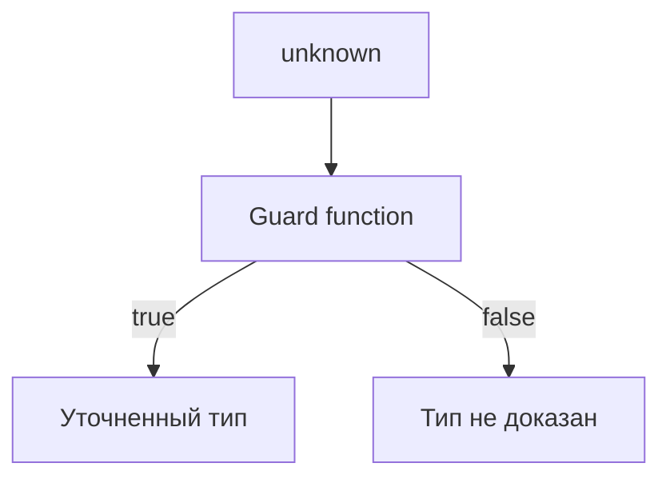
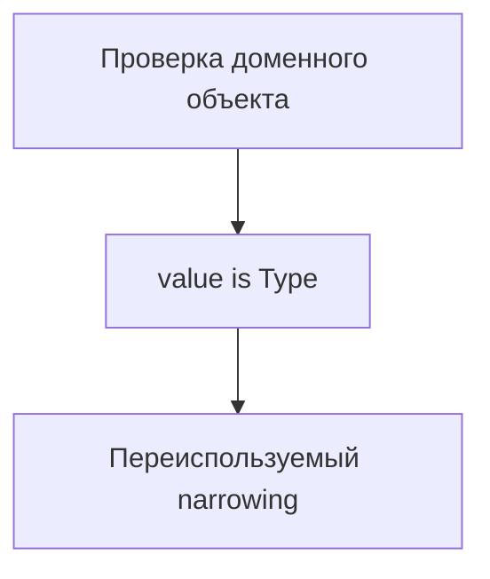

# User Defined Type Guards

## Связь с предыдущей главой

Мы уже знаем, что TypeScript понимает `typeof`, `instanceof`, `in` и сравнение значений.

Но в реальном проекте часто нужны проверки доменных объектов: ответа API, конфигурации, результата helper-функции.

## Главный вопрос

Как написать собственную проверку, которую понимает TypeScript?

## Мотивация

Обычная функция с результатом `boolean` говорит только:

```ts
true или false
```

Но TypeScript не всегда понимает, какой тип доказан этой функцией.

Пользовательский type guard позволяет описать это явно:

```ts
function isSuccess(value: unknown): value is Success
```

Такая функция сообщает TypeScript: если результат `true`, значение можно считать `Success`.

## Теория

### Предикат связывает проверку с типом

Обычная функция, возвращающая `boolean`, тип не сужает. Предикат — сужает:

```ts
function isSuccess(value: unknown): value is Success {
  ...
}
```

Запись `value is Success` означает: если функция вернула `true`, компилятор вправе считать аргумент типом `Success`.

```ts
if (isSuccess(value)) {
  return value.data;   // здесь тип уже сужен
}
```

### Компилятор доверяет, а не проверяет

Ключевое свойство, определяющее всю практику: **компилятор не анализирует тело guard-функции**. Он принимает обещание сигнатуры на веру.

```ts
function isApiError(value: unknown): value is ApiError {
  return typeof value === "object";   // почти ничего не проверено
}
```

Такая функция компилируется и молча ломает всю дальнейшую проверку типов. Неверный guard опаснее его отсутствия: без него компилятор хотя бы требовал осторожности.

Отсюда правило: guard — это место, где ответственность переходит от компилятора к автору. Его стоит писать внимательно и покрывать тестами.

### Как выглядит честный guard

Для объекта проверка состоит из трёх уровней:

```ts
function isTestResult(value: unknown): value is TestResult {
  if (typeof value !== "object" || value === null || Array.isArray(value)) {
    return false;
  }

  return (
    "status" in value &&
    (value.status === "passed" || value.status === "failed") &&
    "durationMs" in value &&
    typeof value.durationMs === "number"
  );
}
```

1. Это вообще объект, а не `null` и не массив.
2. Нужные ключи присутствуют.
3. Значения ключей имеют правильные типы.

Пропуск любого уровня превращает guard в обещание без основания.

### Функции-утверждения

Второй способ сузить тип — функция, которая не возвращает результат, а бросает исключение:

```ts
function assertIsString(value: unknown): asserts value is string {
  if (typeof value !== "string") {
    throw new Error("Ожидалась строка");
  }
}

function use(value: unknown) {
  assertIsString(value);
  return value.toUpperCase();   // после вызова тип сужен
}
```

Разница в применении: предикат нужен, когда оба исхода допустимы и разветвляют логику. Утверждение — когда неподходящее значение означает ошибку и продолжать бессмысленно.

Для тестового кода утверждения часто удобнее: они убирают ветвление и дают понятное сообщение в момент нарушения контракта.

### Guard для массивов

Массив проверяется отдельно: элементы нужно проверить все.

```ts
function isTestResultArray(value: unknown): value is TestResult[] {
  return Array.isArray(value) && value.every(isTestResult);
}
```

Соблазн проверить только первый элемент понятен, но он делает обещание ложным ровно в тот момент, когда данные окажутся неоднородными.

### Где размещать guard

Guard принадлежит **границе**: месту, где данные попадают в программу. Там он вызывается один раз, а дальше весь код работает с уже проверенным типом.

Guard, разбросанный по всему коду, сигнализирует, что граница не определена: неопределённость протекла вглубь и проверяется снова и снова.

## Внутренний механизм



TypeScript доверяет сигнатуре guard-функции. Поэтому если функция написана неверно, компилятор будет делать неверные выводы.

## Главная ментальная модель



Пользовательский type guard — это переиспользуемое сужение типа для своего домена.

## Практические примеры

```ts
type TestResult = {
  status: "passed" | "failed";
  durationMs: number;
};

function isTestResult(value: unknown): value is TestResult {
  if (typeof value !== "object" || value === null || Array.isArray(value)) {
    return false;
  }

  return (
    "status" in value &&
    (value.status === "passed" || value.status === "failed") &&
    "durationMs" in value &&
    typeof value.durationMs === "number"
  );
}
```

```ts
function format(value: unknown): string {
  if (!isTestResult(value)) {
    return "Неизвестный результат";
  }

  return `${value.status}: ${value.durationMs}ms`;
}
```

Запускаемые версии этих примеров находятся в:

```text
examples/02-typescript/chapter-129/
```

`01-type-predicate.ts` — предикат `value is ApiSuccess`.

`02-reusable-guard.ts` — переиспользуемый страж результата теста.

`03-false-guard-danger.ts` — страж, подтверждающий только часть формы.

## Automation QA

В QA-проекте guard полезен на границе с внешними данными:

```ts
type ApiError = {
  errorCode: string;
  message: string;
};

function isApiError(value: unknown): value is ApiError {
  if (typeof value !== "object" || value === null || Array.isArray(value)) {
    return false;
  }

  return "errorCode" in value && typeof value.errorCode === "string" && "message" in value && typeof value.message === "string";
}
```

Такой guard можно использовать в API helper, чтобы дальше код работал с понятным типом.

## Распространённые ошибки

Главная ошибка — написать guard, который почти ничего не проверяет:

```ts
function isApiError(value: unknown): value is ApiError {
  return typeof value === "object";
}
```

Такая функция небезопасна: она обещает больше, чем реально проверяет. Для обычного объекта guard также должен учитывать, что массивы тоже являются объектами в JavaScript.

## Распространённые мифы

**Миф: компилятор проверит, что guard действительно проверяет тип.**
Он доверяет сигнатуре. Тело функции не анализируется.

**Миф: неверный guard просто бесполезен.**
Он хуже отсутствия: даёт ложную уверенность и отключает дальнейшие проверки.

**Миф: достаточно проверить, что значение — объект.**
Нужны три уровня: объект, наличие ключей, типы значений.

**Миф: для массива хватит проверки первого элемента.**
Обещание распространяется на весь массив, значит проверить нужно все элементы.

## Частые вопросы

**Когда предикат, а когда функция-утверждение?**
Предикат — если оба исхода нормальны и ведут в разные ветки. Утверждение — если неподходящее значение означает ошибку.

**Нужно ли тестировать guard-функции?**
Да. Это единственное место, где ошибка не будет замечена компилятором.

**Где вызывать guard?**
На границе получения данных: после разбора ответа, чтения файла, получения переменной окружения.

**Почему guard встречается в коде много раз?**
Обычно это признак, что граница не определена и непроверенные данные ушли вглубь программы.

## Проверьте себя

1. Чем предикат отличается от обычной функции, возвращающей `boolean`?
2. Почему неверный guard опаснее его отсутствия?
3. Из каких трёх уровней состоит честная проверка объекта?
4. Чем функция-утверждение отличается от предиката по применению?
5. Где должен вызываться guard и о чём говорит его многократное использование?

## Практика

Практические задания находятся в конце страницы.

## Краткие итоги

- Пользовательский type guard возвращает `value is Type`.
- Guard-функция должна реально проверять структуру значения.
- TypeScript доверяет сигнатуре guard.
- Неверный guard создает ложное чувство безопасности.
- В Automation QA guards полезны на границах с API, конфигурацией и внешними данными.

## Переход

Иногда TypeScript не может сам доказать тип, а разработчик знает больше о контексте. Следующая глава посвящена type assertions и их ограничениям.
