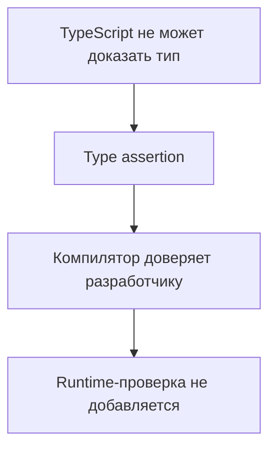
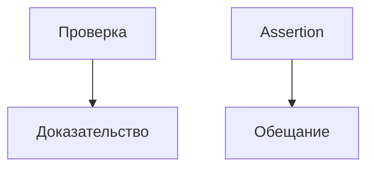

# Type Assertions

## Связь с предыдущей главой

В предыдущей главе мы писали проверки, которые действительно доказывают тип значения.

Теперь разберем другой инструмент: ситуацию, когда разработчик вручную сообщает TypeScript, каким типом считать значение.

## Главный вопрос

Когда программист сообщает TypeScript больше, чем компилятор может вывести сам?

## Мотивация

TypeScript анализирует код статически. Иногда он не знает того, что известно разработчику из контекста.

Например, значение пришло из внешнего источника и уже было проверено раньше.

В такой ситуации можно использовать type assertion:

```ts
const summary = value as TestSummary;
```

Но assertion не выполняет проверку во время работы программы.

## Теория

### Утверждение — это обещание, а не проверка

```ts
const value = unknownValue as SomeType;
```

Запись `as` не выполняет никакой работы во время выполнения. Она сообщает компилятору: «считай это значение таким типом» — и тот перестаёт возражать.

Разница с guard принципиальна: **guard доказывает тип, assertion его обещает**. Если обещание неверно, программа продолжит работать с ложным предположением, и ошибка проявится позже и в другом месте.

### Границы утверждения

Совсем произвольное приведение запрещено:

```ts
const bad = 42 as string;   // ошибка: типы не пересекаются
```

Компилятор допускает утверждение только между типами, у которых есть что-то общее. Обойти это можно двойным приведением:

```ts
const forced = 42 as unknown as string;
```

Появление `as unknown as` в коде — почти всегда признак, что происходит что-то сомнительное. Это сигнал остановиться и проверить предположение.

### Non-null assertion

Оператор `!` убирает `null` и `undefined` из типа:

```ts
const first = items[0]!;
```

Он не проверяет наличие значения — он заявляет, что значение есть. Для массива это особенно опасно: обращение по индексу и так оптимистично, а `!` снимает последнюю возможность заметить проблему.

Частый безопасный вариант — заменить `!` на явную проверку или на `at()` с обработкой отсутствия.

### Когда утверждение оправдано

Есть ситуации, где компилятор объективно знает меньше автора:

- значение уже проверено способом, который компилятор не понимает;
- сторонняя библиотека описана типами неточно;
- известна инвариантность, не выразимая в системе типов.

В этих случаях утверждение — рабочий инструмент. Но правило одно: **утверждение ставится после проверки, а не вместо неё**.

```ts
if (typeof value === "object" && value !== null && "status" in value) {
  const summary = value as TestSummary;
}
```

### Почему guard лучше

Тот же код можно оформить предикатом — и тогда обещание превратится в доказательство, переиспользуемое в других местах. Утверждение же одноразово и не оставляет следа: следующий разработчик не узнает, что проверка вообще была.

Практический ориентир: если утверждение повторяется больше одного раза для того же типа, его пора заменить guard-функцией.

### `as const` — другая конструкция

Совпадение синтаксиса обманчиво. `as Type` просит считать значение другим типом. `as const` не меняет тип на другой, а **запрещает его расширять**. Первое ослабляет проверку, второе усиливает.

## Внутренний механизм



Assertion меняет только статическое представление типа. JavaScript-код после компиляции не получает новой проверки.

## Главная ментальная модель



Guard доказывает тип. Assertion обещает тип.

## Практические примеры

```ts
type TestSummary = {
  status: "passed" | "failed";
};

function readSummary(value: unknown): TestSummary | undefined {
  if (
    typeof value === "object" &&
    value !== null &&
    "status" in value &&
    (value.status === "passed" || value.status === "failed")
  ) {
    return value as TestSummary;
  }

  return undefined;
}
```

Здесь assertion стоит после проверки единственного обязательного поля. Если бы у `TestSummary` были дополнительные поля, их тоже нужно было бы проверить до assertion.

```ts
function firstStatus(statuses: string[]): string {
  const first = statuses[0]!;
  return first.toUpperCase();
}
```

Во втором примере разработчик берет ответственность за то, что массив не пустой.

Запускаемые версии этих примеров находятся в:

```text
examples/02-typescript/chapter-130/
```

`01-type-assertion-after-check.ts` — утверждение типа после настоящей проверки.

`02-non-null-assertion.ts` — оператор `!` и его цена.

`03-dangerous-assertion.ts` — `as` между несовместимыми типами (намеренная ошибка).

## Automation QA

В QA-коде assertion иногда встречается после явной проверки:

```ts
type ReportConfig = {
  outputDir: string;
};

function getOutputDir(value: unknown): string {
  if (typeof value === "object" && value !== null && "outputDir" in value && typeof value.outputDir === "string") {
    const config = value as ReportConfig;
    return config.outputDir;
  }

  return "reports";
}
```

Лучше сначала сузить значение через проверку, а assertion использовать только там, где компилятору не хватает информации.

## Распространённые ошибки

Ошибка — использовать assertion вместо проверки:

```ts
const response = value as { data: string };
```

Если `value` не содержит `data`, TypeScript не остановит ошибку во время выполнения.

Еще одна ошибка — ставить `!` только чтобы убрать ошибку компилятора, не проверив, может ли значение отсутствовать.

## Распространённые мифы

**Миф: `as` преобразует значение.**
Никакого кода не добавляется. Меняется только представление компилятора.

**Миф: `!` проверяет, что значение есть.**
Он заявляет это. Проверки не происходит.

**Миф: `as unknown as T` — обычный приём.**
Это обход ограничения. Почти всегда признак неверного предположения.

**Миф: `as Type` и `as const` похожи.**
Первое ослабляет проверку, второе запрещает расширение типа.

## Частые вопросы

**Когда утверждение допустимо?**
После настоящей проверки либо когда компилятор объективно не знает того, что известно автору.

**Чем заменить `items[0]!`?**
Явной проверкой длины, `at()` с обработкой `undefined` или настройкой `noUncheckedIndexedAccess`.

**Почему `42 as string` не компилируется?**
Типы не пересекаются. Компилятор допускает утверждение только между связанными типами.

**Когда пора заменить утверждение guard-функцией?**
Когда одно и то же утверждение встречается для одного типа больше одного раза.

## Проверьте себя

1. В чём принципиальная разница между guard и assertion?
2. Почему `42 as string` запрещено, а `42 as unknown as string` — нет?
3. Что на самом деле делает оператор `!`?
4. При каком условии утверждение считается оправданным?
5. Чем `as const` отличается от `as Type` по влиянию на проверку?

## Практика

Практические задания находятся в конце страницы.

## Краткие итоги

- Type assertion меняет только статическое представление типа.
- Assertion не добавляет проверку во время выполнения.
- `as` полезен, когда контекст известен разработчику, но не компилятору.
- `!` убирает `null` и `undefined` из типа, но не из реального значения.
- Безопаснее сначала использовать narrowing или guard.

## Переход

Теперь мы различаем проверку и обещание. Следующая глава показывает способ проверить соответствие объекта типу, не теряя точность самого значения.
