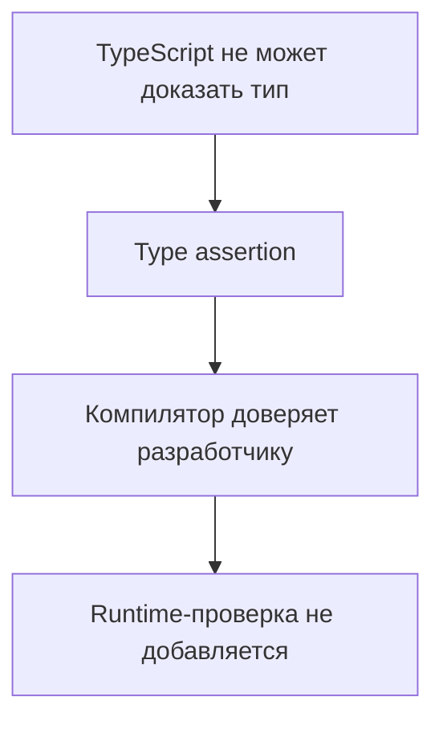
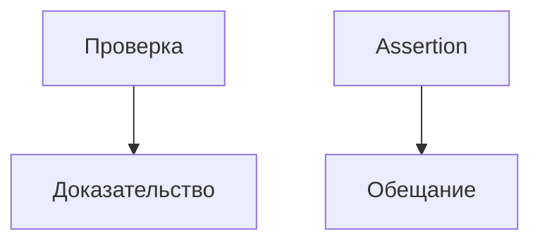

# Type Assertions

## Связь с предыдущей главой

В предыдущей главе мы писали проверки, которые действительно доказывают тип значения.

Теперь разберем другой инструмент: ситуацию, когда разработчик вручную сообщает TypeScript, каким типом считать значение.

## Главный вопрос

Когда программист сообщает TypeScript больше, чем компилятор может вывести сам?

## Мотивация

TypeScript анализирует код статически. Иногда он не знает того, что известно разработчику из контекста.

Например, значение пришло из внешнего источника и уже было проверено раньше.

В такой ситуации можно использовать type assertion:

```ts
const summary = value as TestSummary;
```

Но assertion не выполняет проверку во время работы программы.

## Теория

Type assertion говорит компилятору:

```text
считай это значение таким типом
```

Синтаксис:

```ts
const value = unknownValue as SomeType;
```

Non-null assertion сообщает, что значение не `null` и не `undefined`:

```ts
const first = items[0]!;
```

Обычный assertion `as Type` не равен `as const`. `as const` сохраняет максимально точные literal types у значения, а `as Type` просит компилятор считать значение указанным типом.

Оба инструмента нужно использовать осторожно: они ослабляют защиту TypeScript.

## Внутренний механизм



Assertion меняет только статическое представление типа. JavaScript-код после компиляции не получает новой проверки.

## Главная ментальная модель



Guard доказывает тип. Assertion обещает тип.

## Практические примеры

```ts
type TestSummary = {
  status: "passed" | "failed";
};

function readSummary(value: unknown): TestSummary | undefined {
  if (
    typeof value === "object" &&
    value !== null &&
    "status" in value &&
    (value.status === "passed" || value.status === "failed")
  ) {
    return value as TestSummary;
  }

  return undefined;
}
```

Здесь assertion стоит после проверки единственного обязательного поля. Если бы у `TestSummary` были дополнительные поля, их тоже нужно было бы проверить до assertion.

```ts
function firstStatus(statuses: string[]): string {
  const first = statuses[0]!;
  return first.toUpperCase();
}
```

Во втором примере разработчик берет ответственность за то, что массив не пустой.

## Automation QA

В QA-коде assertion иногда встречается после явной проверки:

```ts
type ReportConfig = {
  outputDir: string;
};

function getOutputDir(value: unknown): string {
  if (typeof value === "object" && value !== null && "outputDir" in value && typeof value.outputDir === "string") {
    const config = value as ReportConfig;
    return config.outputDir;
  }

  return "reports";
}
```

Лучше сначала сузить значение через проверку, а assertion использовать только там, где компилятору не хватает информации.

## Распространённые ошибки

Ошибка — использовать assertion вместо проверки:

```ts
const response = value as { data: string };
```

Если `value` не содержит `data`, TypeScript не остановит ошибку во время выполнения.

Еще одна ошибка — ставить `!` только чтобы убрать ошибку компилятора, не проверив, может ли значение отсутствовать.

## Практика

Практические задания находятся в конце страницы.

## Краткие итоги

- Type assertion меняет только статическое представление типа.
- Assertion не добавляет проверку во время выполнения.
- `as` полезен, когда контекст известен разработчику, но не компилятору.
- `!` убирает `null` и `undefined` из типа, но не из реального значения.
- Безопаснее сначала использовать narrowing или guard.

## Переход

Теперь мы различаем проверку и обещание. Следующая глава показывает способ проверить соответствие объекта типу, не теряя точность самого значения.
