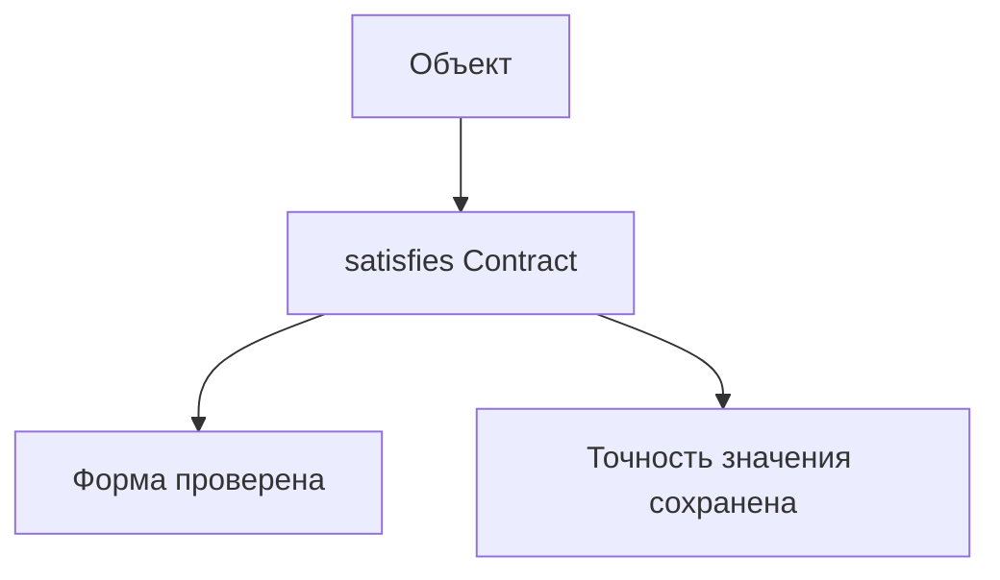
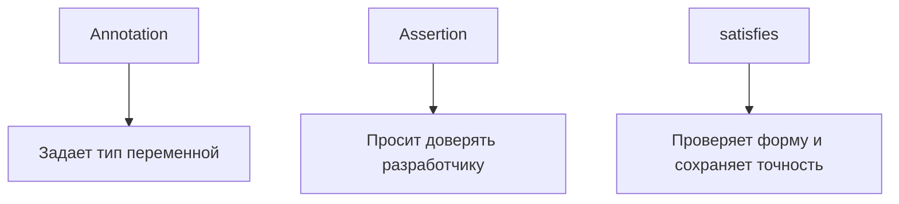

# satisfies

## Связь с предыдущей главой

Type assertion позволяет вручную сказать TypeScript, каким типом считать значение.

Но иногда нужно другое: проверить, что объект соответствует форме, и при этом не заменять тип, выведенный из самого выражения, целевым типом.

## Главный вопрос

Как проверить соответствие типу, не теряя точность значения?

## Мотивация

Annotation задает переменной общий тип:

```ts
type ReportConfig = {
  mode: "summary" | "detailed";
};

const config: ReportConfig = {
  mode: "summary",
};
```

Такой код проверяет форму, но значение может стать менее точным для дальнейшего анализа.

`satisfies` проверяет соответствие типу, но оставляет тип выражения выведенным из самого значения.

## Теория

### Проверить форму, не потеряв точность

`satisfies` проверяет, что выражение подходит под тип, но **оставляет выведенный тип выражения**:

```ts
type ReportConfig = {
  mode: "summary" | "detailed";
  includePassed: boolean;
};

const config = {
  mode: "summary",
  includePassed: true,
} satisfies ReportConfig;
```

Форма проверена. При этом `config.mode` остаётся `"summary"`, а не расширяется до объединения.

### Сравнение с аннотацией

Разница видна сразу:

```ts
const annotated: ReportConfig = { mode: "summary", includePassed: true };
const checked = { mode: "summary", includePassed: true } satisfies ReportConfig;

const a: "summary" = annotated.mode;   // ошибка: тип 'summary' | 'detailed'
const b: "summary" = checked.mode;     // работает
```

Аннотация **назначает** переменной тип: всё, что было известно точнее, теряется. `satisfies` только **сверяет** и ничего не назначает.

Именно поэтому для конфигураций и таблиц констант `satisfies` удобнее: форма проверяется, а конкретные значения остаются доступны коду.

### Сравнение с утверждением

| Инструмент | Что делает |
| --- | --- |
| Аннотация | Назначает тип, теряя точность выражения |
| `as` | Просит поверить, ничего не проверяя |
| `satisfies` | Проверяет соответствие, сохраняя точность |

`satisfies` закрывает пробел между первыми двумя: раньше приходилось выбирать между проверкой и точностью.

Там, где сейчас стоит `as` для «проверки» формы объекта-константы, почти всегда лучше подходит `satisfies`: он покажет ошибку вместо того, чтобы её скрыть.

### Чего `satisfies` не делает

- **Не делает объект `readonly`.** Это не замена `as const`: свойства остаются изменяемыми, а литеральные типы сохраняются только там, где целевой тип этого требует.
- **Не проверяет данные во время выполнения.** Как и всё остальное, конструкция стирается.
- **Не назначает тип переменной.** Если нужен именно объявленный тип — нужна аннотация.

### Сочетание с `as const`

Инструменты дополняют друг друга и часто используются вместе:

```ts
const policies = {
  smoke: { retries: 1 },
  regression: { retries: 3 },
} as const satisfies Record<string, { retries: number }>;
```

`as const` фиксирует значения и делает их неизменяемыми, `satisfies` проверяет, что структура соответствует ожидаемой. Ошибка в любом из уровней будет найдена, а типы останутся максимально точными.

### Где применять

Основные случаи — статические данные, которые одновременно должны соответствовать договору и оставаться точными:

- конфигурации окружений и запусков;
- таблицы соответствий: роли, статусы, политики повторов;
- наборы тестовых данных, из которых потом выводятся типы.

Для обычных переменных и параметров функций `satisfies` не нужен: там достаточно аннотации.

## Внутренний механизм



`satisfies` не меняет поведение во время выполнения. Это проверка на этапе компиляции.

Он также не делает объект `readonly` и не работает как `as const`.

## Главная ментальная модель



`satisfies` особенно полезен для конфигурационных объектов и таблиц констант, когда нужно проверить форму и сохранить тип выражения, а не заменить его annotation-типом.

## Практические примеры

```ts
type EnvironmentConfig = {
  baseUrl: string;
  retries: number;
};

const localConfig = {
  baseUrl: "http://localhost:3000",
  retries: 2,
} satisfies EnvironmentConfig;
```

```ts
type ReportConfig = {
  mode: "summary" | "detailed";
  includePassed: boolean;
};

const reportConfig = {
  mode: "summary",
  includePassed: true,
} satisfies ReportConfig;

const exactMode: "summary" = reportConfig.mode;
```

Запускаемые версии этих примеров находятся в:

```text
examples/02-typescript/chapter-131/
```

`01-satisfies-config.ts` — проверка конфигурации без потери значений.

`02-literal-preservation.ts` — сохранение литерального типа поля.

`03-invalid-satisfies.ts` — несоответствие типу при `satisfies` (намеренная ошибка).

## Automation QA

В QA-проекте `satisfies` удобно использовать для статических настроек:

```ts
type RetryPolicy = {
  retries: number;
  strategy: "none" | "linear";
};

const smokeRetryPolicy = {
  retries: 1,
  strategy: "linear",
} satisfies RetryPolicy;
```

Если написать неверное значение `strategy`, TypeScript покажет ошибку до запуска тестов.

## Распространённые ошибки

Ошибка — считать `satisfies` проверкой данных во время выполнения.

```ts
const config = {
  retries: 2,
} satisfies { retries: number };
```

После компиляции JavaScript не получает дополнительной проверки.

Другая ошибка — использовать `as`, когда нужна именно проверка формы. Assertion может скрыть проблему, а `satisfies` ее покажет.

## Распространённые мифы

**Миф: `satisfies` — это то же самое, что аннотация.**
Аннотация назначает тип и теряет точность выражения. `satisfies` только сверяет.

**Миф: `satisfies` делает объект неизменяемым.**
Не делает. За это отвечает `as const`.

**Миф: `satisfies` проверяет данные во время выполнения.**
Конструкция стирается при компиляции.

**Миф: `satisfies` заменяет `as` во всех случаях.**
Он заменяет `as` там, где нужна проверка формы. Для случаев, где компилятор объективно знает меньше, утверждение остаётся.

## Частые вопросы

**Когда `satisfies`, а когда аннотация?**
Если нужны точные значения свойств — `satisfies`. Если важно зафиксировать тип переменной — аннотация.

**Можно ли использовать вместе с `as const`?**
Да, и это частый приём: `as const` фиксирует значения, `satisfies` проверяет структуру.

**Почему `as` хуже для объекта-константы?**
Он скрывает несоответствие вместо того, чтобы показать его.

**Нужен ли `satisfies` для параметров функций?**
Нет. Там тип задан сигнатурой, и проверка выполняется и так.

## Проверьте себя

1. Что `satisfies` делает с типом выражения, в отличие от аннотации?
2. Почему `annotated.mode` нельзя присвоить переменной типа `"summary"`, а `checked.mode` — можно?
3. Чем `satisfies` отличается от `as` по отношению к ошибкам?
4. Делает ли `satisfies` объект неизменяемым?
5. Зачем сочетать `as const` и `satisfies`?

## Практика

Практические задания находятся в конце страницы.

## Краткие итоги

- `satisfies` проверяет соответствие типу на этапе компиляции.
- Он сохраняет выведенный тип выражения и не заменяет его целевым типом.
- Литеральные значения сохраняются там, где это следует из конкретного выражения и контекста.
- Это не проверка данных во время выполнения.
- `satisfies` полезен для конфигураций, констант и таблиц настроек.
- В отличие от assertion, он не просит TypeScript игнорировать несоответствие.

## Переход

Мы научились уточнять отдельные ветки и проверять формы объектов. Осталось понять, как убедиться, что обработаны все варианты union type.
