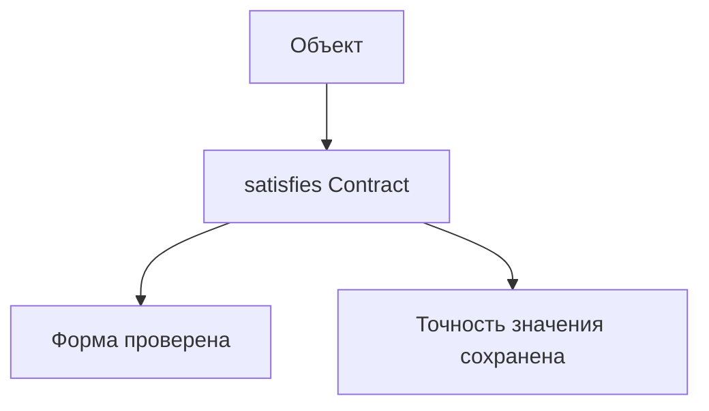
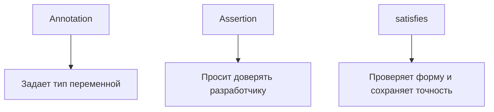

# satisfies

## Связь с предыдущей главой

Type assertion позволяет вручную сказать TypeScript, каким типом считать значение.

Но иногда нужно другое: проверить, что объект соответствует форме, и при этом не заменять тип, выведенный из самого выражения, целевым типом.

## Главный вопрос

Как проверить соответствие типу, не теряя точность значения?

## Мотивация

Annotation задает переменной общий тип:

```ts
type ReportConfig = {
  mode: "summary" | "detailed";
};

const config: ReportConfig = {
  mode: "summary",
};
```

Такой код проверяет форму, но значение может стать менее точным для дальнейшего анализа.

`satisfies` проверяет соответствие типу, но оставляет тип выражения выведенным из самого значения.

## Теория

```ts
type ReportConfig = {
  mode: "summary" | "detailed";
  includePassed: boolean;
};

const config = {
  mode: "summary",
  includePassed: true,
} satisfies ReportConfig;
```

TypeScript проверяет, что объект подходит под `ReportConfig`.

В этом примере `config.mode` остается точным значением `"summary"`, потому что целевой тип содержит literal union `"summary" | "detailed"`. Но `satisfies` не означает, что любое свойство всегда становится максимально узким литеральным типом.

## Внутренний механизм



`satisfies` не меняет поведение во время выполнения. Это проверка на этапе компиляции.

Он также не делает объект `readonly` и не работает как `as const`.

## Главная ментальная модель



`satisfies` особенно полезен для конфигурационных объектов и таблиц констант, когда нужно проверить форму и сохранить тип выражения, а не заменить его annotation-типом.

## Практические примеры

```ts
type EnvironmentConfig = {
  baseUrl: string;
  retries: number;
};

const localConfig = {
  baseUrl: "http://localhost:3000",
  retries: 2,
} satisfies EnvironmentConfig;
```

```ts
type ReportConfig = {
  mode: "summary" | "detailed";
  includePassed: boolean;
};

const reportConfig = {
  mode: "summary",
  includePassed: true,
} satisfies ReportConfig;

const exactMode: "summary" = reportConfig.mode;
```

## Automation QA

В QA-проекте `satisfies` удобно использовать для статических настроек:

```ts
type RetryPolicy = {
  retries: number;
  strategy: "none" | "linear";
};

const smokeRetryPolicy = {
  retries: 1,
  strategy: "linear",
} satisfies RetryPolicy;
```

Если написать неверное значение `strategy`, TypeScript покажет ошибку до запуска тестов.

## Распространённые ошибки

Ошибка — считать `satisfies` проверкой данных во время выполнения.

```ts
const config = {
  retries: 2,
} satisfies { retries: number };
```

После компиляции JavaScript не получает дополнительной проверки.

Другая ошибка — использовать `as`, когда нужна именно проверка формы. Assertion может скрыть проблему, а `satisfies` ее покажет.

## Практика

Практические задания находятся в конце страницы.

## Краткие итоги

- `satisfies` проверяет соответствие типу на этапе компиляции.
- Он сохраняет выведенный тип выражения и не заменяет его целевым типом.
- Литеральные значения сохраняются там, где это следует из конкретного выражения и контекста.
- Это не проверка данных во время выполнения.
- `satisfies` полезен для конфигураций, констант и таблиц настроек.
- В отличие от assertion, он не просит TypeScript игнорировать несоответствие.

## Переход

Мы научились уточнять отдельные ветки и проверять формы объектов. Осталось понять, как убедиться, что обработаны все варианты union type.
