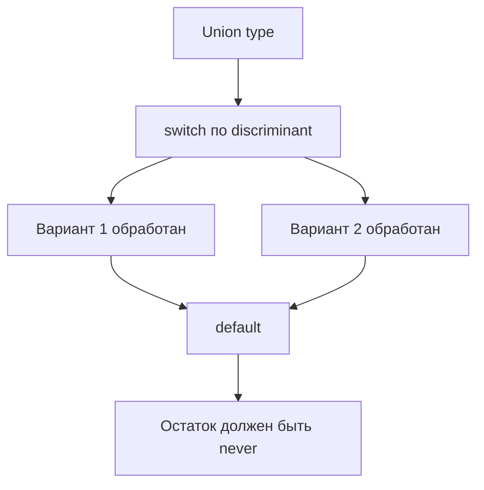
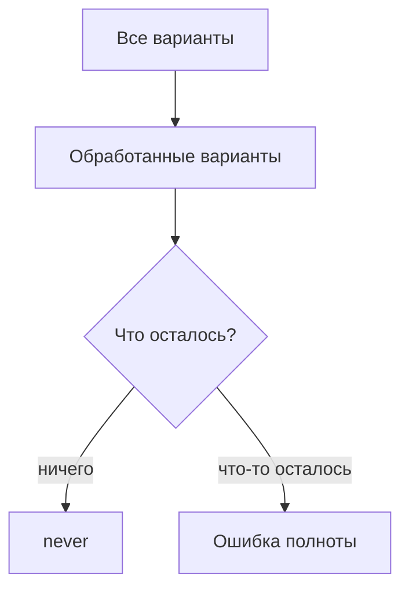

# Exhaustive Checks with never

## Связь с предыдущей главой

В предыдущих главах мы уточняли типы через условия, guard-функции и `satisfies`.

Теперь применим `never`, чтобы TypeScript проверял полноту обработки всех вариантов состояния.

## Главный вопрос

Как убедиться, что обработаны все варианты состояния?

## Мотивация

Union type часто описывает конечный набор состояний:

```ts
type ReportStatus =
  | { kind: "passed"; durationMs: number }
  | { kind: "failed"; message: string };
```

Если позже добавить новый вариант, старый `switch` может забыть его обработать.

Exhaustive check помогает поймать такую ошибку на этапе компиляции.

## Теория

`never` означает тип значения, которого не должно существовать.

Если все варианты union type обработаны, в ветке `default` ничего не остается:

```ts
function describe(status: ReportStatus): string {
  switch (status.kind) {
    case "passed":
      return `Прошел за ${status.durationMs}ms`;
    case "failed":
      return `Ошибка: ${status.message}`;
    default: {
      const exhaustive: never = status;
      return exhaustive;
    }
  }
}
```

Если появится новый вариант и его не обработать, `status` перестанет быть `never`, и TypeScript покажет ошибку.

## Внутренний механизм



Exhaustive check использует narrowing: каждая ветка `case` исключает один вариант union type.

## Главная ментальная модель



`never` превращает забытый вариант в ошибку компиляции.

## Практические примеры

```ts
type JobState =
  | { state: "queued" }
  | { state: "running"; attempt: number }
  | { state: "done"; passed: boolean };

function label(state: JobState): string {
  switch (state.state) {
    case "queued":
      return "В очереди";
    case "running":
      return `Попытка ${state.attempt}`;
    case "done":
      return state.passed ? "Успех" : "Падение";
    default: {
      const exhaustive: never = state;
      return exhaustive;
    }
  }
}
```

## Automation QA

В отчетах тестового проекта статус часто имеет ограниченный набор вариантов:

```ts
type TestReportStatus =
  | { kind: "passed"; durationMs: number }
  | { kind: "failed"; errorMessage: string }
  | { kind: "skipped"; reason: string };

function formatReportStatus(status: TestReportStatus): string {
  switch (status.kind) {
    case "passed":
      return `passed: ${status.durationMs}ms`;
    case "failed":
      return `failed: ${status.errorMessage}`;
    case "skipped":
      return `skipped: ${status.reason}`;
    default: {
      const exhaustive: never = status;
      return exhaustive;
    }
  }
}
```

Если команда добавит новый статус, TypeScript заставит обновить обработчик.

## Распространённые ошибки

Ошибка — добавить `default` без проверки `never`:

```ts
default:
  return "unknown";
```

Такой код скрывает забытый вариант.

Другая ошибка — использовать `never` без discriminated union. Exhaustive checks особенно полезны, когда у вариантов есть общее поле-дискриминатор.

## Практика

Практические задания находятся в конце страницы.

## Краткие итоги

- `never` показывает, что вариантов больше не осталось.
- Exhaustive check проверяет полноту обработки union type.
- `switch` по discriminant хорошо работает с состояниями.
- `default` без `never` может скрыть ошибку.
- В QA-коде это полезно для статусов тестов, отчетов и задач.

## Переход

Мы завершили модуль про narrowing и безопасные ветвления. Следующий раздел переходит к универсальным типам и покажет, как описывать повторно используемые типовые связи.
