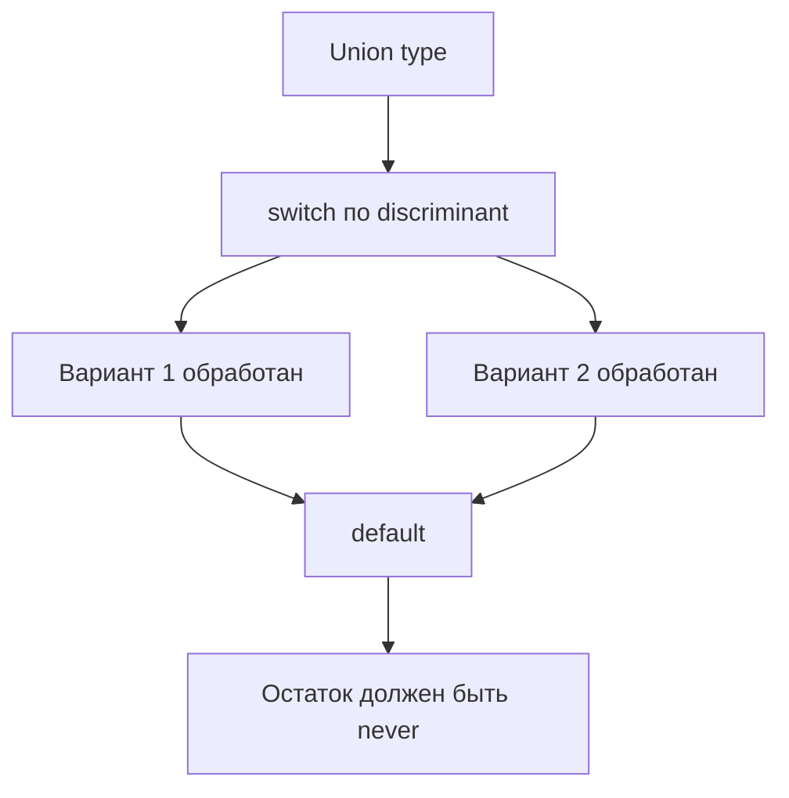
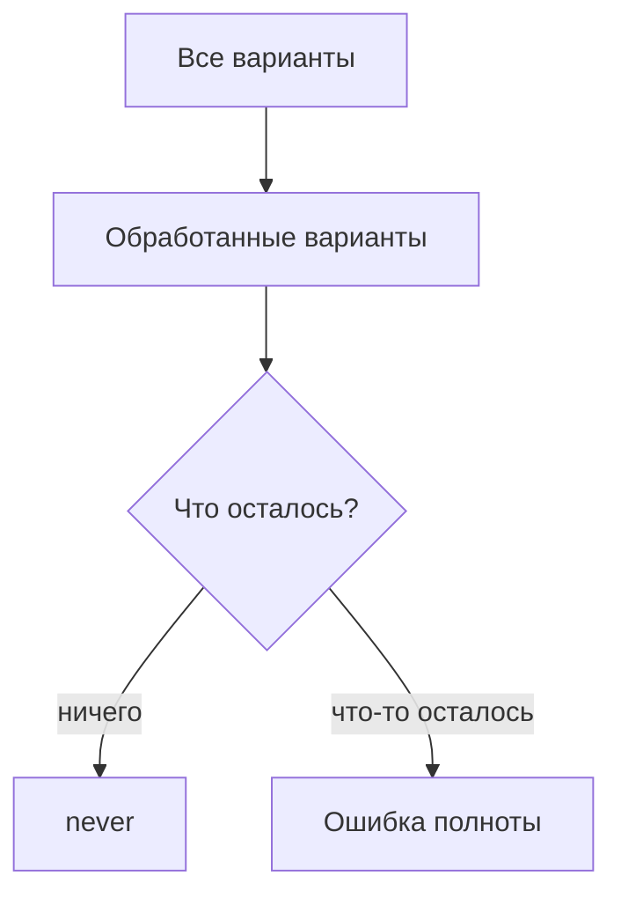

# Exhaustive Checks with never

## Связь с предыдущей главой

В предыдущих главах мы уточняли типы через условия, guard-функции и `satisfies`.

Теперь применим `never`, чтобы TypeScript проверял полноту обработки всех вариантов состояния.

## Главный вопрос

Как убедиться, что обработаны все варианты состояния?

## Мотивация

Union type часто описывает конечный набор состояний:

```ts
type ReportStatus =
  | { kind: "passed"; durationMs: number }
  | { kind: "failed"; message: string };
```

Если позже добавить новый вариант, старый `switch` может забыть его обработать.

Exhaustive check помогает поймать такую ошибку на этапе компиляции.

## Теория

### Забытый вариант должен стать ошибкой компиляции

`never` — тип, значений которого не существует. Если все варианты объединения разобраны, в ветке по умолчанию не остаётся ничего — и это можно проверить:

```ts
function describe(status: ReportStatus): string {
  switch (status.kind) {
    case "passed":
      return `Прошел за ${status.durationMs}ms`;
    case "failed":
      return `Ошибка: ${status.message}`;
    default: {
      const exhaustive: never = status;
      return exhaustive;
    }
  }
}
```

Пока варианты разобраны, присваивание проходит. Стоит добавить третий вариант — `status` в ветке по умолчанию перестанет быть `never`, и компилятор укажет на эту функцию.

### Почему это важнее, чем кажется

Обычный `default` с заглушкой выглядит безобидно:

```ts
default:
  return "unknown";
```

Но он превращает изменение модели в **тихую ошибку**: новый статус молча получит текст «unknown» и доедет до отчёта. Компилятор при этом промолчит, потому что формально код корректен.

Проверка полноты переворачивает ситуацию: расширение объединения становится задачей с готовым списком мест, требующих правки. Компилятор работает как инструмент рефакторинга.

### Механизм: сужение исчерпывает варианты

Каждая ветка `case` исключает один вариант. К ветке по умолчанию не остаётся ни одного, и тип схлопывается в `never`.

Отсюда требование: **объединение должно быть размеченным**. Без общего поля-признака сужение по `switch` не работает, и приём не применим.

### Работает и с `if`

`switch` удобнее для нескольких вариантов, но принцип тот же:

```ts
if (status.kind === "passed") return "…";
if (status.kind === "failed") return "…";

const exhaustive: never = status;
throw new Error(`Неизвестный вариант: ${JSON.stringify(exhaustive)}`);
```

### Бросать или возвращать

Два стиля завершения ветки:

```ts
return exhaustive;                                    // тип never подходит под любой результат
throw new Error(`Неизвестный статус: ${String(exhaustive)}`);   // явная ошибка
```

Первый короче, но при реальном попадании в эту ветку — например, когда данные пришли извне и содержат неизвестный статус — функция вернёт `undefined`. Второй вариант надёжнее: он превращает нарушение контракта в понятное исключение.

Для тестового кода предпочтителен второй: сообщение сразу покажет, какое значение пришло.

### Граница применимости

Проверка полноты защищает от забытых вариантов **в коде**. Она ничего не говорит о данных: если ответ API содержит статус, которого нет в объединении, компилятор об этом не узнает — значение попадёт в ветку по умолчанию уже во время выполнения.

Поэтому приём дополняют проверкой на границе, а не заменяют её.

## Внутренний механизм



Exhaustive check использует narrowing: каждая ветка `case` исключает один вариант union type.

## Главная ментальная модель



`never` превращает забытый вариант в ошибку компиляции.

## Практические примеры

```ts
type JobState =
  | { state: "queued" }
  | { state: "running"; attempt: number }
  | { state: "done"; passed: boolean };

function label(state: JobState): string {
  switch (state.state) {
    case "queued":
      return "В очереди";
    case "running":
      return `Попытка ${state.attempt}`;
    case "done":
      return state.passed ? "Успех" : "Падение";
    default: {
      const exhaustive: never = state;
      return exhaustive;
    }
  }
}
```

Запускаемые версии этих примеров находятся в:

```text
examples/02-typescript/chapter-132/
```

`01-exhaustive-switch.ts` — ветка `default` с `never`.

`02-missing-case-diagnostic.ts` — необработанный вариант объединения (намеренная ошибка).

`03-report-state-processing.ts` — разбор состояния задачи по всем вариантам.

## Automation QA

В отчетах тестового проекта статус часто имеет ограниченный набор вариантов:

```ts
type TestReportStatus =
  | { kind: "passed"; durationMs: number }
  | { kind: "failed"; errorMessage: string }
  | { kind: "skipped"; reason: string };

function formatReportStatus(status: TestReportStatus): string {
  switch (status.kind) {
    case "passed":
      return `passed: ${status.durationMs}ms`;
    case "failed":
      return `failed: ${status.errorMessage}`;
    case "skipped":
      return `skipped: ${status.reason}`;
    default: {
      const exhaustive: never = status;
      return exhaustive;
    }
  }
}
```

Если команда добавит новый статус, TypeScript заставит обновить обработчик.

## Распространённые ошибки

Ошибка — добавить `default` без проверки `never`:

```ts
default:
  return "unknown";
```

Такой код скрывает забытый вариант.

Другая ошибка — использовать `never` без discriminated union. Exhaustive checks особенно полезны, когда у вариантов есть общее поле-дискриминатор.

## Распространённые мифы

**Миф: `default` с заглушкой безопаснее, чем его отсутствие.**
Он скрывает забытый вариант: новый статус молча получит текст-заглушку.

**Миф: проверка полноты защищает от неизвестных данных.**
Она защищает от забытых веток в коде. Данные проверяются на границе.

**Миф: приём работает с любым объединением.**
Нужно поле-признак: без него сужение по ветвям не происходит.

**Миф: `return exhaustive` и `throw` равнозначны.**
При реальном попадании в ветку первый вернёт `undefined`, второй даст понятную ошибку.

## Частые вопросы

**Почему присваивание переменной типа `never` вообще компилируется?**
Потому что к этому моменту все варианты исключены и тип действительно `never`. Появление нового варианта ломает присваивание.

**Можно ли обойтись без `switch`?**
Да, последовательность `if` с ранним возвратом работает так же.

**Что делать, если данные приходят извне?**
Проверять их на границе и приводить к известному объединению. Проверка полноты применяется уже после этого.

**Зачем выводить значение в сообщении об ошибке?**
Чтобы при нарушении контракта сразу было видно, какое значение пришло.

## Проверьте себя

1. Почему в ветке по умолчанию тип становится `never`?
2. Чем `default` с заглушкой опаснее отсутствия проверки полноты?
3. Какое свойство объединения обязательно для работы приёма?
4. В чём разница между `return exhaustive` и `throw` при реальном попадании в ветку?
5. От чего проверка полноты не защищает?

## Практика

Практические задания находятся в конце страницы.

## Краткие итоги

- `never` показывает, что вариантов больше не осталось.
- Exhaustive check проверяет полноту обработки union type.
- `switch` по discriminant хорошо работает с состояниями.
- `default` без `never` может скрыть ошибку.
- В QA-коде это полезно для статусов тестов, отчетов и задач.

## Переход

Мы завершили модуль про narrowing и безопасные ветвления. Следующий раздел переходит к универсальным типам и покажет, как описывать повторно используемые типовые связи.
