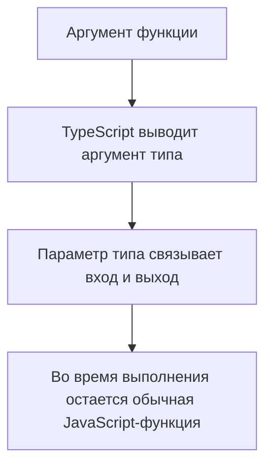
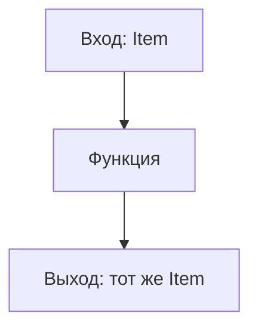

# Generic Functions

## Связь с предыдущей главой

В модуле про narrowing мы учились безопасно работать с разными вариантами данных.

Теперь появляется другая задача: написать одну функцию, которая сохраняет тип входных данных и не превращает его в `any`.

## Главный вопрос

Как функция может сохранить тип данных, который получает на вход?

## Мотивация

В JavaScript одна функция может работать с разными значениями:

```ts
function first(items: unknown[]) {
  return items[0];
}
```

Проблема в том, что TypeScript не знает связь между типом элементов массива и типом результата.

Обобщённая функция описывает эту связь.

## Теория

### Параметр типа сохраняет связь

Обобщённая функция вводит имя для типа, который станет известен при вызове:

```ts
function first<Item>(items: Item[]): Item | undefined {
  return items[0];
}
```

Ценность именно в **связи** между входом и выходом: какой тип элементов пришёл, такой и вернётся.

Сравните с `any`:

```ts
function firstAny(items: any[]): any { return items[0]; }
```

Функция работает, но результат больше ни с чем не связан — дальше проверка не действует. Дженерик решает ту же задачу, не теряя информацию.

### Вывод аргумента типа

Обычно аргумент типа указывать не нужно — компилятор выводит его из значений:

```ts
const status = first(["passed", "failed"]);   // string | undefined
```

Обратите внимание: `Item` выведен как `string`, а не как объединение литералов. Вывод из изменяемого массива **расширяет** литералы — это то же правило, что и для `let`.

### Как сохранить литералы

Если точные значения важны, параметр типа помечают модификатором `const`:

```ts
function firstConst<const Item>(items: readonly Item[]): Item | undefined {
  return items[0];
}

const status = firstConst(["passed", "failed"]);   // 'passed' | 'failed' | undefined
```

Модификатор говорит компилятору выводить тип так, будто к аргументу применён `as const`. Это избавляет вызывающий код от необходимости писать `as const` на каждом вызове.

### Явный аргумент типа

Указать тип можно и вручную:

```ts
const items = first<string>(["a"]);
```

Это нужно редко: когда вывод даёт слишком широкий или слишком узкий тип, либо когда значений для вывода нет. В остальных случаях явное указание только дублирует то, что компилятор и так знает.

### Без ограничения свойства недоступны

Частое заблуждение — считать, что параметр типа ведёт себя как `any`:

```ts
function printId<Entity>(entity: Entity) {
  return entity.id;   // ошибка: про Entity ничего не известно
}
```

И это правильно: `Entity` может оказаться числом. Чтобы читать свойство, нужно потребовать его наличие — тема следующей главы.

### Дженерик не создаёт копий функции

После компиляции остаётся одна обычная функция. Параметры типа стираются, никакой специализации под конкретные типы не происходит.

Отсюда практическое следствие: внутри функции нельзя узнать, чем был параметр типа. Если поведение должно от него зависеть, нужную информацию передают значением.

### Когда дженерик не нужен

Параметр типа, встречающийся в сигнатуре **один раз**, обычно лишний:

```ts
function log<Message>(message: Message): void { }
```

Связывать здесь нечего — то же самое выражает `unknown`. Дженерик оправдан, когда параметр типа появляется минимум дважды: связывает вход с выходом или два входа между собой.

## Внутренний механизм



Обобщённая функция не создает несколько версий во время выполнения. После компиляции остается одна JavaScript-функция.

## Главная ментальная модель

Обобщённая функция — это функция с сохранением типовой связи.



`any` стирает связь. Обобщённая функция ее сохраняет.

## Практические примеры

```ts
function wrapWithMeta<Value>(value: Value) {
  return {
    value,
    createdAt: new Date().toISOString(),
  };
}

const wrappedStatus = wrapWithMeta("passed");
```

```ts
function pair<Expected, Actual>(expected: Expected, actual: Actual) {
  return { expected, actual };
}

const comparison = pair(200, "200");
```

Запускаемые версии этих примеров находятся в:

```text
examples/02-typescript/chapter-133/
```

`01-first-generic.ts` — дженерик-функция для разных типов элементов.

`02-wrap-with-meta.ts` — сохранение типа значения при упаковке.

`03-generic-is-not-any.ts` — обращение к полю параметра-типа (намеренная ошибка).

## Automation QA

Обобщённые функции полезны для вспомогательных функций, которые не должны терять тип данных:

```ts
function createTestData<Data>(data: Data): Data {
  return data;
}

const user = createTestData({
  id: "u-1",
  role: "admin",
});
```

TypeScript сохраняет форму объекта `user`.

## Распространённые ошибки

Ошибка — использовать generic как замену `any`, а внутри функции делать предположения о свойствах:

```ts
function printId<Entity>(entity: Entity): void {
  // entity.id недоступен: Entity ничем не ограничен.
}
```

Если функция должна читать свойство, нужен constraint. Это тема следующей главы.

## Распространённые мифы

**Миф: дженерик — это `any` с красивым синтаксисом.**
`any` теряет связь между входом и выходом, дженерик её сохраняет.

**Миф: внутри обобщённой функции доступны свойства аргумента.**
Без ограничения о типе ничего не известно, поэтому свойства недоступны.

**Миф: для каждого типа создаётся своя версия функции.**
После компиляции остаётся одна функция; параметры типа стираются.

**Миф: аргумент типа нужно указывать явно.**
Обычно он выводится. Явное указание требуется редко.

## Частые вопросы

**Почему вывод дал `string`, а не объединение литералов?**
Вывод из изменяемого массива расширяет литеральные типы. Сохранить их помогает модификатор `const` у параметра типа.

**Когда указывать аргумент типа вручную?**
Когда вывод даёт неподходящий тип или выводить не из чего.

**Как понять, что дженерик лишний?**
Если параметр типа встречается в сигнатуре один раз, он ничего не связывает.

**Можно ли узнать внутри функции, чем был параметр типа?**
Нет: он стирается. Нужную информацию передают значением.

## Проверьте себя

1. Что именно сохраняет обобщённая функция в отличие от версии с `any`?
2. Почему `first(["passed", "failed"])` даёт `string | undefined`?
3. Что делает модификатор `const` у параметра типа?
4. Почему без ограничения нельзя обратиться к свойству аргумента?
5. По какому признаку понять, что параметр типа лишний?

## Практика

Практические задания находятся в конце страницы.

## Краткие итоги

- Обобщённая функция сохраняет связь между типами входа и выхода.
- Параметр типа существует только на этапе проверки TypeScript.
- TypeScript часто выводит аргумент типа автоматически.
- Generic не равен `any`.
- Generic не проверяет внешние данные во время выполнения.

## Переход

Теперь мы умеем сохранять типовую связь. Дальше нужно научиться ограничивать параметр типа минимальной формой.
