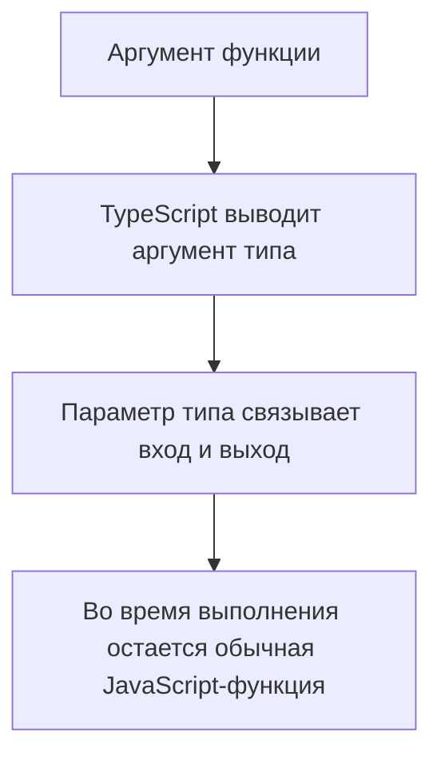
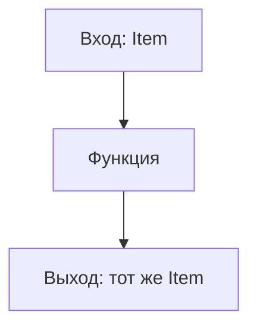

# Generic Functions

## Связь с предыдущей главой

В модуле про narrowing мы учились безопасно работать с разными вариантами данных.

Теперь появляется другая задача: написать одну функцию, которая сохраняет тип входных данных и не превращает его в `any`.

## Главный вопрос

Как функция может сохранить тип данных, который получает на вход?

## Мотивация

В JavaScript одна функция может работать с разными значениями:

```ts
function first(items: unknown[]) {
  return items[0];
}
```

Проблема в том, что TypeScript не знает связь между типом элементов массива и типом результата.

Обобщённая функция описывает эту связь.

## Теория

Обобщённая функция использует параметр типа:

```ts
function first<Item>(items: Item[]): Item | undefined {
  return items[0];
}
```

`Item` — это не значение во время выполнения. Это параметр типа, который существует только во время проверки TypeScript.

Когда функция вызывается, TypeScript может вывести аргумент типа сам:

```ts
const status = first(["passed", "failed"]);
```

Здесь `status` получает тип `string | undefined`.

## Внутренний механизм



Обобщённая функция не создает несколько версий во время выполнения. После компиляции остается одна JavaScript-функция.

## Главная ментальная модель

Обобщённая функция — это функция с сохранением типовой связи.



`any` стирает связь. Обобщённая функция ее сохраняет.

## Практические примеры

```ts
function wrapWithMeta<Value>(value: Value) {
  return {
    value,
    createdAt: new Date().toISOString(),
  };
}

const wrappedStatus = wrapWithMeta("passed");
```

```ts
function pair<Expected, Actual>(expected: Expected, actual: Actual) {
  return { expected, actual };
}

const comparison = pair(200, "200");
```

## Automation QA

Обобщённые функции полезны для вспомогательных функций, которые не должны терять тип данных:

```ts
function createTestData<Data>(data: Data): Data {
  return data;
}

const user = createTestData({
  id: "u-1",
  role: "admin",
});
```

TypeScript сохраняет форму объекта `user`.

## Распространённые ошибки

Ошибка — использовать generic как замену `any`, а внутри функции делать предположения о свойствах:

```ts
function printId<Entity>(entity: Entity): void {
  // entity.id недоступен: Entity ничем не ограничен.
}
```

Если функция должна читать свойство, нужен constraint. Это тема следующей главы.

## Практика

Практические задания находятся в конце страницы.

## Краткие итоги

- Обобщённая функция сохраняет связь между типами входа и выхода.
- Параметр типа существует только на этапе проверки TypeScript.
- TypeScript часто выводит аргумент типа автоматически.
- Generic не равен `any`.
- Generic не проверяет внешние данные во время выполнения.

## Переход

Теперь мы умеем сохранять типовую связь. Дальше нужно научиться ограничивать параметр типа минимальной формой.
