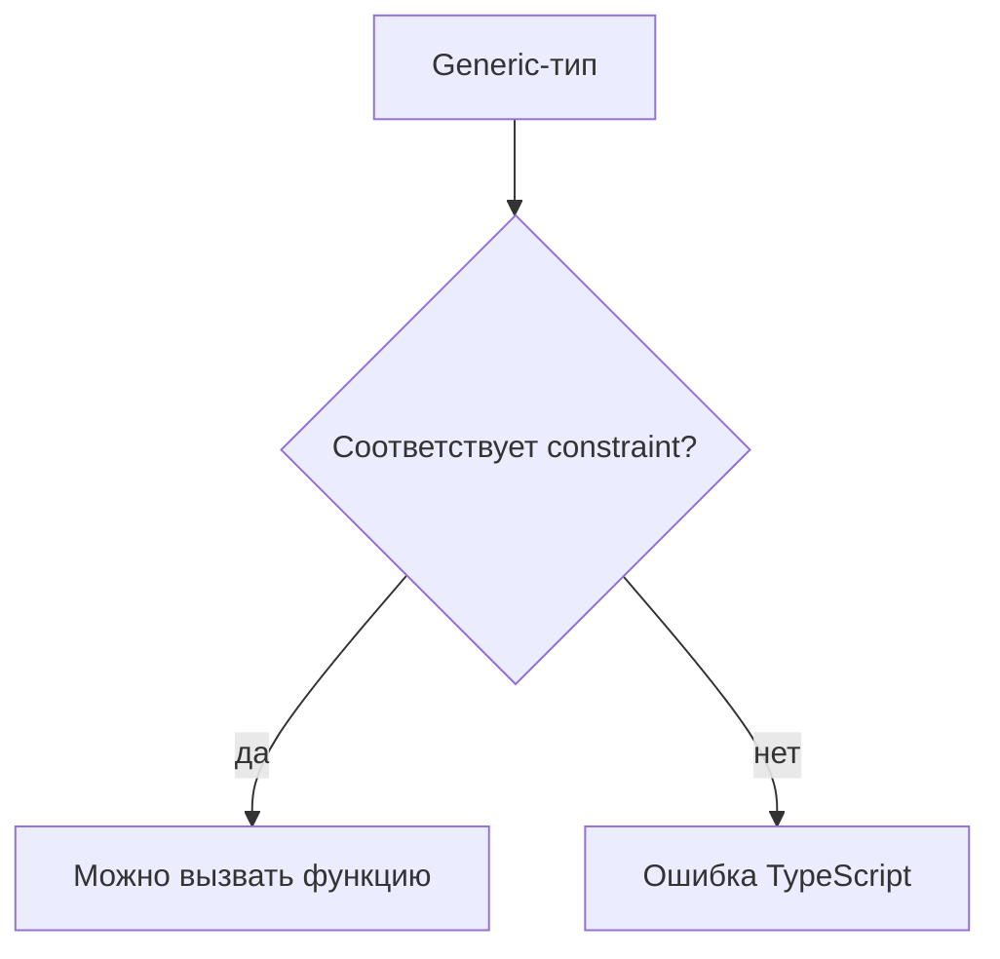
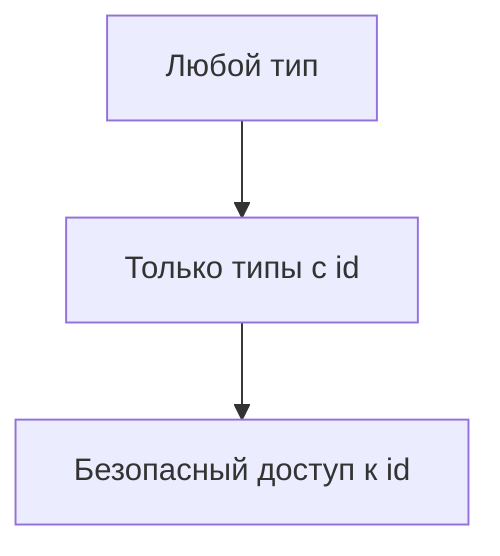

# Generic Constraints

## Связь с предыдущей главой

Обобщённая функция сохраняет типовую связь, но без ограничений TypeScript не знает, какие свойства доступны у параметра типа.

Теперь нужно научиться задавать минимальный контракт для параметра типа.

## Главный вопрос

Как ограничить параметр типа нужной формой?

## Мотивация

Если функция должна читать `id`, TypeScript должен знать, что входной тип точно содержит это свойство:

```ts
function getId<Entity>(entity: Entity) {
  // entity.id недоступен
}
```

Constraint решает эту проблему.

## Теория

### Ограничение — минимальный контракт параметра типа

Без ограничения о параметре типа не известно ничего, поэтому и сделать с ним ничего нельзя. Ограничение задаёт нижнюю границу требований:

```ts
function getId<Entity extends { id: string }>(entity: Entity): string {
  return entity.id;
}
```

Теперь компилятор знает: что бы ни подставили вместо `Entity`, поле `id` там есть.

### `extends` здесь — не наследование

Слово то же, смысл другой. В ограничении `extends` читается как «должен быть совместим с», а не «наследуется от».

Проверка структурная: подойдёт любой тип, у которого есть нужные свойства подходящих типов. Ни классов, ни иерархий не требуется.

### Ограничение не сужает результат

Ключевое свойство, ради которого всё и делается:

```ts
const result = getId({ id: "u-1", role: "admin" });
```

Аргумент сохраняет свой полный тип — `Entity` стал объектом с двумя полями, а не только с `id`. Если бы параметр был описан как `entity: { id: string }`, информация о `role` потерялась бы.

Именно поэтому дженерик с ограничением лучше обычного параметра: он **требует минимум, но помнит максимум**.

### Что можно ограничивать

Ограничением может быть любой тип, не только объект:

```ts
function hasItems<C extends { length: number }>(c: C): boolean { }
function fromList<T extends string | number>(items: T[]): T { }
function keys<O extends object>(o: O): (keyof O)[] { }
```

Ограничение `extends object` часто встречается, когда нужно исключить примитивы.

### Ограничение — не проверка данных

Как и всё остальное, ограничение стирается:

```ts
function getId<Entity extends { id: string }>(entity: Entity): string {
  return entity.id;
}
```

Если значение пришло из ответа API как `unknown`, компилятор потребует проверки **до** вызова, но внутри функции никакой проверки не будет. Ограничение доказывает соответствие на этапе компиляции — и только там, где типы известны.

### Ограничение и значение по умолчанию

Ограничение часто сочетают со значением параметра типа по умолчанию — это тема главы 138. Важно не путать две конструкции: ограничение задаёт допустимое множество типов, значение по умолчанию — что подставить, если аргумент не указан.

### Слишком сильное ограничение

Ограничение стоит делать **минимальным из достаточных**. Требование `Entity extends { id: string; createdAt: string }` там, где используется только `id`, сужает применимость функции без всякой пользы.

Практический признак: если ограничение перечисляет поля, к которым функция не обращается, его можно урезать.

## Внутренний механизм



Constraint проверяется до запуска программы и не добавляет проверку во время выполнения.

## Главная ментальная модель

Constraint — это минимальный контракт для параметра типа.



## Практические примеры

```ts
function label<Entity extends { id: string }>(entity: Entity): string {
  return `entity:${entity.id}`;
}

const userLabel = label({ id: "u-1", role: "admin" });
```

```ts
function hasItems<Collection extends { length: number }>(collection: Collection): boolean {
  return collection.length > 0;
}

const result = hasItems(["login", "checkout"]);
```

## Automation QA

В тестовых данных часто есть общие поля:

```ts
function markEntity<Entity extends { id: string }>(entity: Entity) {
  return {
    entity,
    marker: `test-${entity.id}`,
  };
}
```

Функция сохраняет исходный тип `Entity`, но требует поле `id`.

## Распространённые ошибки

Ошибка — считать constraint валидацией во время выполнения.

```ts
function getId<Entity extends { id: string }>(entity: Entity): string {
  return entity.id;
}
```

Если данные пришли извне как `unknown`, их все равно нужно проверить до использования.

## Распространённые мифы

**Миф: `extends` в ограничении означает наследование.**
Он означает совместимость по структуре. Классы не нужны.

**Миф: ограничение сужает тип аргумента до себя.**
Аргумент сохраняет полный тип. В этом главное преимущество перед обычным параметром.

**Миф: ограничение проверяет данные во время выполнения.**
Оно стирается. Внешние данные проверяются отдельно.

**Миф: чем строже ограничение, тем лучше.**
Лишние требования сужают применимость функции без пользы.

## Частые вопросы

**Чем дженерик с ограничением лучше обычного параметра `{ id: string }`?**
Он помнит полный тип аргумента, а обычный параметр обрезает его до объявленного.

**Можно ли ограничить примитивами?**
Да, ограничением может быть любой тип, включая объединения примитивов.

**Как исключить примитивы?**
Ограничением `extends object`.

**Как понять, что ограничение избыточно?**
Если оно требует свойства, к которым функция не обращается.

## Проверьте себя

1. Что даёт ограничение параметра типа и почему без него свойства недоступны?
2. Чем `extends` в ограничении отличается от наследования?
3. Почему аргумент сохраняет полный тип, а не сужается до ограничения?
4. Проверяет ли ограничение данные во время выполнения?
5. По какому признаку ограничение считается избыточным?

## Практика

Практические задания находятся в конце страницы.

## Краткие итоги

- Constraint ограничивает допустимые аргументы типа.
- `extends` в constraint означает требование к типу, а не наследование во время выполнения.
- Внутри функции доступны только свойства из constraint.
- Constraint не проверяет данные во время выполнения.
- Слишком широкий constraint дает мало пользы.

## Переход

Теперь мы можем требовать форму объекта. Следующая глава покажет, как ограничить значение только ключами существующего объекта.
