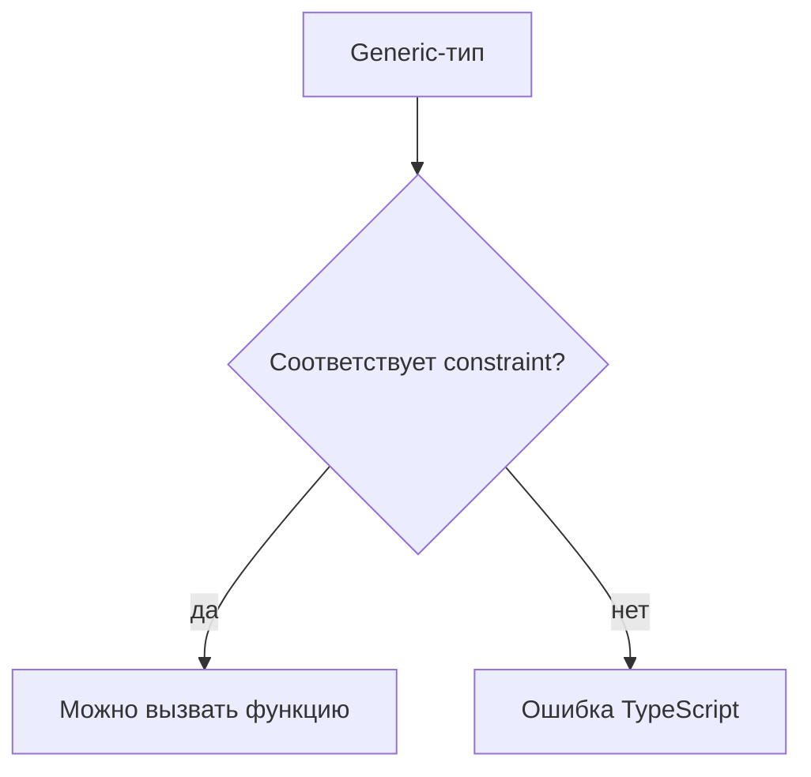
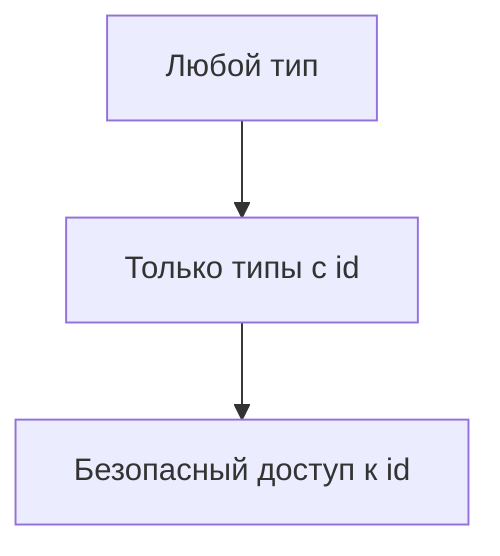

# Generic Constraints

## Связь с предыдущей главой

Обобщённая функция сохраняет типовую связь, но без ограничений TypeScript не знает, какие свойства доступны у параметра типа.

Теперь нужно научиться задавать минимальный контракт для параметра типа.

## Главный вопрос

Как ограничить параметр типа нужной формой?

## Мотивация

Если функция должна читать `id`, TypeScript должен знать, что входной тип точно содержит это свойство:

```ts
function getId<Entity>(entity: Entity) {
  // entity.id недоступен
}
```

Constraint решает эту проблему.

## Теория

Generic constraint записывается через `extends`:

```ts
function getId<Entity extends { id: string }>(entity: Entity): string {
  return entity.id;
}
```

Здесь `extends` означает требование к форме типа, а не наследование класса во время выполнения.

TypeScript разрешает использовать только свойства, гарантированные constraint.

## Внутренний механизм



Constraint проверяется до запуска программы и не добавляет проверку во время выполнения.

## Главная ментальная модель

Constraint — это минимальный контракт для параметра типа.



## Практические примеры

```ts
function label<Entity extends { id: string }>(entity: Entity): string {
  return `entity:${entity.id}`;
}

const userLabel = label({ id: "u-1", role: "admin" });
```

```ts
function hasItems<Collection extends { length: number }>(collection: Collection): boolean {
  return collection.length > 0;
}

const result = hasItems(["login", "checkout"]);
```

## Automation QA

В тестовых данных часто есть общие поля:

```ts
function markEntity<Entity extends { id: string }>(entity: Entity) {
  return {
    entity,
    marker: `test-${entity.id}`,
  };
}
```

Функция сохраняет исходный тип `Entity`, но требует поле `id`.

## Распространённые ошибки

Ошибка — считать constraint валидацией во время выполнения.

```ts
function getId<Entity extends { id: string }>(entity: Entity): string {
  return entity.id;
}
```

Если данные пришли извне как `unknown`, их все равно нужно проверить до использования.

## Практика

Практические задания находятся в конце страницы.

## Краткие итоги

- Constraint ограничивает допустимые аргументы типа.
- `extends` в constraint означает требование к типу, а не наследование во время выполнения.
- Внутри функции доступны только свойства из constraint.
- Constraint не проверяет данные во время выполнения.
- Слишком широкий constraint дает мало пользы.

## Переход

Теперь мы можем требовать форму объекта. Следующая глава покажет, как ограничить значение только ключами существующего объекта.
