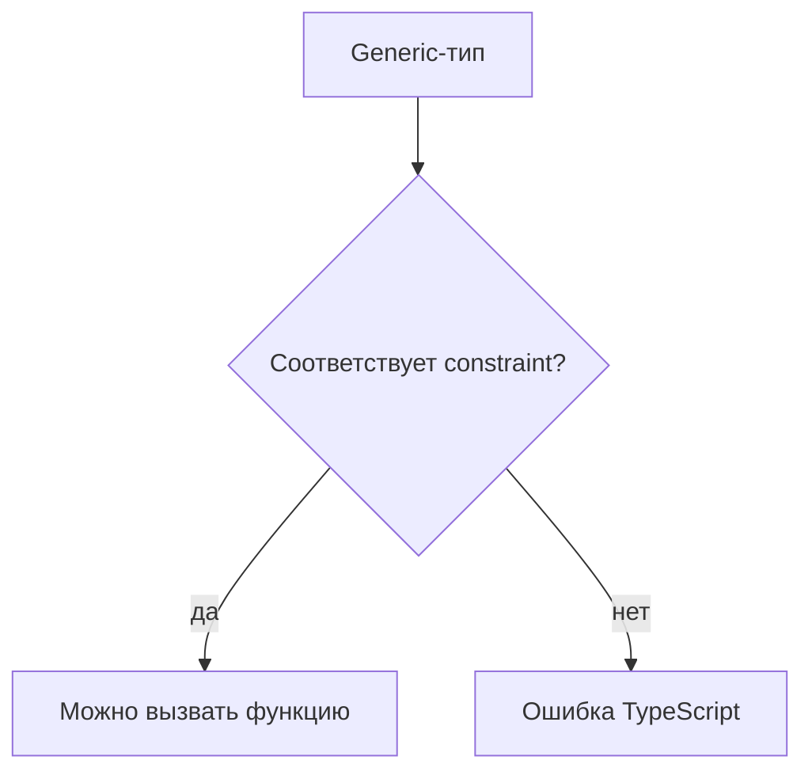
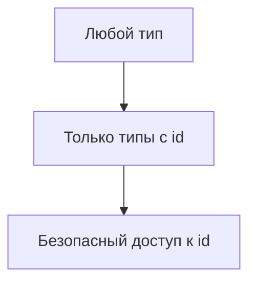

# Ограничения обобщений

## Связь с предыдущей главой

Обобщённая функция сохраняет типовую связь, но без ограничений TypeScript не знает, какие свойства доступны у параметра типа.

Теперь нужно научиться задавать минимальный контракт для параметра типа.

## Главный вопрос

Как ограничить параметр типа нужной формой?

## Мотивация

Если функция должна читать `id`, TypeScript должен знать, что входной тип точно содержит это свойство:

```ts
function getId<Entity>(entity: Entity) {
  // entity.id недоступен
}
```

Constraint решает эту проблему.

## Теория

### Ограничение — минимальный контракт параметра типа

Без ограничения о параметре типа не известно ничего, поэтому и сделать с ним ничего нельзя. Ограничение задаёт нижнюю границу требований:

```ts
function getId<Entity extends { id: string }>(entity: Entity): string {
  return entity.id;
}
```

Теперь компилятор знает: что бы ни подставили вместо `Entity`, поле `id` там есть.

### `extends` здесь — не наследование

Слово то же, смысл другой. В ограничении `extends` читается как «должен быть совместим с», а не «наследуется от».

Проверка структурная: подойдёт любой тип, у которого есть нужные свойства подходящих типов. Ни классов, ни иерархий не требуется.

### Ограничение не сужает результат

Ключевое свойство, ради которого всё и делается:

```ts
const result = getId({ id: "u-1", role: "admin" });
```

Аргумент сохраняет свой полный тип — `Entity` стал объектом с двумя полями, а не только с `id`. Если бы параметр был описан как `entity: { id: string }`, информация о `role` потерялась бы.

Именно поэтому дженерик с ограничением лучше обычного параметра: он **требует минимум, но помнит максимум**.

### Что можно ограничивать

Ограничением может быть любой тип, не только объект:

```ts
function hasItems<C extends { length: number }>(c: C): boolean { }
function fromList<T extends string | number>(items: T[]): T { }
function keys<O extends object>(o: O): (keyof O)[] { }
```

Ограничение `extends object` часто встречается, когда нужно исключить примитивы.

### Ограничение — не проверка данных

Как и всё остальное, ограничение стирается:

```ts
function getId<Entity extends { id: string }>(entity: Entity): string {
  return entity.id;
}
```

Если значение пришло из ответа API как `unknown`, компилятор потребует проверки **до** вызова, но внутри функции никакой проверки не будет. Ограничение доказывает соответствие на этапе компиляции — и только там, где типы известны.

### Ограничение и значение по умолчанию

Ограничение часто сочетают со значением параметра типа по умолчанию — это тема главы 138. Важно не путать две конструкции: ограничение задаёт допустимое множество типов, значение по умолчанию — что подставить, если аргумент не указан.

### Слишком сильное ограничение

Ограничение стоит делать **минимальным из достаточных**. Требование `Entity extends { id: string; createdAt: string }` там, где используется только `id`, сужает применимость функции без всякой пользы.

Практический признак: если ограничение перечисляет поля, к которым функция не обращается, его можно урезать.

## Внутренний механизм


```mermaid
flowchart TD
    A[Generic-тип] --> B{Соответствует constraint?}
    B -->|да| C[Можно вызвать функцию]
    B -->|нет| D[Ошибка TypeScript]
```

Ограничение проверяется до запуска программы и не добавляет проверки во время выполнения.

### Ограничение открывает доступ к свойствам

```ts
function len<T>(v: T) { return v.length; }               // ошибка: у T нет length

function len2<T extends { length: number }>(v: T) {
  return v.length;                                        // разрешено
}
```

Без ограничения параметр типа — «что угодно», и обращаться к его членам нельзя.
`extends` здесь означает не наследование, а требование к форме.

### Что ограничение делает с выводом

```ts
function pick<T extends WorkItem>(item: T): T { return item; }

const r = pick(rowWithExtraFields);
// тип r — исходный тип аргумента, со ВСЕМИ его полями
```

Дженерик с ограничением сохраняет точный тип аргумента; параметр, объявленный
просто как `WorkItem`, сузил бы результат до договора. Разница видна, когда
вызывающий код ожидает вернуть своё, а получает урезанное.

| Форма | Результат |
| --- | --- |
| `(item: WorkItem): WorkItem` | ровно `WorkItem` |
| `<T extends WorkItem>(item: T): T` | тип аргумента целиком |

### Проверки в прогоне по-прежнему нет

Ограничение исчезает при компиляции. Значение, пришедшее из `json()` и
приведённое к `T`, ограничению не подчиняется — компилятор проверил только
текст программы.

## Главная ментальная модель

Ограничение — это минимальный договор для параметра типа.


```mermaid
flowchart TD
    A[Любой тип] --> B[Только типы с id]
    B --> C[Безопасный доступ к id]
```

## Практические примеры

```ts
function label<Entity extends { id: string }>(entity: Entity): string {
  return `entity:${entity.id}`;
}

const userLabel = label({ id: "u-1", role: "admin" });
```

```ts
function hasItems<Collection extends { length: number }>(collection: Collection): boolean {
  return collection.length > 0;
}

const result = hasItems(["login", "checkout"]);
```

Запускаемые версии этих примеров находятся в:

```text
examples/02-typescript/chapter-134/
```

`01-entity-constraint.ts` — ограничение `extends { id: string }`.

`02-length-constraint.ts` — ограничение по `length` для строк и массивов.

`03-constraint-diagnostic.ts` — аргумент, не удовлетворяющий ограничению (намеренная ошибка).

## Automation QA

В тестовых данных часто есть общие поля:

```ts
function markEntity<Entity extends { id: string }>(entity: Entity) {
  return {
    entity,
    marker: `test-${entity.id}`,
  };
}
```

Функция сохраняет исходный тип `Entity`, но требует поле `id`.

### Ограничение сохраняет точный тип

Разница с обычным параметром видна на результате. Если объявить аргумент как
`{ id: string }`, вернётся именно он — остальные поля потеряются для
компилятора.

```ts
function markEntity<Entity extends { id: string }>(entity: Entity) {
  return { entity, marker: `test-${entity.id}` };
}

const marked = markEntity({ id: 't-1', title: 'Проверить вход', priority: 'HIGH' });

// Поле title доступно: тип не сузился до { id: string }.
console.log(marked.entity.title);
```

В подготовке данных это встречается постоянно: вспомогательная функция требует
идентификатор, но не должна знать остальную форму записи и не должна её
терять.

### Ограничение — требование, а не подмена проверки

`extends { id: string }` говорит, что поле обязано быть у **типа**. Если объект
пришёл из сети, тип ему назначили аннотацией, и поле может отсутствовать в
действительности. Ограничение защищает от ошибки в своём коде, а не от
неверных данных стенда.

## Распространённые ошибки

Ошибка — считать ограничение проверкой во время выполнения.

```ts
function getId<Entity extends { id: string }>(entity: Entity): string {
  return entity.id;
}
```

Если данные пришли извне как `unknown`, их все равно нужно проверить до использования.

## Распространённые мифы

**Миф: `extends` в ограничении означает наследование.**
Он означает совместимость по структуре. Классы не нужны.

**Миф: ограничение сужает тип аргумента до себя.**
Аргумент сохраняет полный тип. В этом главное преимущество перед обычным параметром.

**Миф: ограничение проверяет данные во время выполнения.**
Оно стирается. Внешние данные проверяются отдельно.

**Миф: чем строже ограничение, тем лучше.**
Лишние требования сужают применимость функции без пользы.

## Частые вопросы

**Чем дженерик с ограничением лучше обычного параметра `{ id: string }`?**
Он помнит полный тип аргумента, а обычный параметр обрезает его до объявленного.

**Можно ли ограничить примитивами?**
Да, ограничением может быть любой тип, включая объединения примитивов.

**Как исключить примитивы?**
Ограничением `extends object`.

**Как понять, что ограничение избыточно?**
Если оно требует свойства, к которым функция не обращается.

## Проверьте себя

1. Что даёт ограничение параметра типа и почему без него свойства недоступны?
2. Чем `extends` в ограничении отличается от наследования?
3. Почему аргумент сохраняет полный тип, а не сужается до ограничения?
4. Проверяет ли ограничение данные во время выполнения?
5. По какому признаку ограничение считается избыточным?

### Ответы

1. Ограничение задаёт минимальные требования к типу, и компилятор разрешает всё, что верно для любого подходящего типа. Без него параметр может оказаться чем угодно, и никаких свойств у него не гарантировано.
2. В ограничении `extends` означает «совместим с», то есть подходит по форме. Наследование классов — это ещё и переиспользование реализации.
3. Параметр типа выводится из конкретного аргумента, а ограничение лишь проверяет его пригодность. Благодаря этому результат сохраняет точный тип.
4. Нет. Ограничения существуют только при компиляции.
5. Если внутри функции используются не все требуемые им свойства. Требовать больше, чем нужно, — значит без причины сузить круг подходящих аргументов.

## Практика

Практические задания находятся в конце страницы.

## Краткие итоги

- Ограничение сужает допустимые аргументы типа.
- `extends` в ограничении означает требование к типу, а не наследование во время выполнения.
- Внутри функции доступны только свойства из ограничения.
- Ограничение не проверяет данных во время выполнения.
- Слишком широкое ограничение даёт мало пользы.

## Переход

Теперь мы можем требовать форму объекта. Следующая глава покажет, как ограничить значение только ключами существующего объекта.
