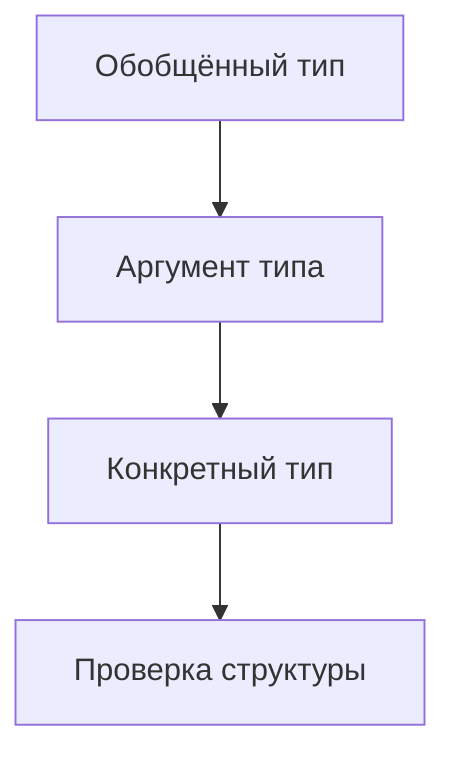
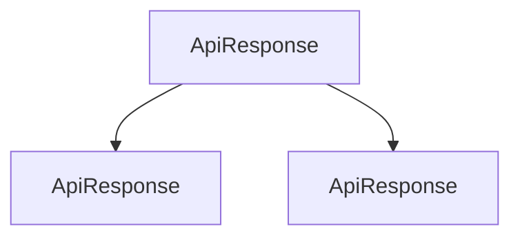

# Generic Type Aliases and Interfaces

## Связь с предыдущей главой

Обобщённые функции параметризуют поведение функций.

Но в проекте часто нужно параметризовать сами типы: ответ API, результат операции, страницу данных или builder.

## Главный вопрос

Как сделать собственные типы параметризуемыми?

## Мотивация

Без generics приходится дублировать похожие типы:

```ts
type UserResponse = {
  ok: true;
  data: { id: string };
};
```

Но форма ответа может быть одинаковой, а тип `data` — разным.

## Теория

Обобщённый псевдоним типа:

```ts
type ApiResponse<Data> = {
  ok: true;
  data: Data;
};
```

Обобщённый интерфейс:

```ts
interface TestDataBuilder<Data> {
  build(): Data;
}
```

Параметр типа используется как временное имя для конкретного типа.

## Внутренний механизм



Обобщённый псевдоним типа и interface не создают обертку во время выполнения. Это модель для проверки TypeScript.

## Главная ментальная модель

Обобщённый тип — это шаблон типа с параметром.



## Практические примеры

```ts
type TestResult<Data> = {
  status: "passed" | "failed";
  data: Data;
};

type UserResult = TestResult<{ id: string; role: string }>;
```

```ts
interface Page<Data> {
  items: Data[];
  total: number;
}
```

## Automation QA

Обобщённая модель ответа помогает описывать разные API-ответы одной формой:

```ts
type ApiResponse<Data> = {
  status: number;
  body: Data;
};

type UserBody = {
  id: string;
  email: string;
};

type UserResponse = ApiResponse<UserBody>;
```

## Распространённые ошибки

Ошибка — добавлять параметр типа, который нигде не используется:

```ts
type Box<Value> = {
  createdAt: string;
};
```

Такой generic ничего не связывает и только усложняет код.

## Практика

Практические задания находятся в конце страницы.

## Краткие итоги

- Обобщённый псевдоним типа параметризует type alias.
- Обобщённый интерфейс параметризует interface.
- Параметр типа должен использоваться осмысленно.
- Обобщённая модель не проверяет внешние данные во время выполнения.
- Такие типы полезны для API responses, results и builders.

## Переход

Теперь мы можем параметризовать типы. Следующий шаг — применить тот же принцип к классам.
