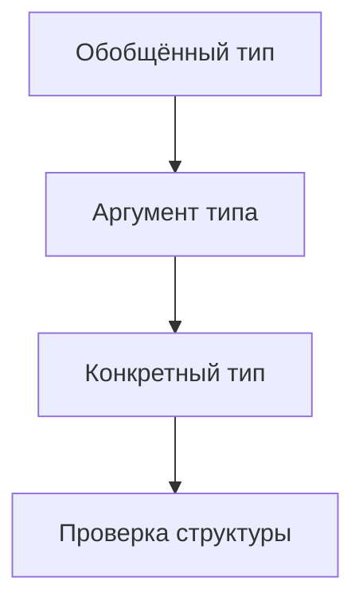
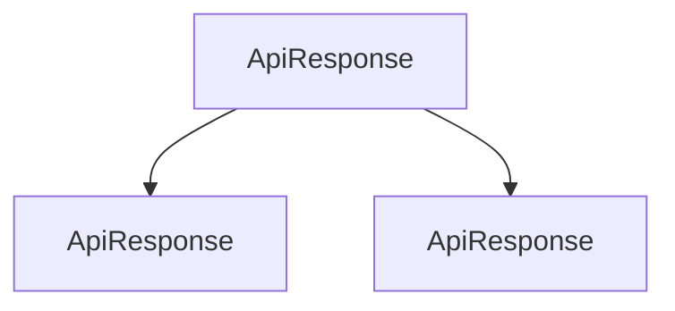

# Обобщённые псевдонимы типов и интерфейсы

## Связь с предыдущей главой

Обобщённые функции параметризуют поведение функций.

Но в проекте часто нужно параметризовать сами типы: ответ API, результат операции, страницу данных или builder.

## Главный вопрос

Как сделать собственные типы параметризуемыми?

## Мотивация

Без generics приходится дублировать похожие типы:

```ts
type UserResponse = {
  ok: true;
  data: { id: string };
};
```

Но форма ответа может быть одинаковой, а тип `data` — разным.

## Теория

### Шаблон типа с параметром

Обобщённым может быть не только функция, но и сам тип:

```ts
type ApiResponse<Data> = {
  ok: true;
  data: Data;
};

interface Page<Item> {
  items: Item[];
  total: number;
}
```

Параметр типа работает как имя, которое будет подставлено при использовании:

```ts
type UserResponse = ApiResponse<{ id: string; email: string }>;
type UserPage = Page<User>;
```

Один шаблон описывает целое семейство типов, избавляя от копирования одинаковой структуры для каждой сущности.

### Где особенно полезно

Типичные случаи — обёртки, у которых меняется только содержимое:

- ответ API: одинаковый конверт, разное тело;
- страница выдачи: одинаковая пагинация, разные элементы;
- результат операции: одинаковые поля успеха и ошибки, разные данные.

Во всех трёх структура повторяется десятки раз, а меняется одна часть. Без параметра типа пришлось бы описывать каждый случай заново — и расходиться при первом же изменении конверта.

### Несколько параметров

Параметров может быть несколько, если тип связывает несколько независимых частей:

```ts
type Result<Value, Error> =
  | { ok: true; value: Value }
  | { ok: false; error: Error };
```

Имена стоит давать осмысленные: `Value`, `Item`, `Data`, `Error` читаются лучше, чем `T`, `U`, `V`. Однобуквенные имена оправданы только там, где параметр действительно произвольный и его смысл очевиден из одной строки.

### Ограничения работают и здесь

Параметр типа можно ограничить так же, как у функции:

```ts
type Indexed<Item extends { id: string }> = {
  byId: Record<string, Item>;
  all: Item[];
};
```

Ограничение говорит, что шаблон рассчитан не на произвольный тип, а на сущность с идентификатором.

### Параметр должен что-то связывать

Главная ошибка — добавить параметр, который нигде не используется:

```ts
type Box<Value> = {
  createdAt: string;
};
```

Компилятор не возразит, но `Box<number>` и `Box<string>` окажутся одним и тем же типом. Параметр создаёт видимость точности, ничего не гарантируя.

Правило то же, что для функций: параметр типа оправдан, когда он появляется в описании хотя бы один раз по делу — иначе он лишний.

### Обобщённый тип исчезает после компиляции

Ни псевдоним, ни интерфейс с параметрами не создают ничего во время выполнения. Это модель для проверки: `ApiResponse<User>` и `ApiResponse<Order>` после компиляции неразличимы, потому что их вообще нет.

Поэтому проверять ответ API всё равно придётся руками — обобщённый тип описывает ожидание, а не гарантию.

## Внутренний механизм


```mermaid
flowchart TD
    A[Обобщённый тип] --> B[Аргумент типа]
    B --> C[Конкретный тип]
    C --> D[Проверка структуры]
```

Обобщённый псевдоним и интерфейс не создают обёртки во время выполнения. Это модель для проверки TypeScript.

### Параметр типа как часть договора

```ts
type ApiResult<T> =
  | { ok: true; value: T }
  | { ok: false; status: number; body: unknown };

interface Repository<T, K = string> {
  read(id: K): Promise<T>;
  remove(id: K): Promise<void>;
}
```

Обобщённый тип описывает **форму отношений**, а конкретное наполнение остаётся
за точкой использования. Для тестового проекта это основной способ описать
результат клиента один раз: `ApiResult<WorkItem>`, `ApiResult<WorkItem[]>`,
`ApiResult<void>`.

### Неиспользуемый параметр типа ничего не разделяет

```ts
interface Box<T> { id: string }       // T нигде не встречается

const a: Box<number> = { id: "1" };
const b: Box<string> = a;              // разрешено: типы совместимы
```

Проверка структурная, поэтому параметр, не влияющий на форму, не создаёт
различия. Если разделение нужно на самом деле, в тип добавляют поле, зависящее
от `T`, или помеченное свойство.

### Псевдоним или интерфейс

| Нужно | Что берут |
| --- | --- |
| объединение вариантов (`ApiResult`) | `type` — интерфейс так не умеет |
| набор операций слоя (`Repository`) | `interface` — его можно дополнить |
| значение параметра типа по умолчанию | обе формы поддерживают |

## Главная ментальная модель

Обобщённый тип — это шаблон типа с параметром.


```mermaid
flowchart TD
    A[ApiResponse<Data>] --> B[ApiResponse<User>]
    A --> C[ApiResponse<Order>]
```

## Практические примеры

```ts
type TestResult<Data> = {
  status: "passed" | "failed";
  data: Data;
};

type UserResult = TestResult<{ id: string; role: string }>;
```

```ts
interface Page<Data> {
  items: Data[];
  total: number;
}
```

Запускаемые версии этих примеров находятся в:

```text
examples/02-typescript/chapter-136/
```

`01-api-response-alias.ts` — дженерик-псевдоним `ApiResponse<Data>`.

`02-builder-interface.ts` — дженерик-интерфейс строителя данных.

`03-unused-type-parameter.ts` — параметр-тип, который нигде не используется (намеренная ошибка).

## Automation QA

Обобщённая модель ответа помогает описывать разные API-ответы одной формой:

```ts
type ApiResponse<Data> = {
  status: number;
  body: Data;
};

type UserBody = {
  id: string;
  email: string;
};

type UserResponse = ApiResponse<UserBody>;
```

### Одна обёртка на все клиенты

Обобщённая модель ответа — это способ описать транспортную часть один раз.
Клиент каждого ресурса подставляет свою форму тела, а общие поля — код
состояния, заголовки, длительность — не копируются.

```ts
type ApiResponse<Data> = { status: number; body: Data };

async function getJson<Data>(path: string): Promise<ApiResponse<Data>> {
  const response = await fetch(path);

  return { status: response.status, body: (await response.json()) as Data };
}

const task = await getJson<{ id: string; title: string }>('/work-items/1');
```

Тип `Data` здесь — обещание вызывающего кода. Оно удобно, но не проверяется:
приведение внутри `getJson` остаётся приведением.

### Где поставить проверку

Честная форма — принимать проверяющую функцию вместе с типом:

```ts
async function getChecked<Data>(
  path: string,
  check: (value: unknown) => value is Data
): Promise<ApiResponse<Data>> {
  const response = await fetch(path);
  const body: unknown = await response.json();

  if (!check(body)) throw new Error(`ответ ${path} не соответствует контракту`);

  return { status: response.status, body };
}
```

Обобщение остаётся удобным, а доверие к внешним данным появляется только
после проверки.

## Распространённые ошибки

Ошибка — добавлять параметр типа, который нигде не используется:

```ts
type Box<Value> = {
  createdAt: string;
};
```

Такой параметр ничего не связывает и только усложняет код.

## Распространённые мифы

**Миф: обобщённый тип создаёт обёртку во время выполнения.**
Он стирается полностью, как и любой другой тип.

**Миф: неиспользуемый параметр типа безвреден.**
Он делает разные подстановки одним и тем же типом и создаёт ложное ощущение точности.

**Миф: параметры типа принято называть одной буквой.**
Осмысленные имена читаются лучше; одна буква оправдана только в совсем коротких объявлениях.

**Миф: обобщённый тип гарантирует форму данных из API.**
Он описывает ожидание. Реальную форму проверяют во время выполнения.

## Частые вопросы

**Когда заводить обобщённый тип?**
Когда одна и та же структура повторяется с разным содержимым: конверты ответов, страницы, результаты операций.

**Можно ли ограничить параметр типа у псевдонима?**
Да, точно так же, как у функции: `<Item extends { id: string }>`.

**Чем `type` лучше `interface` для обобщённых типов?**
Тем же, чем и всегда: псевдоним умеет называть объединения и функции. Для объектных шаблонов оба подходят.

**Почему `Box<number>` и `Box<string>` оказались совместимы?**
Скорее всего параметр типа нигде не используется в описании.

## Проверьте себя

1. Какую задачу решает параметр типа у псевдонима или интерфейса?
2. Приведите два случая, где обобщённый тип особенно уместен.
3. Что произойдёт, если параметр типа нигде не используется?
4. Можно ли ограничить параметр типа и как это читается?
5. Гарантирует ли `ApiResponse<User>` форму реального ответа?

### Ответы

1. Описать структуру один раз, оставив часть типов подставляемыми, — чтобы не повторять одну и ту же форму для каждого вида данных.
2. Обёртка ответа API, у которой меняется только тип тела, и результат операции, у которого меняется тип успешного значения.
3. Он ничего не связывает и только усложняет запись. Обычно это признак того, что тип должен быть обычным.
4. Да, через `extends`: `type Response<T extends object> = ...`. Читается как «параметр типа должен быть совместим с указанным типом».
5. Нет. Это описание ожидаемой формы при компиляции; настоящий ответ проверяется только явным кодом разбора.

## Практика

Практические задания находятся в конце страницы.

## Краткие итоги

- Обобщённый псевдоним параметризует именованный тип.
- Обобщённый интерфейс параметризует объектный договор.
- Параметр типа должен использоваться осмысленно.
- Обобщённая модель не проверяет внешние данные во время выполнения.
- Такие типы полезны для ответов API, результатов и сборщиков.

## Переход

Теперь мы можем параметризовать типы. Следующий шаг — применить тот же принцип к классам.
