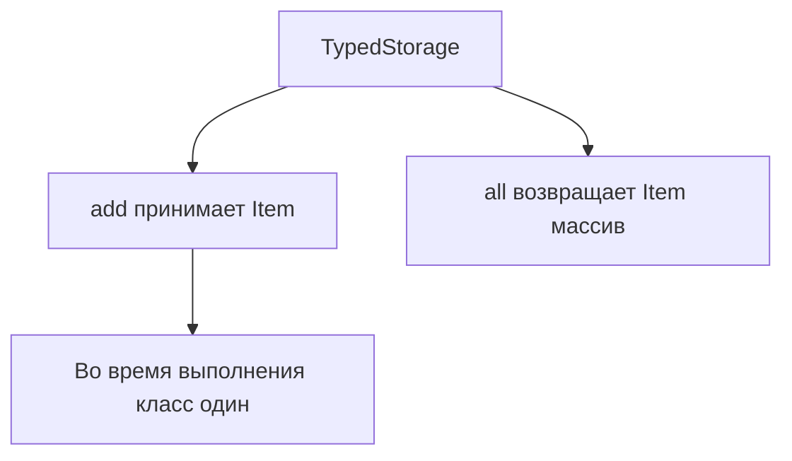

# Generic Classes

## Связь с предыдущей главой

Обобщённые aliases и interfaces описывают параметризуемые типы.

Классы тоже могут работать с разными типами данных и сохранять строгую проверку.

## Главный вопрос

Как класс может работать с разными типами данных безопасно?

## Мотивация

Класс-хранилище может хранить разные сущности:

```ts
class Storage {
  private items: unknown[] = [];
}
```

Но `unknown` теряет точную связь между хранилищем и типом элементов.

Обобщённый класс сохраняет эту связь.

## Теория

### Класс, помнящий тип данных

```ts
class TypedStorage<Item> {
  private items: Item[] = [];

  add(item: Item): void {
    this.items.push(item);
  }

  all(): Item[] {
    return this.items;
  }
}
```

Параметр типа связывает поле, аргумент метода и результат. Хранилище строк не примет число, а `all()` вернёт именно массив строк — без приведений на стороне вызывающего кода.

### Параметр типа выводится из конструктора

Указывать аргумент типа вручную обычно не нужно:

```ts
class Box<Value> {
  constructor(public value: Value) {}
}

const box = new Box("x");   // Box<string>
```

Если же конструктор не принимает значение нужного типа, выводить не из чего — тогда аргумент указывают явно: `new TypedStorage<string>()`.

### Параметр типа принадлежит экземпляру

Частая ошибка — попытка использовать параметр типа в статическом члене:

```ts
class Store<Item> {
  static make(): Item | undefined { }   // ошибка
}
```

Причина логична: статический член принадлежит **классу**, а параметр типа появляется только при создании экземпляра. У класса как такового никакого `Item` нет.

Если статическому методу нужен параметр типа, он объявляет собственный: `static make<T>(): T | undefined`.

### Ограничения работают как у функций

```ts
class EntityStore<Entity extends { id: string }> {
  findById(id: string): Entity | undefined { }
}
```

Ограничение задаёт минимальные требования к содержимому, сохраняя полный тип подставленной сущности.

### Классы тоже проверяются по форме

Неожиданное следствие структурной типизации: два разных дженерик-класса с одинаковой формой взаимозаменяемы.

```ts
class S1<T> { constructor(public v: T) {} }
class S2<T> { constructor(public v: T) {} }

const s: S1<number> = new S2(1);   // допустимо
```

Наследование не требуется. Если такое смешение нежелательно, нужен приём с меткой из главы 114 — приватное поле тоже делает класс номинальным.

### Класс или функция-фабрика

Дженерик-класс оправдан, когда есть **состояние**, которое живёт между вызовами: накопленные элементы, открытое соединение, собранный билдер.

Если состояния нет, обобщённая функция проще: не нужно создавать экземпляр, нет `this`, легче передавать как значение. Класс ради одного метода — лишняя церемония.

### Параметр типа исчезает после компиляции

Во время выполнения остаётся обычный класс. Узнать внутри методов, чем был `Item`, невозможно; если поведение должно зависеть от типа, нужную информацию передают значением в конструктор.

## Внутренний механизм



## Главная ментальная модель

Обобщённый класс — это класс, который помнит тип данных на уровне TypeScript.

## Практические примеры

```ts
class EntityStore<Entity extends { id: string }> {
  private items: Entity[] = [];

  add(entity: Entity): void {
    this.items.push(entity);
  }

  findById(id: string): Entity | undefined {
    return this.items.find((entity) => entity.id === id);
  }
}
```

## Automation QA

Builder может возвращать разные типы тестовых данных:

```ts
class TestDataBuilder<Data> {
  constructor(private readonly data: Data) {}

  build(): Data {
    return this.data;
  }
}

const userBuilder = new TestDataBuilder({ id: "u-1", role: "admin" });
```

## Распространённые ошибки

Ошибка — думать, что параметр типа доступен в static members класса.

Параметр типа принадлежит экземпляру обобщённого класса. Static side класса не знает конкретный `Item`.

## Распространённые мифы

**Миф: параметр типа доступен в статических членах.**
Он принадлежит экземпляру. Статическому методу нужен собственный параметр типа.

**Миф: два разных класса с одинаковой формой несовместимы.**
Проверка структурная: они взаимозаменяемы, даже без общего предка.

**Миф: аргумент типа всегда нужно указывать при создании.**
Он выводится из аргументов конструктора, если те его содержат.

**Миф: для каждого аргумента типа создаётся отдельный класс.**
После компиляции остаётся один класс; параметры типа стираются.

## Частые вопросы

**Почему `new TypedStorage()` требует явного аргумента типа?**
Конструктор не принимает значений, из которых можно вывести `Item`.

**Как сделать классы несовместимыми по форме?**
Добавить приватное поле или метку: тогда проверка перестаёт считать их одинаковыми.

**Когда предпочесть обобщённую функцию?**
Когда нет состояния между вызовами: функция проще и легче передаётся как значение.

**Можно ли узнать `Item` внутри метода?**
Нет, параметр типа стирается. Информацию передают значением.

## Проверьте себя

1. Что связывает параметр типа внутри обобщённого класса?
2. Почему статический член не видит параметр типа класса?
3. В каком случае аргумент типа выводится автоматически?
4. Почему `S1<number>` и `S2<number>` совместимы?
5. По какому признаку выбирают класс, а не обобщённую функцию?

## Практика

Практические задания находятся в конце страницы.

## Краткие итоги

- Обобщённый класс сохраняет типовую связь между методами и состоянием экземпляра.
- Параметр типа исчезает после компиляции.
- Поведение класса во время выполнения остается обычным JavaScript.
- Constraint можно использовать, если классу нужны гарантированные свойства.
- Не нужно делать класс обобщённым, если тип не связывает его API.

## Переход

Generic API иногда должен иметь удобный тип по умолчанию. Это тема следующей главы.
