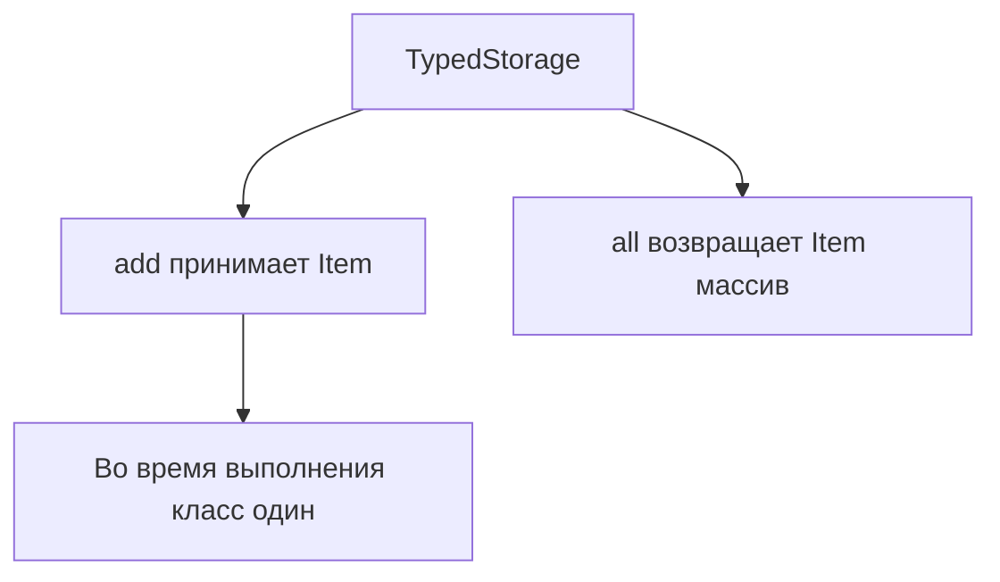

# Generic Classes

## Связь с предыдущей главой

Обобщённые aliases и interfaces описывают параметризуемые типы.

Классы тоже могут работать с разными типами данных и сохранять строгую проверку.

## Главный вопрос

Как класс может работать с разными типами данных безопасно?

## Мотивация

Класс-хранилище может хранить разные сущности:

```ts
class Storage {
  private items: unknown[] = [];
}
```

Но `unknown` теряет точную связь между хранилищем и типом элементов.

Обобщённый класс сохраняет эту связь.

## Теория

```ts
class TypedStorage<Item> {
  private items: Item[] = [];

  add(item: Item): void {
    this.items.push(item);
  }

  all(): Item[] {
    return this.items;
  }
}
```

`Item` существует только на этапе проверки TypeScript. Во время выполнения класс остается обычным JavaScript-классом.

## Внутренний механизм



## Главная ментальная модель

Обобщённый класс — это класс, который помнит тип данных на уровне TypeScript.

## Практические примеры

```ts
class EntityStore<Entity extends { id: string }> {
  private items: Entity[] = [];

  add(entity: Entity): void {
    this.items.push(entity);
  }

  findById(id: string): Entity | undefined {
    return this.items.find((entity) => entity.id === id);
  }
}
```

## Automation QA

Builder может возвращать разные типы тестовых данных:

```ts
class TestDataBuilder<Data> {
  constructor(private readonly data: Data) {}

  build(): Data {
    return this.data;
  }
}

const userBuilder = new TestDataBuilder({ id: "u-1", role: "admin" });
```

## Распространённые ошибки

Ошибка — думать, что параметр типа доступен в static members класса.

Параметр типа принадлежит экземпляру обобщённого класса. Static side класса не знает конкретный `Item`.

## Практика

Практические задания находятся в конце страницы.

## Краткие итоги

- Обобщённый класс сохраняет типовую связь между методами и состоянием экземпляра.
- Параметр типа исчезает после компиляции.
- Поведение класса во время выполнения остается обычным JavaScript.
- Constraint можно использовать, если классу нужны гарантированные свойства.
- Не нужно делать класс обобщённым, если тип не связывает его API.

## Переход

Generic API иногда должен иметь удобный тип по умолчанию. Это тема следующей главы.
