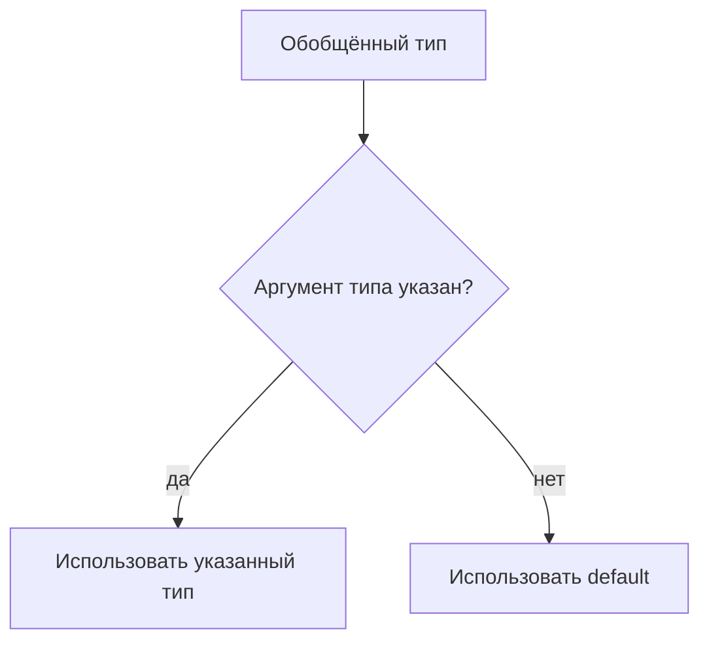

# Default Generic Parameters

## Связь с предыдущей главой

Обобщённые классы и типы могут принимать аргументы типа.

Иногда у generic API есть разумный тип по умолчанию, который можно использовать, если пользователь не передал аргумент типа явно.

## Главный вопрос

Как задать generic-тип по умолчанию?

## Мотивация

Обобщённый тип может быть удобнее, если самый частый вариант не нужно указывать каждый раз:

```ts
type ApiResponse<Data = unknown> = {
  status: number;
  body: Data;
};
```

Если `Data` не указан, TypeScript использует `unknown`.

## Теория

### Запасной аргумент типа

Значение по умолчанию позволяет не указывать аргумент типа:

```ts
type ApiResponse<Data = unknown> = {
  status: number;
  body: Data;
};

type Raw = ApiResponse;                 // body: unknown
type User = ApiResponse<{ id: string }>; // body: { id: string }
```

Обе записи корректны — вторая уточняет то, что первая оставила общим.

### Default обязан удовлетворять ограничению

Если параметр ограничен, значение по умолчанию должно проходить ту же проверку:

```ts
type EntityBox<Entity extends { id: string } = { id: string }> = {
  entity: Entity;
};
```

Иначе запись без аргумента типа порождала бы тип, нарушающий собственное ограничение.

### Порядок параметров

Параметр без значения по умолчанию не может идти после параметра с ним:

```ts
type Bad<X = string, Y> = { x: X; y: Y };   // ошибка
```

Причина та же, что и у параметров функций: вызывающему негде пропустить первый аргумент, чтобы указать второй. Параметры со значениями по умолчанию всегда идут последними.

### Default не мешает выводу

Значение по умолчанию используется, **только** когда аргумент типа не указан и вывести его не из чего. Если вывод возможен, он побеждает:

```ts
function wrap<Value = unknown>(value: Value) { return { value }; }

const r = wrap("x");   // Value выведен как string, а не unknown
```

Поэтому значение по умолчанию у функций встречается реже, чем у типов: у функций обычно есть аргументы, из которых выводить.

### `unknown` против `any` в качестве default

Выбор значения по умолчанию определяет, что произойдёт при небрежном использовании:

```ts
type Response1<Data = unknown> = { body: Data };
type Response2<Data = any> = { body: Data };
```

С `unknown` тот, кто не указал аргумент типа, обязан проверить данные перед использованием. С `any` он молча получит отключённую проверку — и ошибка всплывёт позже.

Правило: значение по умолчанию должно быть **безопасным**, а не удобным. `unknown` заставляет сделать осознанный шаг, `any` позволяет его пропустить.

### Обратная совместимость API

Значения по умолчанию — способ добавить параметр типа, не ломая существующий код:

```ts
type Result<Value> = { value: Value };
type Result<Value, Meta = undefined> = { value: Value; meta: Meta };
```

Весь код, использующий `Result<string>`, продолжает работать. Это основной сценарий применения в библиотеках и общих модулях проекта.

## Внутренний механизм



Параметр типа по умолчанию существует только на этапе проверки TypeScript.

## Главная ментальная модель

Параметр типа по умолчанию — это запасной аргумент типа для удобства API.

## Практические примеры

```ts
type ApiResponse<Data = unknown> = {
  status: number;
  body: Data;
};

type UnknownResponse = ApiResponse;
type UserResponse = ApiResponse<{ id: string }>;
```

```ts
interface Builder<Data = unknown> {
  build(): Data;
}
```

Запускаемые версии этих примеров находятся в:

```text
examples/02-typescript/chapter-138/
```

`01-default-response.ts` — параметр-тип со значением по умолчанию.

`02-default-with-constraint.ts` — значение по умолчанию вместе с ограничением.

`03-default-diagnostic.ts` — тип по умолчанию всё равно требует поля (намеренная ошибка).

## Automation QA

Для ответов вспомогательных функций удобно иметь безопасный default:

```ts
type HelperResult<Data = unknown> = {
  ok: boolean;
  data: Data;
};

const rawResult: HelperResult = {
  ok: true,
  data: { received: true },
};
```

`unknown` заставляет проверить данные перед использованием.

## Распространённые ошибки

Ошибка — выбирать слишком широкий default, который скрывает проблему:

```ts
type ApiResponse<Data = any> = {
  body: Data;
};
```

`any` отключает проверку. Для неизвестных данных безопаснее `unknown`.

## Распространённые мифы

**Миф: значение по умолчанию подменяет выведенный тип.**
Оно используется только когда выводить не из чего.

**Миф: порядок параметров типа произволен.**
Параметры со значениями по умолчанию обязаны идти последними.

**Миф: `any` — удобное значение по умолчанию.**
Оно отключает проверку у всех, кто не указал аргумент типа.

**Миф: значение по умолчанию существует во время выполнения.**
Оно стирается, как и всё остальное в системе типов.

## Частые вопросы

**Когда значение по умолчанию действительно полезно?**
При добавлении нового параметра типа в существующий API и для общих обёрток вроде ответа сервера.

**Почему у функций оно встречается реже?**
У функций обычно есть аргументы, из которых параметр типа выводится.

**Что выбрать: `unknown` или конкретный тип?**
Конкретный — если он действительно типичен. `unknown` — если данные заранее неизвестны и их нужно проверять.

**Может ли значение по умолчанию ссылаться на другой параметр типа?**
Да, если тот объявлен раньше.

## Проверьте себя

1. Когда используется значение параметра типа по умолчанию?
2. Почему оно обязано удовлетворять ограничению?
3. Почему параметр без значения по умолчанию не может идти после параметра с ним?
4. Чем `unknown` безопаснее `any` в этой позиции?
5. Как значения по умолчанию помогают не сломать существующий код?

## Практика

Практические задания находятся в конце страницы.

## Краткие итоги

- Параметр типа по умолчанию используется, когда аргумент типа не указан.
- Default не меняет поведение во время выполнения.
- Default должен соответствовать constraint.
- `unknown` часто безопаснее, чем `any`.
- Defaults делают public API удобнее, но слишком широкие defaults вредят проверке.

## Переход

Модуль Generics завершен. Следующий раздел переходит к операциям над типами и начинает с `keyof` как отдельной темы.
